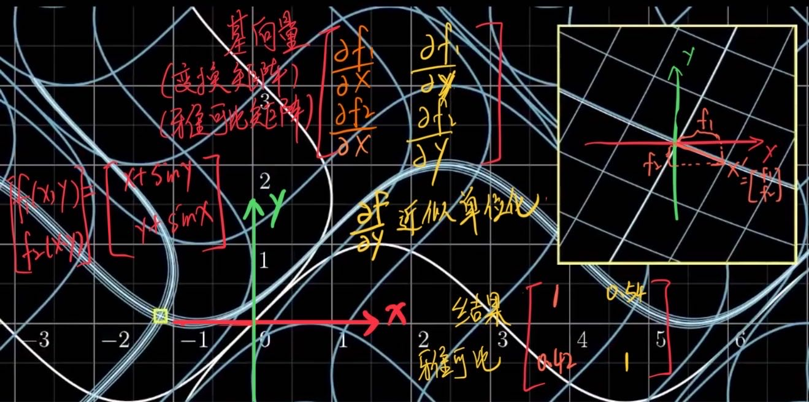

<!--more-->
## 3DGS椭球的成像过程的数学推导

假设世界坐标系下的高斯分布为 ${}^{w}G\sim N(\mu,\Sigma)$

### 世界坐标系到相机坐标系

> 坐标系的变换是使用仿射变换AX+b， A为旋转和缩放，b为平移。而常见的变换矩阵是4x4（由仿射变换推导的齐次坐标形式）的，但是他是对齐次坐标形式的点进行变换的。归根结底，坐标系之间的变换需要仿射变换。

> 仿射变换包括：平移，旋转，缩放，翻转

$$
^{camera}G=^{camera}_{word}\mathbf{W}^{word}\mathbf{X}+^{camera}\mathbf{b}
$$

而对于3DGS来说，变换后的形式如下：

$$
^{camera}G\sim N(\mathbf{W}\mathbf{\mu}+\mathbf{b},\mathbf{W}\Sigma\mathbf{W}^T)
$$

> 为什么是 $\mathbf{W}\Sigma\mathbf{W^T}$ 形式那？
> 一维高斯 $aX + b$ 结果 $X\sim N(a\mu+b,a^{2}\sigma)$
> 类似的三维高斯 $\mathbf{A}\mathbf{X}+\mathbf{b}$ 结果 $X\sim N(\mathbf{A}\mathbf{\mu}+\mathbf{b},\mathbf{A}\Sigma\mathbf{A}^T)$
> 由于矩阵左乘和右乘含义不同，所以分开。

#### 补充

**线性变换：**

1. 变换前是直线的，变换后依然是直线
2. 直线比例保持不变
3. 变换前是原点的，变换后依然是原点

**仿射变换：**

1. 变换前是直线的，变换后依然是直线
2. 直线比例保持不变

少了3因为仿射变换有平移操作，仿射变换不是线性变换。
**仿射变换（非线性变换）= 旋转缩放变换（线性变换）+ 平移变换（非线性变换）**

> 注意：线性变换是指，映射到自身空间的线性映射。充要条件：1. $T(a+b)=T(a)+T(b)$ 2. $T(aX) = aT(X)$
> 可以证明仿射变换不是线性变换

### 透视投影变换

透视投影并不是线性变换，也不是一个仿射变换。但可以写成4x4的齐次坐标形式。

透视投影的变换就是非仿射变换非线性变换的坐标系转换，需要用到**雅可比矩阵**转换。

$$
^{persp}G = ^{persp}_{camera}\mathbf{M}_{4\times4}^{camera}\mathbf{X}
$$

$$
^{persp}G\sim N(M(\mathbf{W}\mathbf{\mu}+\mathbf{b}),\mathbf{J}\mathbf{W}\Sigma\mathbf{W^T}\mathbf{J}^T)
$$

$$
J=\begin{bmatrix}\frac{\partial f_{1}}{\partial x}&\frac{\partial f_{1}}{\partial y}&\frac{\partial f_{1}}{\partial z}\\\frac{\partial f_{2}}{\partial x}&\frac{\partial f_{2}}{\partial y}&\frac{\partial f_{2}}{\partial z} \\ \frac{\partial f_{3}}{\partial x}&\frac{\partial f_{3}}{\partial y}&\frac{\partial f_{3}}{\partial z} \end{bmatrix}
$$

> 此处J相当于仿射变换的旋转缩放矩阵因此和W一样左右乘，$\mathbf{M}_{4\times4}$ 不是仿射变换不能拆成AX+b
>
> $\mathbf{f}$ 为$\mathbf{M}\mathbf{x}$再进行一次齐次坐标转换得来的

### 仿射变换和雅可比矩阵

坐标系的转换是靠雅可比矩阵变换 + 平移变换的（也可以写成齐次坐标形式）。

如果坐标系之间只有旋转缩放平移翻转这些**仿射变换的关系**，那么**雅可比矩阵就是仿射变换的旋转缩放矩阵**。换句话说这些情况（一般坐标系变换也就这些操作）坐标系变化可以用仿射变换转换。

> 雅可比矩阵的含义：对非线性变换的局部线性近似（仿射变换就不是近似了，它就是仿射变换的旋转缩放矩阵）

如果坐标系之间有弯曲等非线性关系，那么雅可比矩阵就是某一点周围微小局部的旋转变换的估计。

