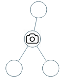
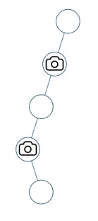

<!--more-->
## 题目

[968. 监控二叉树 - 力扣（LeetCode）](https://leetcode.cn/problems/binary-tree-cameras/description/)

给定一个二叉树，我们在树的节点上安装摄像头。

节点上的每个摄影头都可以监视**其父对象、自身及其直接子对象。**

计算监控树的所有节点所需的最小摄像头数量。

**示例 1：**



```
输入：[0,0,null,0,0]
输出：1
解释：如图所示，一台摄像头足以监控所有节点。

```

**示例 2：**



```
输入：[0,0,null,0,null,0,null,null,0]
输出：2
解释：需要至少两个摄像头来监视树的所有节点。 上图显示了摄像头放置的有效位置之一。

```

**提示：**

1. 给定树的节点数的范围是 `[1, 1000]`。
2. 每个节点的值都是 0。

## 解答

```c++
/**
 * Definition for a binary tree node.
 * struct TreeNode {
 *     int val;
 *     TreeNode *left;
 *     TreeNode *right;
 *     TreeNode() : val(0), left(nullptr), right(nullptr) {}
 *     TreeNode(int x) : val(x), left(nullptr), right(nullptr) {}
 *     TreeNode(int x, TreeNode *left, TreeNode *right) : val(x), left(left), right(right) {}
 * };
 */
class Solution
{
    int result;
public:
    int minCameraCover(TreeNode *root)
    {
        result = 0;
        if(traval(root) == 0)
        {
            result++;
        }
        return result;
    }
    int traval(TreeNode* node)
    {
        /**
         * 0 无覆盖
         * 1 有摄象头
         * 2 有覆盖
         */
        if (!node) return 2;

        int left = traval(node->left);
        int right = traval(node->right);
        if(left == 0 || right == 0)
        {
            result++;
            return 1;
        }
        if(left == 2 && right == 2) return 0;
        if(left == 1 || right == 1) return 2;
        return -1;
    }
    
};
```