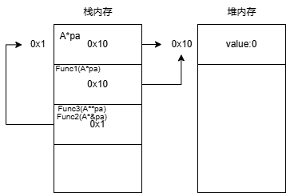
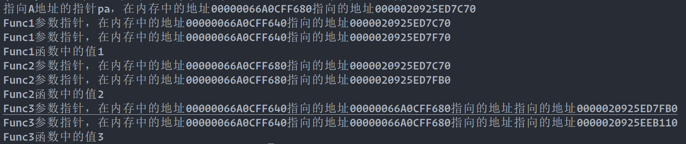

<!--more-->
## 具体例子

```csharp
A a = new A(0.0f); //相当与指针pa
Func1(a);
Console.WriteLine(a.value); // 0.0
Func2(ref a);
Console.WriteLine(a.value); // 2.0


void Func1(A a) //拷贝一份指针，但指向同一地址
{
    a = new A(1.0f);
}
void Func2(ref A a)//相当于指针的引用
{
    a = new A(2.0f);
}

class A
{
    public float value;
    public A(float v)
    {
        this.value = v;
    }
}


```

## 对应C++



```cpp
#include <iostream>


class A
{
public:
    float value;
    A(float v) {this->value=v;}
    ~A() {}
};

void Func1(A* a)
{
    std::cout << "Func1参数指针，在内存中的地址" << &a << "指向的地址"<< a <<std::endl;
    a = new A(2);
    std::cout << "Func1参数指针，在内存中的地址" << &a << "指向的地址"<< a <<std::endl;
}
void Func2(A*& a)
{
    std::cout << "Func2参数指针，在内存中的地址" << &a << "指向的地址"<< a <<std::endl;
    a = new A(2);
    std::cout << "Func2参数指针，在内存中的地址" << &a << "指向的地址"<< a <<std::endl;
}
void Func3(A** a)
{
    std::cout << "Func3参数指针，在内存中的地址" << &a << "指向的地址"<< a << "指向的地址指向的地址" << *a <<std::endl;
    *a = new A(3);
    std::cout << "Func3参数指针，在内存中的地址" << &a << "指向的地址"<< a << "指向的地址指向的地址" << *a <<std::endl;
}

int main(int, char**)
{

    A* pa = new A(1);
    std::cout << "指向A地址的指针pa，在内存中的地址" << &pa << "指向的地址"<< pa <<std::endl;

    Func1(pa);
    std::cout << "Func1函数中的值" << pa->value << std::endl;

    Func2(pa);
    std::cout << "Func2函数中的值" << pa->value << std::endl;

    Func3(&pa);
    std::cout << "Func3函数中的值" << pa->value << std::endl;
}

```

