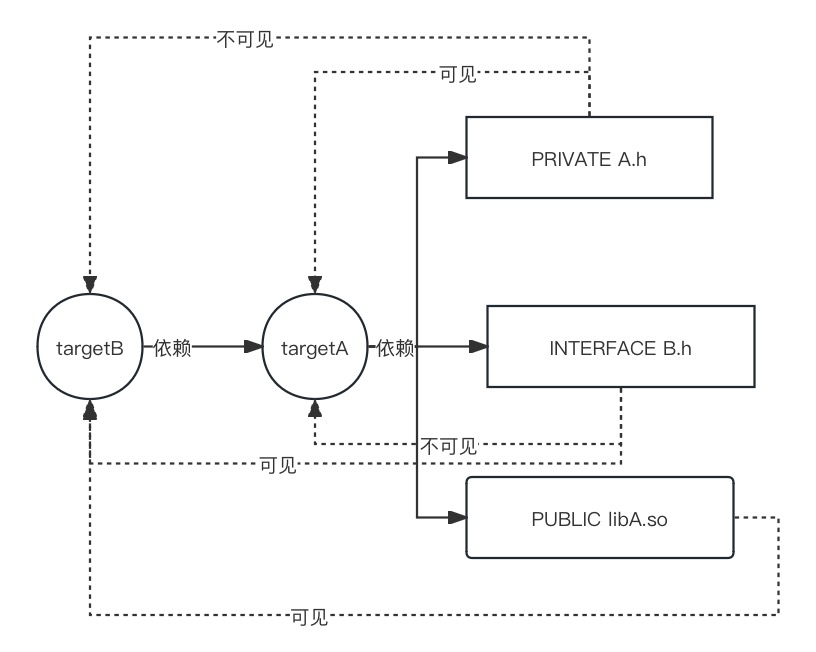

介绍c++编译过程和CMake
<!--more-->
## C++文件到可执行程序的过程

1. 预编译Preprocessing

展开宏定义（#define），处理条件预编译命令#if #ifndef，处理#include，过滤注释，添加行号和文件名标识。生成 `.i`或.`ii`文件

例如

```c++
#include <iostream>
#define PI 3.14

int main()
{
    int radius = 5;
    double area = PI * radius * radius;

    std::cout << "Area of the circle: " << area << std::endl;

    return 0;
}
```

`g++ -E example.cpp -o example.i`

```c++

# 1 ".\\example.cpp"
# 1 "<built-in>"
# 1 "<command-line>"
# 1 ".\\example.cpp"
# 1 "E:/CodeEnvironment/TDM-GCC/lib/gcc/x86_64-w64-mingw32/10.3.0/include/c++/iostream" 1 3
# 36 "E:/CodeEnvironment/TDM-GCC/lib/gcc/x86_64-w64-mingw32/10.3.0/include/c++/iostream" 3
     
# 37 "E:/CodeEnvironment/TDM-GCC/lib/gcc/x86_64-w64-mingw32/10.3.0/include/c++/iostream" 3

# 1 "E:/CodeEnvironment/TDM-GCC/lib/gcc/x86_64-w64-mingw32/10.3.0/include/c++/x86_64-w64-mingw32/bits/c++config.h" 1 3
# 262 "E:/CodeEnvironment/TDM-GCC/lib/gcc/x86_64-w64-mingw32/10.3.0/include/c++/x86_64-w64-mingw32/bits/c++config.h" 3

# 262 "E:/CodeEnvironment/TDM-GCC/lib/gcc/x86_64-w64-mingw32/10.3.0/include/c++/x86_64-w64-mingw32/bits/c++config.h" 3

//省略以上是iostream头文件的内容

# 4 ".\\example.cpp"
int main()
{
    int radius = 5;
    double area = 3.14 * radius * radius;

    std::cout << "Area of the circle: " << area << std::endl;

    return 0;
}

```

2. 编译Compilation

预处理后，编译器将源代码翻译成汇编代码，并生成目标代码文件，通常以 `.obj` `.o`或 `.co`为扩展名

+ 词法分析（Lexical Analysis）： 编译器首先对源代码进行词法分析，将代码分解为词法单元（tokens）。这些词法单元是源代码的基本构建块，如变量名、关键字、运算符等。
+ 语法分析（Syntax Analysis）： 编译器进行语法分析，根据语法规则构建语法树。语法树表示了源代码的结构和层次关系。
+ 语义分析（Semantic Analysis）： 编译器进行语义分析，检查语法树上的语义是否符合语言规范。这包括类型检查、作用域检查等。
+ 优化（Optimization）： 编译器执行优化步骤，尝试提高程序性能。这可能包括常量折叠、循环展开、内联函数等优化技术。
+ 中间代码生成（Intermediate Code Generation）： 编译器生成中间代码，这是一种抽象的、与机器无关的代码表示形式。中间代码提供了一个在不同硬件平台上进行优化和转换的基础。
+ 代码优化（Code Optimization）： 编译器对生成的中间代码进行进一步优化，以提高程序性能和效率。这可以包括局部优化（如循环展开、死代码消除）和全局优化（如函数内联、常量传播）等。
+ 目标代码生成（Code Generation）： 编译器将中间代码转换为特定硬件平台的机器代码或汇编代码。这个阶段的输出是目标代码。
+ 符号解析（Symbol Resolution）： 编译器解析程序中使用的符号，确定它们的地址或存储位置

`g++ -S example.i -o example.s`

```cpp
 .file "example.cpp"
 .text
 .section .rdata,"dr"
_ZStL19piecewise_construct:
 .space 1
.lcomm _ZStL8__ioinit,1,1
 .def __main; .scl 2; .type 32; .endef
.LC1:
 .ascii "Area of the circle: \0"
 .text
 .globl mainexamp`le
 .def main; .scl 2; .type 32; .endef
 .seh_proc main
main:
.LFB1632:
 pushq %rbp
 .seh_pushreg %rbp
 movq %rsp, %rbp

//............省略..........
 
```

3. 汇编Assembly

将汇编代码翻译成目标机器的机器代码。生成目标文件,通常是以 `.o` 或 `.obj` 为扩展名。

`as example.s -o example.o`

生成二进制文件

4. 链接Linking

将多个目标文件以及可能的库链接在一起，生成最终的可执行文件。

`g++ example.o -o example`

或

`g++ --shared -fPIC example.o -o libExample.so` `g++ --shared -fPIC example.o -o libExample.dll`生成动态链接库。

或

`ar rcs libexample.a example.o`生成静态链接库

5. 总结和注意

总体过程为：预编译->编译->汇编->链接->生成可执行文件或库文件

g++可以通过 `g++ -c example.i -o example.o`可以进行编译和汇编两个步骤。通过 `g++ example.cpp -o example`进行全部步骤。

## CMakeLists.txt

### 命令

列出常用命令

#### 指定cmake最低版本

```cmake
cmake_minimum_required(VERSION 3.10)
```

#### 设置项目名称

```cmake
project(MyProject)
```

#### 设置可执行文件或库

```cmake
add_executable(MyExecutable main.cpp) //制作可执行文件
# 或者
add_library(MyLibrary SHARED my_source_files.cpp) //制作动态库
add_library(MyLibrary STATIC my_source_files.cpp) //制作静态库
add_library(MyLibrary my_source_files.cpp) //默认静态库
```

#### 设置编译选项

SET(VAR [VALUE] [CACHE TYPE DOCSTRING [FORCE]])

+ VAR：变量名
+ VALUE：变量值

```cmake
set(CMAKE_CXX_COMPILER /path to C++)
set(CMAKE_C_COMPILER /path to C)
set(CMAKE_CXX_STANDARD 11) //指定c++11
set(CMAKE_CXX_STANDARD_REQUIRED ON) //若不支持c++11则报错
```

#### 头文件管理

```cmake
file(GLOB/GLOB_RECURSE HEADERS
    include/*.h
)
```

+ GLOB: 将指定目录下搜索到的满足条件的所有文件名生成一个列表，并将其存储到变量中。
+ GLOB_RECURSE：递归搜索指定目录，将搜索到的满足条件的文件名生成一个列表，并将其存储到变量中。

```cmake
target_include_directories(MyExecutable PRIVATE HEADERS 或者)
```

> `include_directories`和 `target_include_directories`区别
> `include_directories`用于设置全局的头文件搜索路径，影响整个项目的所有目标。
> `target_include_directories`用于为特定目标设置头文件搜索路径，只影响指定的目标。

> `include_directories` 会设置全局的头文件搜索路径，而 `target_include_directories` 可以针对具体的目标设置头文件搜索路径。
> include_directories 的变更会影响整个项目，而 `target_include_directories` 可以更精确地控制目标之间的头文件搜索路径。
> **推荐在现代 CMake 中使用 `target_include_directories`，因为它提供更好的控制权，特别是在大型项目中。**

#### 源文件管理

```cmake
aux_source_directory(dir VARIABLE) //搜寻dir下的源文件加到VARIABLE
```

```cmake
target_sources(my_executable
    PRIVATE
        src/file1.cpp
        src/file2.cpp
        或者aux_source_directory的VARIABLE
        或者file得到的源文件列表
        # 添加其他私有源文件
)
```

#### 添加库链接

这个命令既可以链接动态库和静态库

```cmake
target_link_libraries(<target> <PRIVATE|PUBLIC|INTERFACE> MyLibrary ...)
```

\<target\>：指定要加载动态库的文件的名字

+ 该文件可能是一个源文件
+ 该文件可能是一个动态库文件
+ 该文件可能是一个可执行文件

PRIVATE|PUBLIC|INTERFACE：动态库的访问权限，默认为PUBLIC

如果各个动态库之间没有依赖关系，无需做任何设置，三者没有没有区别，一般无需指定，使用默认的 PUBLIC 即可。

动态库的链接具有传递性，如果动态库 A 链接了动态库B、C，动态库D链接了动态库A，此时动态库D相当于也链接了动态库B、C，并可以使用动态库B、C中定义的方法。

```CMAKE
target_link_libraries(A B C)
target_link_libraries(D A)
```

PUBLIC：在public后面的库会被Link到前面的target中，并且里面的符号也会被导出，提供给第三方使用。比如另一个程序链接了target，那他可以用target的东西，也能用target依赖的库的东西。
PRIVATE：在private后面的库仅被link到前面的target中，并且终结掉，第三方不能感知你调了啥库，比如另一个程序链接了target，那他只能用target的东西，不能用target依赖的库的东西。
INTERFACE：在interface后面引入的库不会被链接到前面的target中，只会导出符号。

> `link_directories` 和 `target_include_directories`区别

> link_directories 用于指定链接器在链接时查找库文件的路径。
> 这个命令告诉链接器在指定的路径查找库文件，以便在链接目标（例如可执行文件或共享库）时正确解析库的位置。然而，使用 link_directories 有时被认为是不推荐的，因为它可能导致与其他目标之间的链接问题。在现代 CMake 中，更推荐使用 target_link_libraries 和 find_library 来进行库的链接。

> target_include_directories 用于指定编译器在编译时查找头文件的路径。
> 这个命令告诉编译器在指定的路径查找头文件，以便在编译目标时正确解析头文件的位置。不同于 link_directories，target_include_directories 更关注的是编译时的头文件搜索路径。

> **在现代 CMake 中，通常推荐使用 target_link_libraries 来指定链接库，并使用 target_include_directories 来指定头文件搜索路径。此外，可以使用 find_library 来查找库文件而不是使用 link_directories**

#### 查找包和库

##### 查找包

```cmake
find_package(<PackageName> [version] [EXACT] [QUIET] [MODULE]
             [REQUIRED] [[COMPONENTS] [components...]]
             [OPTIONAL_COMPONENTS components...]
             [REGISTRY_VIEW  (64|32|64_32|32_64|HOST|TARGET|BOTH)]
             [GLOBAL]
             [NO_POLICY_SCOPE]
             [BYPASS_PROVIDER])
```

+ 默认会找/usr/local/lib、/usr/lib和/lib等目录。以及CMake包注册表中的路径。
+ 需要包有.cmake结尾的文件，例如OpenCVConfig就可以find_package(OpenCV)(注意opencv需加入系统环境变量)

> find_package()函数可以自动查找并导入一个包，并设置一些变量，这些变量可以用来链接到包中的库。这使得查找和链接第三方库更加方便和可靠，而target_link_directories()函数只能手动指定链接库路径，这可能会导致一些问题。例如，如果你手动指定的链接库路径不正确，或者链接库的名称不正确，那么链接器就无法找到要链接的库，从而导致链接失败。

##### 查找库

```cmake
find_library(<VAR> name [path1 path2 ...])
```

#### 注意

请注意源文件#include的路径，不在同一目录的要加路径

## 总结和推荐写法

以下是现代cmake所推荐的写法。用以下命令便以足够大多数情况。

### 添加子目录

```cmake
add_subdirectory(source_dir [binary_dir] [EXCLUDE_FROM_ALL] [SYSTEM])
```

### 包含头文件路径

```cmake
target_include_directories(<target> [SYSTEM] [AFTER|BEFORE]
  <INTERFACE|PUBLIC|PRIVATE> [items1...]
  [<INTERFACE|PUBLIC|PRIVATE> [items2...] ...])
```

### 查找库

```cmake
find_library(<VAR> name [path1 path2 ...])
```

### 链接库

```cmake
 #指定库文件搜索路径
target_link_directories(<target>
                      <PRIVATE|PUBLIC|INTERFACE> <item>...
                     [<PRIVATE|PUBLIC|INTERFACE> <item>...]...)
```

```cmake
 #添加库文件搜索路径
target_link_libraries(<target>
                      <PRIVATE|PUBLIC|INTERFACE> <item>...
                     [<PRIVATE|PUBLIC|INTERFACE> <item>...]...)
```

找不到是试一下绝对路径

### PRIVATE PUBLIC INTERFACE

在现代 CMake 中，private、public 和 interface 是用于定义目标属性（target properties）的关键字，用于指定目标的可见性和属性。这些关键字通常用于目标的链接（linking）和包含（including）过程中。

