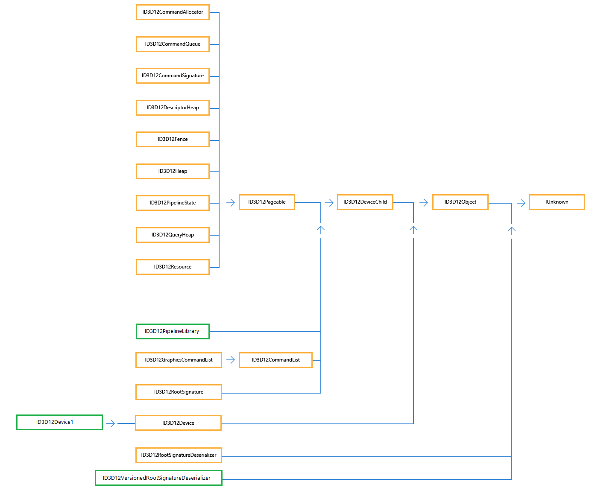
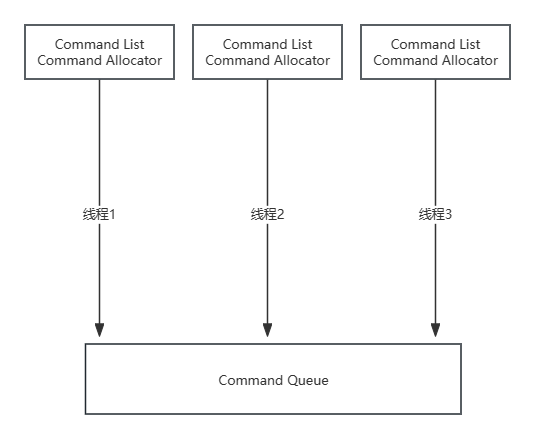
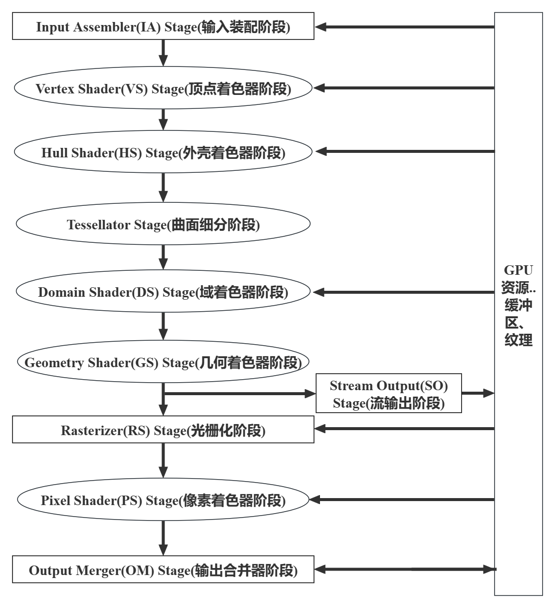
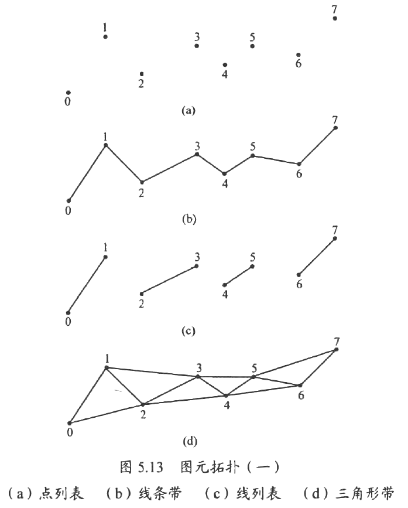
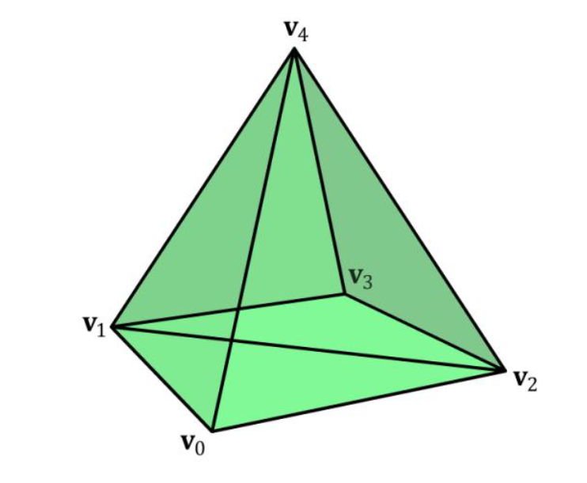
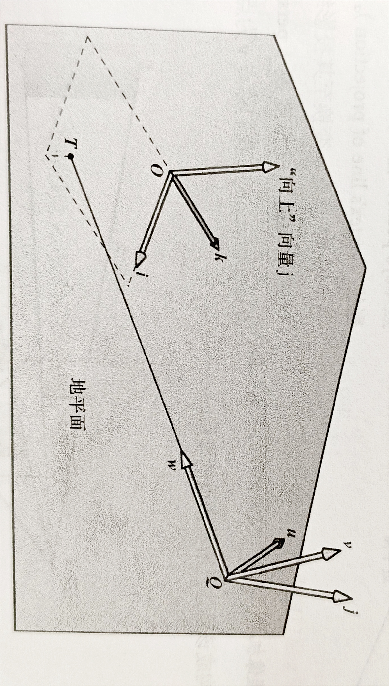
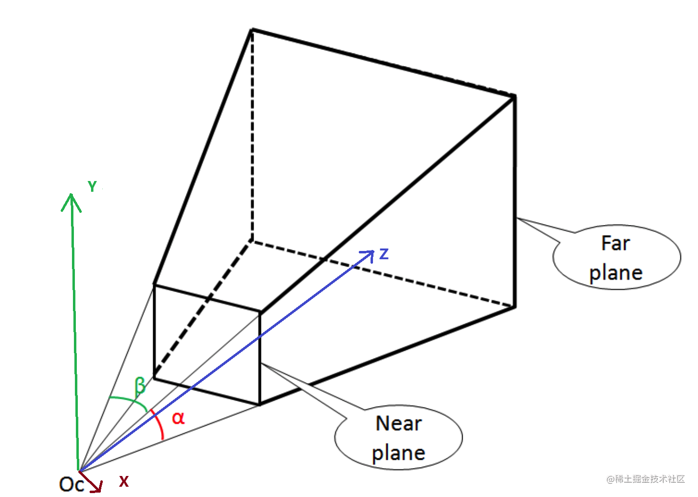
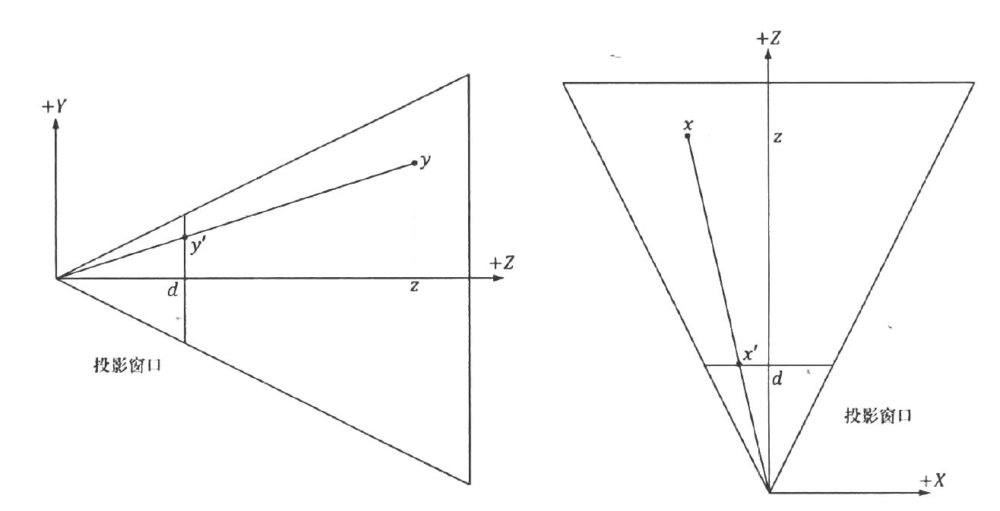
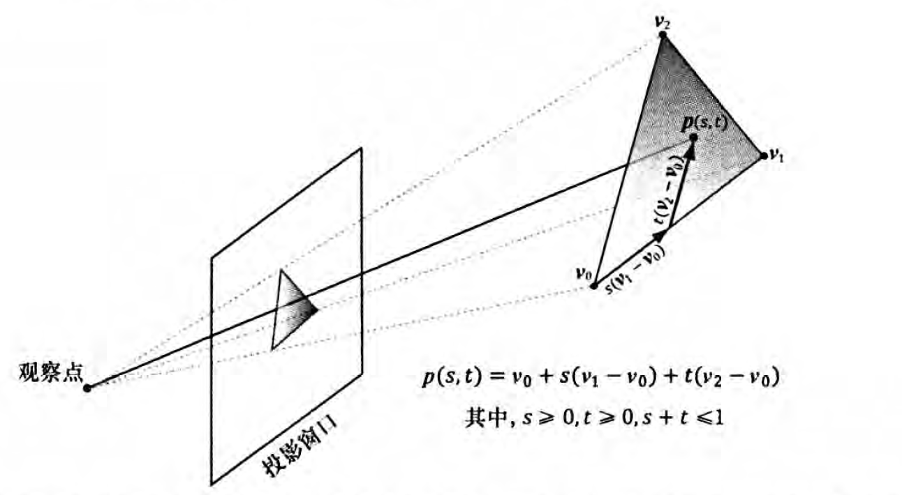

学习DirectX 12 3D 游戏开发实战(龙书)笔记。
<!--more-->
## 接口



### COM(Component Object Model,组件对象模型)

> 《Direct 3D 12 编程指南》
>
> COM是为了构建分布式系统而设计的，可以认为是CORBA在Windows平台上的实现。然而DXGI和Direct3D不需要用到构建分布式系统的相关功能，因此，DXGI和Direct3D并没有与COM运行时层交互。一个很有力的证据就是，在调用DXGI和Direct3D的API时，并不要求主调线程事先调用Colnitialize(Ex）进入到某个COM套间中。
>
> 除了构建分布式系统，COM的另外一个功能是使对象的接口和实现彻底分离，这也是COM（ComponentObject Model，组件对象模型）的名字的由来。读者不妨回忆一下C++中抽象类的相关知识。例如我们将A定义为抽象类，B和C同时继承自A（即B和C同时实现了接口A），那么B和C的使用者就可以用A的指针统一访问B和C的对象，从而使B和C的使用者与B和C的实现分离。在C++中，B和C的使用者需要调用B和C的构造函数来创建B和C的对象，从而使B和C的使用者必须包含B和C的定义。也就是说，如果B和C的定义发生了任何改变，那么所有与调用B和C的构造函数相关的代码将全部受到影响，即B和C的使用者并没有在真正意义上与B和C的实现分离。COM解决方案是由B和C的实现者，而不是B和C的使用者负责B和C的对象的创建过程。B和C的使用者通过一个实现者事先约定的C风格全局函数来创建B和C的对象（在DXGI中是CreateDXGIFactory，在Direct3D12中是D3D12CreateDevice，见后文），从而使B和C的使用者不再需要包含B和C的定义。如果B和C的定义发生任何改变，只要抽象类A不发生变化，B和C的使用者就不会受到任何影响。然而COM并没有规定B和C的实现者在C风格全局函数中创建对象的方式，并不一定是new，因此B和C的使用者并不一定可以用delete来销毁对象。实现者需要事先约定某个函数，在其中定义了与对象的创建方法相兼容的销毁方式，供B和C的使用者调用。为了统一，COM对此进行了规定：所有的抽象类A都继承自IUnknown接口，B和C的使用者通过IUnknown接口的Release方法来销毁对象。关于COM的知识暂时就介绍这么多，如果在接下来的章节中需要用到关于COM的其他知识，那么会在相应的章节中进行介绍。

COM对象的引用计数为0时，会自动销毁。COM使用Release释放的不是delete

为了辅助管理COM对象生命周期，Windows运行时库WRL提供了ComPtr，相当于COM的智能指针，当ComPtr超出作用域时，会自动调用Release方法。

ComPtr的Get方法返回的是 `T*`, GetAddressOf返回的是 `T**`

## 资源

### 资源的状态

不论什么资源本质都是内存中的一块数据，并没有什么属性，可以对资源进行读写。但是当这个资源没有被写入数据的时候读出，则会导致资源冒险。因此D3D12对资源设置了一些状态，来使资源同一时间只能读或写。

例如要对资源进行写的时候，会将其转换为Render Target状态，进行写。这个时候就不能对他进行读。

要对资源进行读的时候，需要将其转换为Shader Resource状态。

### 资源描述符

资源并不能直接绑定到渲染流水线上，而是要通过一种中间途径（资源描述符）来间接绑定到资源流水线上。有了资源描述符，GPU就可以得知（1）资源的类型，用途等等，（2）资源本身的数据。

某一个资源可以即是RTV也可以是SRV等多个描述符，区别在于要把当前资源作为什么使用。

### 资源描述符堆

资源描述符是存储在资源描述符堆上的，每一种描述符就需要创建单独的描述符堆，也可以为同一种描述符创建多个描述符堆。

### 一个例子

```C++
//创建资源
ID3D12Resource* textureResource = nullptr;
D3D12_RESOURCE_DESC textureDesc = {};
textureDesc.Dimension = D3D12_RESOURCE_DIMENSION_TEXTURE2D;
textureDesc.Width = 1024;  // 纹理宽度
textureDesc.Height = 1024; // 纹理高度
textureDesc.DepthOrArraySize = 1;
textureDesc.MipLevels = 1;
textureDesc.Format = DXGI_FORMAT_R8G8B8A8_UNORM; // 常用的纹理格式
textureDesc.SampleDesc.Count = 1;
textureDesc.SampleDesc.Quality = 0;
textureDesc.Layout = D3D12_TEXTURE_LAYOUT_UNKNOWN;
textureDesc.Flags = D3D12_RESOURCE_FLAG_NONE; // 不需要额外的标记

D3D12_HEAP_PROPERTIES heapProps = {D3D12_HEAP_TYPE_DEFAULT};

// 创建纹理资源
HRESULT hr = device->CreateCommittedResource(
    &heapProps,
    D3D12_HEAP_FLAG_NONE,
    &textureDesc,
    D3D12_RESOURCE_STATE_COMMON,
    nullptr,
    IID_PPV_ARGS(&textureResource));

if (FAILED(hr)) {
    // 错误处理
}

//创建描述符堆
ID3D12DescriptorHeap* srvHeap = nullptr;
D3D12_DESCRIPTOR_HEAP_DESC srvHeapDesc = {};
srvHeapDesc.NumDescriptors = 1; // 这里只创建一个SRV
srvHeapDesc.Type = D3D12_DESCRIPTOR_HEAP_TYPE_CBV_SRV_UAV;
srvHeapDesc.Flags = D3D12_DESCRIPTOR_HEAP_FLAG_SHADER_VISIBLE;

hr = device->CreateDescriptorHeap(&srvHeapDesc, IID_PPV_ARGS(&srvHeap));

if (FAILED(hr)) {
    // 错误处理
}

//创建描述符
D3D12_SHADER_RESOURCE_VIEW_DESC srvDesc = {};
srvDesc.Shader4ComponentMapping = D3D12_DEFAULT_SHADER_4_COMPONENT_MAPPING;
srvDesc.Format = textureDesc.Format;
srvDesc.ViewDimension = D3D12_SRV_DIMENSION_TEXTURE2D;
srvDesc.Texture2D.MipLevels = 1;

// 获取描述符堆的起始句柄
D3D12_CPU_DESCRIPTOR_HANDLE srvHandle = srvHeap->GetCPUDescriptorHandleForHeapStart();
device->CreateShaderResourceView(textureResource, &srvDesc, srvHandle);

//绑定流水线
// 假设 commandList 是已经初始化的 ID3D12GraphicsCommandList
// 假设我们的根签名有一个SRV在索引0的位置

// 绑定描述符堆
ID3D12DescriptorHeap* heaps[] = { srvHeap };
commandList->SetDescriptorHeaps(_countof(heaps), heaps);

// 绑定SRV到管线，假设它在根签名的索引0
commandList->SetGraphicsRootDescriptorTable(0, srvHeap->GetGPUDescriptorHandleForHeapStart());

// 接下来可以绘制操作...
```

## 命令列表和命令队列以及CPU,GPU的同步

### Command List和Command Queue和Command Allocator

目的是为了尽量使CPU和GPU并行工作，当CPU有需要GPU操作的命令时，并不会直接与GPU交互，而是将命令提交到一个命令列表里(Command List)，之后CPU可以干其他事情。随后调用 `ID3D12CommandQueue::ExecuteCommandLists(UINT Count, ID3D12CommandList *const * ppCommandLists);`将命令列表里的命令转移到命令队列(Command Queue)里面，GPU就会不断从命令队列里面取命令并执行。

命令列表的创建需要命令分配器，一个命令分配器可以对应一个命令列表，也可以对应多个命令列表(但是同时只能有一个命令列表工作，只有当这个命令列表没有记录命令时，才能开启一个其他命令列表)

每个线程都可以有一个命令列表(对应一个命令分配器)，但是每个线程只能调用自己的命令列表，自己的命令分配器。但是命令队列是每个线程都可以访问的。



### 同步

既然CPU，GPU并行工作，那么必不可少的要有同步的机制。通过创建围栏来实现同步。

当命令列表提交给命令队列后，会用 `ID3D12CommandQueue::Signal`方法在Command Queue最后添加一个Signal命令，当它之前命令执行完后会执行Signal命令来修改围栏的值。

通过 `mFence->GetCompletedValue()`来获取围栏的值，当Signal没有执行的时候，这个函数返回的是没有+1的值，由此可以判断GPU还没执行完CommandQueue的命令，需让CPU等待（指定等待结束后事件）。当Signal执行后，这个函数返回的是+1后的值，由此CPU可以不用等待。

## Rendering Pipeline(渲染管线)

rendering pipeline就是给定 `3D场景`和 `虚拟摄像机的位置和角度`后，基于此摄像机的观察视角将3D场景渲染为 `2D图片`过程的 `一系列步骤`。

### D3D12 rendering pipeline过程



其中HS,TS,DS,GS是一个可选渲染阶段

## 渲染管线各阶段的工作

### IA Stage

IA阶段会从显存中读取Vertex和Index，再进行Geometry Primitive(几何图元)装配。

#### Primitive Topology(图元拓扑)

有了顶点之后，需要对这些顶点进行解释，例如两两顶点解释成线段，还是三个一组解释成三角形。

D3D12的图元拓扑下表所示：

| 枚举值                                              | 含义                     |
| --------------------------------------------------- | ------------------------ |
| D3D12_PRIMITIVE_TOPOLOGY_UNDEFINED                  | 未定义                   |
| D3D12_PRIMITIVE_TOPOLOGY_POINTLIST                  | 点列表                   |
| D3D12_PRIMITIVE_TOPOLOGY_LINELIST                   | 线列表                   |
| D3D12_PRIMITIVE_TOPOLOGY_LINESTRIP                  | 线条带                   |
| D3D12_PRIMITIVE_TOPOLOGY_TRIANGLELIST               | 三角形列表               |
| D3D12_PRIMITIVE_TOPOLOGY_TRIANGLESTRIP              | 三角带                   |
| D3D12_PRIMITIVE_TOPOLOGY_LINELIST_ADJ               | 带相邻线列表             |
| D3D12_PRIMITIVE_TOPOLOGY_LINESTRIP_ADJ              | 带相邻线条带             |
| D3D12_PRIMITIVE_TOPOLOGY_TRIANGLELIST_ADJ           | 带相邻三角形列表         |
| D3D12_PRIMITIVE_TOPOLOGY_TRIANGLESTRIP_ADJ          | 带相邻三角带             |
| D3D12_PRIMITIVE_TOPOLOGY_1_CONTROL_POINT_PATCHLIST  | 控制点数为 1 的面片列表  |
| D3D12_PRIMITIVE_TOPOLOGY_2_CONTROL_POINT_PATCHLIST  | 控制点数为 2 的面片列表  |
| D3D12_PRIMITIVE_TOPOLOGY_3_CONTROL_POINT_PATCHLIST  | 控制点数为 3 的面片列表  |
| D3D12_PRIMITIVE_TOPOLOGY_4_CONTROL_POINT_PATCHLIST  | 控制点数为 4 的面片列表  |
| D3D12_PRIMITIVE_TOPOLOGY_5_CONTROL_POINT_PATCHLIST  | 控制点数为 5 的面片列表  |
| D3D12_PRIMITIVE_TOPOLOGY_6_CONTROL_POINT_PATCHLIST  | 控制点数为 6 的面片列表  |
| D3D12_PRIMITIVE_TOPOLOGY_7_CONTROL_POINT_PATCHLIST  | 控制点数为 7 的面片列表  |
| D3D12_PRIMITIVE_TOPOLOGY_8_CONTROL_POINT_PATCHLIST  | 控制点数为 8 的面片列表  |
| D3D12_PRIMITIVE_TOPOLOGY_9_CONTROL_POINT_PATCHLIST  | 控制点数为 9 的面片列表  |
| D3D12_PRIMITIVE_TOPOLOGY_10_CONTROL_POINT_PATCHLIST | 控制点数为 10 的面片列表 |
| D3D12_PRIMITIVE_TOPOLOGY_11_CONTROL_POINT_PATCHLIST | 控制点数为 11 的面片列表 |
| D3D12_PRIMITIVE_TOPOLOGY_12_CONTROL_POINT_PATCHLIST | 控制点数为 12 的面片列表 |
| D3D12_PRIMITIVE_TOPOLOGY_13_CONTROL_POINT_PATCHLIST | 控制点数为 13 的面片列表 |
| D3D12_PRIMITIVE_TOPOLOGY_14_CONTROL_POINT_PATCHLIST | 控制点数为 14 的面片列表 |
| D3D12_PRIMITIVE_TOPOLOGY_15_CONTROL_POINT_PATCHLIST | 控制点数为 15 的面片列表 |
| D3D12_PRIMITIVE_TOPOLOGY_16_CONTROL_POINT_PATCHLIST | 控制点数为 16 的面片列表 |
| D3D12_PRIMITIVE_TOPOLOGY_17_CONTROL_POINT_PATCHLIST | 控制点数为 17 的面片列表 |
| D3D12_PRIMITIVE_TOPOLOGY_18_CONTROL_POINT_PATCHLIST | 控制点数为 18 的面片列表 |
| D3D12_PRIMITIVE_TOPOLOGY_19_CONTROL_POINT_PATCHLIST | 控制点数为 19 的面片列表 |
| D3D12_PRIMITIVE_TOPOLOGY_20_CONTROL_POINT_PATCHLIST | 控制点数为 20 的面片列表 |
| D3D12_PRIMITIVE_TOPOLOGY_21_CONTROL_POINT_PATCHLIST | 控制点数为 21 的面片列表 |
| D3D12_PRIMITIVE_TOPOLOGY_22_CONTROL_POINT_PATCHLIST | 控制点数为 22 的面片列表 |
| D3D12_PRIMITIVE_TOPOLOGY_23_CONTROL_POINT_PATCHLIST | 控制点数为 23 的面片列表 |
| D3D12_PRIMITIVE_TOPOLOGY_24_CONTROL_POINT_PATCHLIST | 控制点数为 24 的面片列表 |
| D3D12_PRIMITIVE_TOPOLOGY_25_CONTROL_POINT_PATCHLIST | 控制点数为 25 的面片列表 |
| D3D12_PRIMITIVE_TOPOLOGY_26_CONTROL_POINT_PATCHLIST | 控制点数为 26 的面片列表 |
| D3D12_PRIMITIVE_TOPOLOGY_27_CONTROL_POINT_PATCHLIST | 控制点数为 27 的面片列表 |
| D3D12_PRIMITIVE_TOPOLOGY_28_CONTROL_POINT_PATCHLIST | 控制点数为 28 的面片列表 |
| D3D12_PRIMITIVE_TOPOLOGY_29_CONTROL_POINT_PATCHLIST | 控制点数为 29 的面片列表 |
| D3D12_PRIMITIVE_TOPOLOGY_30_CONTROL_POINT_PATCHLIST | 控制点数为 30 的面片列表 |
| D3D12_PRIMITIVE_TOPOLOGY_31_CONTROL_POINT_PATCHLIST | 控制点数为 31 的面片列表 |
| D3D12_PRIMITIVE_TOPOLOGY_32_CONTROL_POINT_PATCHLIST | 控制点数为 32 的面片列表 |



> 控制点面片列表常用于曲面细分的阶段

#### Index

在使用三角形列表的时候，若每个三角形都保存三个顶点，那么相邻三角形必然会有顶点重复，因此采用索引来降低存储大小以及避免GPU对同一顶点的重复处理。

例如：如下三角形



```C++
Vertex vertices[5] = {
    v0,v1,v2,v3,v4
};//顶点数组

UINT indices[] = {
    0,1,2,
    1,3,2,
    1,4,0,
    0,4,2,
    2,4,3,
    3,4,1
}; //索引
```

### VS Stage

待图元被装配完毕后，其顶点就会被送入顶点着色器阶段。这个阶段是处理单个顶点，对其进行变换、光照和位移贴图等操作。

#### 局部空间和世界空间

要说到变换，那么就离不开局部坐标系和世界坐标系，以及两者互相转化的矩阵。

通常，物体的中心位于局部空间的原点，并关于主轴对称。将局部坐标系内的坐标转换为全局场景坐标系中称为world transform(世界变换)，所用的变换称为world matrix(世界矩阵)

#### 观察空间

构建2D图像，需要一台虚拟摄像机，因此需要确定摄像机的位置角度，摄像机的坐标系称为view space(观察空间) or eye space or(视觉空间) camera space(摄像机空间)

摄像机在这个坐标系中位于原点并沿Z轴的正方向观察，X轴指向右侧，Y轴指向上方。由世界空间转换为观察空间的过程称为view transform(取景变换)，所用的变换矩阵称为view matrix(观察矩阵)



获取观察矩阵的算法如下：

1. 需要提前得知虚拟摄像机的位置$Q$，和摄像机对准的观察点$T$，以及 `世界空间`中向上方向的单位向量$j$
2. 虚拟相机的观察方向 $w=\frac{T-Q}{||T-Q||}$(即为view space的Z轴方向)，右侧方向$u=\frac{j\times w}{||j\times w||}$(即为view space的X轴方向)，上侧方向$v=w\times u$
3. view matrix即为
4. $$
   V = W ^{-1}=\begin{pmatrix}
   \mathbf{u}& 0\\\mathbf{v}& 0\\\mathbf{w}& 0\\\mathbf{Q}& 1
   \end{pmatrix}^{-1} = \begin{pmatrix}
   u_x & u_y & u_z & 0\\v_x & v_y & v_z & 0 \\w_x & w_y & w_z & 0\\Q_x & Q_y & Q_z & 1
   \end{pmatrix}^{-1} = \begin{pmatrix}
   u_x & v_y & w_z & 0\\u_x & v_y & w_z & 0 \\u_x & v_y & w_z & 0\\-\mathbf{Q} \cdot \mathbf{u} & -\mathbf{Q} \cdot \mathbf{v}  & -\mathbf{Q} \cdot \mathbf{w}  & 1
   \end{pmatrix}
   $$

> 这里的$^w_cQ$和$R^w_c(u,v,w)$都是在世界坐标下的，$^w_cR$是的含义是将相机坐标的点转换到世界坐标，因此请注意求逆的过程。求完逆后才是view matrix即将世界坐标的点变换到相机坐标系。

> $(-\mathbf{Q} \cdot \mathbf{u} ， -\mathbf{Q} \cdot \mathbf{v} ，  -\mathbf{Q} \cdot \mathbf{w})$ 代表的是原点在相机坐标系中的位置。相当于在相机坐标系远点生成一个虚拟的世界坐标系，这个坐标系与世界坐标的对应轴方向相反，于是世界坐标的原点位置就是$-Q$，再将坐标投影到相机坐标系的三个基向量上就是世界坐标原点在相机坐标系上的坐标。

> 这里的变换矩阵和[计算机图形学基础](./计算机图形学基础.md)中的矩阵形式为转置关系。[计算机图形学基础](./计算机图形学基础.md)的向量和点用 `列`向量表示，这里的向量和点用 `行`向量表示，这是为了方便DirectXMath库中的计算。例如对于同一个点$P$，使用$TP = P^TT^T$效果是一样的。

使用DirectXMath库进行view matrix计算的代码如下：

```C++
#include<DirectXMath.h>
#include<iostream>
using namespace std;
using namespace DirectX;
int main()
{
	XMVECTOR cameraPostion = XMVectorSet(-20.0f, 35.0f, -50.0f, 1.0f); //point
	XMVECTOR lookTarget = XMVectorSet(10.0f, 0.0f, 30.0f, 1.0f); //point
	XMVECTOR up = XMVectorSet(0.0f, 1.0f, 0.0f, 0.0f); // vector
	XMMATRIX viewMatrix = XMMatrixLookAtLH(cameraPostion, lookTarget, up);
    for (int i = 0; i < 4; ++i) 
    {
        XMVECTOR row = viewMatrix.r[i];
        // Get the elements of the row vector
        float x = XMVectorGetX(row);
        float y = XMVectorGetY(row);
        float z = XMVectorGetZ(row);
        float w = XMVectorGetW(row);
        // Print the elements
        cout << x << " " << y << " " << z << " " << w << endl;
    }
	return 0;
}
    //[output]:
    //0.936329 0.133101 0.324918 0
    //0 0.925367 -0.379071 0
    //-0.351123 0.354935 0.866449 0
    //1.17041 -11.9791 63.0883 1
```

> DirextX采用的是左手坐标系

#### 投影和齐次裁剪空间

将3D场景渲染成2D图像，需要将3D场景里的物体投影到一个平面上，形成图像，这个平面称为投影窗口，因此需要一个变换矩阵将空间上的点变换为投影窗口的点，以下操作便是这个矩阵的推导过程。

要想实现这个目的，首先定义摄像机可以观察的空间为一个平截头体。其拥有near plane(近平面或近裁平面) $n$、far plane(远平面或远裁平面) $f$、垂直视角场$\alpha$以及aspect ratio(纵横比或宽高比) $r$。其中水平视角场$\beta$是由$\alpha$和$r$确定的，$\beta = 2\arctan(r\cdot\tan(\alpha/2))$



FovX为$\beta$，FovY为$\alpha$

给定空间中一顶点$(x,y,z)$，利用相似三角形的性质，可以推到出其在投影窗口的投影点$(x',y',d)$

$x^{\prime}=\frac{x d}{z}=\frac{x \cot (a / 2)}{z}=\frac{x}{z \tan (a / 2)}$

$y^{\prime}=\frac{y d}{z}=\frac{y \cot (a / 2)}{z}=\frac{y}{z \tan (a / 2)}$

为了保证点在平截头体内，其应满足(假设投影平面高为2)：

$-r \leqslant x^{\prime} \leqslant r$
$-1 \leqslant y^{\prime} \leqslant 1$
$n \leqslant z \leqslant f$



为了消除投影窗口映射到后台缓冲区时，需要告诉硬件纵横比的压需求，需要将$[-r,r]$归一化到$[-1,1]$。为了写出投影矩阵，同时又保存深度缓冲信息Z，需将$[n,f]$也归一化到$[0,1]$，近平面为0，远平面为1。

因此可以写出变换矩阵即透视投影矩阵：
$\boldsymbol{P}=\left[\begin{array}{cccc}\frac{1}{r \tan \left(\frac{\alpha}{2}\right)} & 0 & 0 & 0 \\ 0 & \frac{1}{\tan \left(\frac{\alpha}{2}\right)} & 0 & 0 \\ 0 & 0 & \frac{f}{f-n} & 1 \\ 0 & 0 & \frac{-n f}{f-n} & 0\end{array}\right]$

> $\frac{-n f}{f-n}$和$\frac{f}{f-n}$的推导过程可以参考《DirectX12 3D 游戏开发实战》第162页。

> 若已知透视投影矩阵
>
> $$
> \begin{bmatrix}
> A & 0 & 0 & 0 \\
> 0 & B & 0 & 0 \\
> 0 & 0 & C & 1 \\
> 0 & 0 & D & 0 \end{bmatrix}
> $$
>
> 则可以根据以下式子反推出则可以根据以下式子反推出$\alpha$,$r$,$n$,$f$
> $r=\frac{B}{A} \\ \alpha=2 \arctan\left(\frac{1}{B}\right) \\ n=-\frac{D}{C} \\ f=\frac{D}{1-C}$

> 透视投影矩阵的另一种形式，已知$n,f$,近平面高$h$,宽$w$
> $\boldsymbol{P}=\left[\begin{array}{cccc}\frac{2 n}{w} & 0 & 0 & 0 \\ 0 & \frac{2 n}{h} & 0 & 0 \\ 0 & 0 & \frac{f}{f-n} & 1 \\ 0 & 0 & \frac{-n f}{f-n} & 0\end{array}\right]$

顶点$(x,y,z,1)$与透视投影矩阵相乘得到的是齐次裁剪空间或投影空间的坐标，因此进行一次透视除法后，得到的便是规格化设备坐标NDC

$\left[\frac{x}{r \tan \left(\frac{\alpha}{2}\right)}, \frac{y}{\tan \left(\frac{\alpha}{2}\right)}, \frac{f}{f-n} z+\frac{-n f}{f-n}, z\right] \rightarrow\left[\frac{x}{r z \tan \left(\frac{\alpha}{2}\right)}, \frac{y}{z \tan \left(\frac{\alpha}{2}\right)}, \frac{ f}{f-n}+{\frac{-n f}{z(f-n)}}, 1\right]$

> 注意：投影矩阵一般形式为
>
> $$
> PerspectiveMatrix = 
> \begin{pmatrix}
> a & 0 & 0 & 0 \\
> 0 & b & 0 & 0 \\
> 0 & 0 & c & d \\
> 0 & 0 & e & 0
> \end{pmatrix}
> $$
>
> 1. e 为 1 则表示该矩阵在左手系下推导得到，看向 Z 正半轴；e 为-1 则为右手系，看向 Z 负半轴
> 2. c 的分子为 zNear+zFar 表示深度映射范围是 [-1, 1]
> 3. c 的分子为 zFar 表示深度映射范围是 [0, 1] 并且 zFar=>1
> 4. c 的分子为 zNear 表示深度映射范围是 [0, 1] 并且 zNear=>1，也就是 ReversedZ
> 5. c 是常数则表示该矩阵是 zFar 趋于正无穷的情况
>
> 几种投影矩阵的形式:
>
> 1. Games101
>
> $$
> MatPersp1 = MatOrtho \times MatP2O = 
> \begin{pmatrix}
> \frac{2n}{r-l} & 0 & 0 & 0 \\
> 0 & \frac{2n}{t-b} & 0 & 0 \\
> 0 & 0 & \frac{n+f}{f-n} & - \frac{2nf}{f-n} \\
> 0 & 0 & 1 & 0
> \end{pmatrix}
> $$
>
> 2. glm
>
> $$
> MatPersp2 = 
> \begin{pmatrix}
> \frac{2*zNear}{r-l} & 0 & \frac{r+l}{r-l} & 0 \\
> 0 & \frac{2*zNear}{t-b} & \frac{t+b}{t-b} & 0 \\
> 0 & 0 & -\frac{zFar+zNear}{zFar-zNear} & -\frac{2*zNear*zFar}{zFar-zNear} \\
> 0 & 0 & -1 & 0
> \end{pmatrix}
> $$
>
> $$
> MatPersp3 = 
> \begin{pmatrix}
> \frac{1}{tan(\frac{fovy}{2}) * aspect} & 0 & 0 & 0 \\
> 0 & \frac{1}{tan(\frac{fovy}{2})} & 0 & 0 \\
> 0 & 0 & -\frac{zFar+zNear}{zFar-zNear} & -\frac{2*zNear*zFar}{zFar-zNear} \\
> 0 & 0 & -1 & 0
> \end{pmatrix}
> $$
>
> 3. UE
>
> 左手系，深度映射范围是 n=>0，f=>1
>
> $$
> MatPerspective1 = MatOrtho \times handedness \times MatP2O = 
> \begin{pmatrix}
> \frac{2*zNear}{r-l} & 0 & 0 & 0 \\
> 0 & \frac{2*zNear}{t-b} & 0 & 0 \\
> 0 & 0 & \frac{zFar}{zFar-zNear} & -\frac{zNear*zFar}{zFar-zNear} \\
> 0 & 0 & 1 & 0
> \end{pmatrix}
> $$
>
> $$
> MatPerspective2 = MatOrtho \times handedness \times MatP2O = 
> \begin{pmatrix}
> \frac{1}{tan(\frac{fovx}{2})} & 0 & 0 & 0 \\
> 0 & \frac{1}{tan(\frac{fovy}{2})} & 0 & 0 \\
> 0 & 0 & \frac{zFar}{zFar-zNear} & -\frac{zNear*zFar}{zFar-zNear} \\
> 0 & 0 & 1 & 0
> \end{pmatrix}
> $$

使用DirectXMath库中的XMMatrixPerspectiveFovLH函数构建透视投影矩阵。

```C++
#include<DirectXMath.h>
#include<iostream>
using namespace std;
using namespace DirectX;

int main()
{
    XMMATRIX Projection = XMMatrixPerspectiveFovLH(
        0.25f * XM_PI, //垂直视角场α，弧度制
        16/9, //纵横比r
        1.0f, //近平面n
        1000.0f //原平面f
    );
    for (int i = 0; i < 4; ++i) 
    {
        XMVECTOR row = Projection.r[i];
        // Get the elements of the row vector
        float x = XMVectorGetX(row);
        float y = XMVectorGetY(row);
        float z = XMVectorGetZ(row);
        float w = XMVectorGetW(row);
        // Print the elements
        cout << x << " " << y << " " << z << " " << w << endl;
    }
	return 0;
}
//[output]
//2.41421 0 0 0
//0 2.41421 0 0
//0 0 1.001 1
//0 0 -1.001 0
```

### TS Stage

这一阶段的目的是通过对网格中的三角形进行细分，增加物体表面的三角形数量。

### GS Stage

> 后续补充

### RS Stage

光栅化阶段的目的是为投影到屏幕上的三角形计算相应的像素颜色。

#### 背面剔除

对于观察点而言，正面朝向的三角形将会遮挡背面朝向的三角形，因此绘制背面朝向的三角形是没有意义的。这一操作将会减少一半三级形处理量。

#### 顶点属性插值

对于一个三角形，一般只有顶点才会有位置，纹理信息。而对三角形内部的一些点(不是顶点)而言，其要想渲染成2D图像必须要有这些属性，因此对于这些点需要进行插值处理。插值操作由硬件自动完成。



### PS Stage

这一阶段会针对每一个像素片段(pixel fragment或片元)进行处理，计算颜色等等。

### OM Stage

这一阶段将处理好的像素片段进行合并，这一过程中可能会丢弃一些片段(例如未通过深度缓冲区测试)，剩下的会被写入(或混合上一次的像素，不单单是覆写)后台缓冲区。

## DirectX12的创建流程

## 创建DXGI

### 函数原型

```C++
HRESULT CreateDXGIFactory(REFIID riid, [out] void **ppFactory);
HRESULT CreateDXGIFactory1(REFIID riid, [out] void **ppFactory);
HRESULT CreateDXGIFactory2(UINT Flags, REFIID riid, [out] void **ppFactory);
```

##### 参数

Flags只有两个值:

+ DXGI_CREATE_FACTORY_DEBUG (0x01)
+ 0

## 选择适配器

```C++
pFactory->EnumAdapters1(index, &pAdapter)
```

### 示例

```C++
for (UINT index = 0; pFactory->EnumAdapters1(index, &pAdapter) != DXGI_ERROR_NOT_FOUND; index++)
    {
        DXGI_ADAPTER_DESC1 des;
        pAdapter->GetDesc1(&des);
        if(des.Flags == DXGI_ADAPTER_FLAG_SOFTWARE)
        {
            continue;
        }
        if(SUCCEEDED(D3D12CreateDevice(pAdapter.Get(), D3D_FEATURE_LEVEL_12_1, IID_PPV_ARGS(&pDevice))))
        {
            break;
        }
    }
```

## 创建ID3D12Device

### 函数原型

```C++
HRESULT D3D12CreateDevice(
  [in, optional]  IUnknown          *pAdapter,
                  D3D_FEATURE_LEVEL MinimumFeatureLevel,
  [in]            REFIID            riid,
  [out, optional] void              **ppDevice
);
```

## 创建命令队列

### 函数原型

#### CreateCommandQueue

```C++
HRESULT CreateCommandQueue(
  const D3D12_COMMAND_QUEUE_DESC *pDesc,
  REFIID                         riid,
  void                           **ppCommandQueue
);
```

##### 参数

+ pDesc：指定一个[D3D12_COMMAND_QUEUE_DESC](#d3d12_command_queue_desc)，描述命令队列的属性。
+ riid：命令队列接口的全局唯一标识符（GUID）。参见备注。作为输入参数。
+ ppCommandQueue：一个指向内存块的指针，用于接收命令队列的ID3D12CommandQueue接口的指针。

#### CreateCommandQueue1

```C++
HRESULT CreateCommandQueue1(
  const D3D12_COMMAND_QUEUE_DESC *pDesc,
  REFIID                         CreatorID,
  REFIID                         riid,
  void                           **ppCommandQueue
);
```

##### 参数

+ pDesc：指定一个描述命令队列的[D3D12_COMMAND_QUEUE_DESC](#d3d12_command_queue_desc)。
+ CreatorID：创建者的唯一标识符。

> 当同一个进程中的多个组件共享一个单独的Direct3D 12设备时，它们通常会在独立的命令队列上拥有不同的工作负载。在某些硬件实现中，独立的队列只能与特定的其他命令队列并行运行。
> Direct3D 12对队列应用了先到先服务的分组方式，这种方式可能对于所有应用程序或组件设计都不适用。为了帮助指导Direct3D 12对队列的分组，您可以指定一个创建者ID（每个组件唯一），该ID限制了与相同ID的其他队列的分组。在可能的情况下，组件应该为其所有队列选择相同的唯一ID。Microsoft已经为在Direct3D 12之上开发的API的Microsoft实现保留了一些众所周知的创建者ID。

+ riid：命令队列接口的全局唯一标识符（GUID）。
+ ppCommandQueue：一个指向内存块的指针，用于接收ID3D12CommandQueue接口的指针。

### 结构体

#### D3D12_COMMAND_QUEUE_DESC

```C++
typedef struct D3D12_COMMAND_QUEUE_DESC {
  D3D12_COMMAND_LIST_TYPE   Type;
  INT                       Priority;
  D3D12_COMMAND_QUEUE_FLAGS Flags;
  UINT                      NodeMask;
} D3D12_COMMAND_QUEUE_DESC;
```

##### 参数

+ Type: 指定[D3D12_COMMAND_LIST_TYPE](#d3d12_command_list_type)中的一个成员。
+ Priority: 命令队列的优先级，作为[D3D12_COMMAND_QUEUE_PRIORITY](#d3d12_command_queue_priority)枚举常量来选择普通或高优先级。
+ Flags: 指定[D3D12_COMMAND_QUEUE_FLAGS](#d3d12_command_queue_flags)枚举中的任何标志。
+ NodeMask: 对于单个GPU操作，将其设置为零。如果有多个GPU节点，则设置一个位来标识命令队列适用于的节点（设备的物理适配器）。掩码中的每个位对应一个节点。只能设置1位。参考多适配器系统。

### 枚举

#### D3D12_COMMAND_LIST_TYPE

```C++
typedef enum D3D12_COMMAND_LIST_TYPE {
    D3D12_COMMAND_LIST_TYPE_DIRECT = 0, // 直接命令列表，用于执行图形渲染和计算命令
    D3D12_COMMAND_LIST_TYPE_BUNDLE = 1, // 捆绑命令列表，用于存储和重用一组命令
    D3D12_COMMAND_LIST_TYPE_COMPUTE = 2, // 计算命令列表，用于执行计算任务
    D3D12_COMMAND_LIST_TYPE_COPY = 3, // 复制命令列表，用于数据传输和资源复制
    D3D12_COMMAND_LIST_TYPE_VIDEO_DECODE = 4, // 视频解码命令列表，用于视频解码操作
    D3D12_COMMAND_LIST_TYPE_VIDEO_PROCESS = 5, // 视频处理命令列表，用于视频处理操作
    D3D12_COMMAND_LIST_TYPE_VIDEO_ENCODE, // 视频编码命令列表，用于视频编码操作
    D3D12_COMMAND_LIST_TYPE_NONE // 无效的命令列表类型
} ;
```

#### D3D12_COMMAND_QUEUE_PRIORITY

```C++
typedef enum D3D12_COMMAND_QUEUE_PRIORITY {
    D3D12_COMMAND_QUEUE_PRIORITY_NORMAL = 0, // 普通优先级
    D3D12_COMMAND_QUEUE_PRIORITY_HIGH = 100, // 高优先级
    D3D12_COMMAND_QUEUE_PRIORITY_GLOBAL_REALTIME = 10000 // 全局实时优先级
} ;
```

#### D3D12_COMMAND_QUEUE_FLAGS

```C++
typedef enum D3D12_COMMAND_QUEUE_FLAGS {
    D3D12_COMMAND_QUEUE_FLAG_NONE = 0, // 无标志
    D3D12_COMMAND_QUEUE_FLAG_DISABLE_GPU_TIMEOUT = 0x1 // 禁用GPU超时
} ;
```

## 创建交换链

一共有4种方式创建交换链

1. CreateSwapChainForComposition
   专门用于合成场景，通常用于 Windows 8 及以上的现代应用程序，它们使用 DirectComposition 来处理复杂的图形合成。
2. CreateSwapChainForHwnd
   绑定到一个窗口句柄（HWND），适用于传统的桌面应用程序，通过窗口句柄来管理窗口。
3. CreateSwapChainForCoreWindow
   绑定到一个 CoreWindow 对象，适用于 Windows 8 及以上的现代应用程序，特别是 UWP（Universal Windows Platform）应用程序
4. CreateSwapChain
   这是最基本的创建交换链的方法，通常用于更低级别的操作，开发者需要手动提供更多的参数和配置。

### 函数原型

#### CreateSwapChainForComposition

```C++
HRESULT CreateSwapChainForComposition(
  [in]           IUnknown                    *pDevice,
  [in]           const DXGI_SWAP_CHAIN_DESC1 *pDesc,
  [in, optional] IDXGIOutput                 *pRestrictToOutput,
  [out]          IDXGISwapChain1             **ppSwapChain
);
```

#### CreateSwapChainForHwnd

```C++
HRESULT CreateSwapChainForHwnd(
  [in]           IUnknown                              *pDevice,
  [in]           HWND                                  hWnd,
  [in]           const DXGI_SWAP_CHAIN_DESC1           *pDesc,
  [in, optional] const DXGI_SWAP_CHAIN_FULLSCREEN_DESC *pFullscreenDesc,
  [in, optional] IDXGIOutput                           *pRestrictToOutput,
  [out]          IDXGISwapChain1                       **ppSwapChain
);
```

##### 参数

+ pDevice：对于Direct3D 11和早期版本的Direct3D，这是指向交换链的Direct3D设备的指针。对于Direct3D 12，这是指向直接 `命令队列的指针`（参考ID3D12CommandQueue）。此参数不能为空。
+ hWnd：与CreateSwapChainForHwnd创建的交换链关联的HWND句柄。此参数不能为空。
+ pDesc：指向DXGI_SWAP_CHAIN_DESC1结构的指针，用于描述交换链的属性。此参数不能为空。
+ pFullscreenDesc：指向DXGI_SWAP_CHAIN_FULLSCREEN_DESC结构的指针，用于描述全屏交换链的属性。您可以选择设置此参数以创建全屏交换链。将其设置为NULL以创建窗口化交换链。
+ pRestrictToOutput：指向IDXGIOutput接口的指针，用于限制内容的输出目标。您还必须在IDXGISwapChain1::Present1调用中传递DXGI_PRESENT_RESTRICT_TO_OUTPUT标志，以强制内容在任何其他输出上显示为黑屏。如果要将内容限制在不同的输出上，则必须创建新的交换链。但是，您可以根据DXGI_PRESENT_RESTRICT_TO_OUTPUT标志有条件地限制内容。 如果您不想将内容限制在输出目标上，请将此参数设置为NULL。
  ppSwapChain：接收CreateSwapChainForHwnd创建的交换链的IDXGISwapChain1接口指针的变量的指针。

#### CreateSwapChain

```C++
HRESULT CreateSwapChain(
  [in]  IUnknown             *pDevice,
  [in]  DXGI_SWAP_CHAIN_DESC *pDesc,
  [out] IDXGISwapChain       **ppSwapChain
);
```

#### CreateSwapChainForCoreWindow

```C++
HRESULT CreateSwapChainForCoreWindow(
  [in]           IUnknown                    *pDevice,
  [in]           IUnknown                    *pWindow,
  [in]           const DXGI_SWAP_CHAIN_DESC1 *pDesc,
  [in, optional] IDXGIOutput                 *pRestrictToOutput,
  [out]          IDXGISwapChain1             **ppSwapChain
);
```

### 结构体

#### DXGI_SWAP_CHAIN_DESC

```C++
typedef struct DXGI_SWAP_CHAIN_DESC {
  DXGI_MODE_DESC   BufferDesc;
  DXGI_SAMPLE_DESC SampleDesc;
  DXGI_USAGE       BufferUsage;
  UINT             BufferCount;
  HWND             OutputWindow;
  BOOL             Windowed;
  DXGI_SWAP_EFFECT SwapEffect;
  UINT             Flags;
} DXGI_SWAP_CHAIN_DESC;
```

##### 参数

+ BufferDesc
  描述后备缓冲区显示模式的[DXGI_MODE_DESC](#dxgi_mode_desc)结构。
+ SampleDesc
  描述多重采样参数的[DXGI_SAMPLE_DESC](#dxgi_sample_desc)结构。
+ BufferUsage
  属于[DXGI_USAGE](#dxgi_usage)枚举类型的成员，描述后备缓冲区的表面使用和CPU访问选项。后备缓冲区可用于着色器输入或渲染目标输出。
+ BufferCount
  描述交换链中的缓冲区数量的值。当调用IDXGIFactory::CreateSwapChain创建全屏交换链时，通常将前缓冲区包含在此值中。有关交换链缓冲区的更多信息，请参阅备注。
+ OutputWindow
  指向输出窗口的HWND句柄。此成员不能为空。
+ Windowed
  一个布尔值，指定输出是否处于窗口模式。如果输出处于窗口模式，则为TRUE；否则为FALSE。

> 建议创建一个窗口化的交换链，并允许最终用户通过 `IDXGISwapChain::SetFullscreenState`将交换链切换到全屏模式。不要将 `Windowed`成员设置为 `FALSE`以强制交换链全屏。如果您创建的交换链是全屏的，请通过 `BufferDesc`成员为最终用户提供支持的显示模式列表。使用不受支持的显示模式创建的交换链可能导致显示变黑，阻止最终用户看到任何内容。

+ SwapEffect
  属于[DXGI_SWAP_EFFECT](#dxgi_swap_effect)枚举类型的成员，描述在呈现表面后如何处理呈现缓冲区的内容的选项。
+ Flags
  属于[DXGI_SWAP_CHAIN_FLAG](#dxgi_swap_chain_flag)枚举类型的成员，描述交换链行为的选项。

#### DXGI_SWAP_CHAIN_DESC1

```C++
typedef struct DXGI_SWAP_CHAIN_DESC1 {
  UINT             Width;
  UINT             Height;
  DXGI_FORMAT      Format;
  BOOL             Stereo;
  DXGI_SAMPLE_DESC SampleDesc;
  DXGI_USAGE       BufferUsage;
  UINT             BufferCount;
  DXGI_SCALING     Scaling;
  DXGI_SWAP_EFFECT SwapEffect;
  DXGI_ALPHA_MODE  AlphaMode;
  UINT             Flags;
} DXGI_SWAP_CHAIN_DESC1;
```

##### 参数

+ Width：描述分辨率的宽度值。如果在调用 `IDXGIFactory2::CreateSwapChainForHwnd`方法创建交换链时将宽度指定为零，则运行时会从输出窗口获取宽度，并将该宽度值分配给交换链描述。您随后可以调用 `IDXGISwapChain1::GetDesc1`方法检索分配的宽度值。在调用 `IDXGIFactory2::CreateSwapChainForComposition`方法时，不能将宽度指定为零。
+ Height：描述分辨率的高度值。如果在调用 `IDXGIFactory2::CreateSwapChainForHwnd`方法创建交换链时将高度指定为零，则运行时会从输出窗口获取高度，并将该高度值分配给交换链描述。您随后可以调用 `IDXGISwapChain1::GetDesc1`方法检索分配的高度值。在调用 `IDXGIFactory2::CreateSwapChainForComposition`方法时，不能将高度指定为零。
+ Format：描述显示格式的[DXGI_FORMAT](#dxgi_format)结构。
+ Stereo：指定全屏显示模式或交换链后备缓冲区是否为立体。如果为立体，则为TRUE；否则为FALSE。如果指定了立体，则还必须指定翻转模型的交换链（即在SwapEffect成员中设置了DXGI_SWAP_EFFECT_FLIP_SEQUENTIAL值）。
+ SampleDesc：描述多重采样参数的[DXGI_SAMPLE_DESC](#dxgi_sample_desc)结构。此成员仅对位块传输（bitblt）模型的交换链有效。
+ BufferUsage：属于[DXGI_USAGE](#dxgi_usage)枚举类型的成员，描述后备缓冲区的表面使用和CPU访问选项。后备缓冲区可用于着色器输入或渲染目标输出。
+ BufferCount：描述交换链中的缓冲区数量的值。当创建全屏交换链时，通常将前缓冲区包含在此值中。
+ Scaling：属于[DXGI_SCALING](#dxgi_scaling)枚举类型的成员，标识如果后备缓冲区的大小与目标输出不相等时的调整行为。
+ SwapEffect：属于 `DXGI_SWAP_EFFECT`枚举类型的成员，描述交换链使用的呈现模型以及在呈现表面后如何处理呈现缓冲区的内容的选项。在调用 `IDXGIFactory2::CreateSwapChainForComposition`方法时，必须指定 `DXGI_SWAP_EFFECT_FLIP_SEQUENTIAL`值，因为该方法仅支持翻转呈现模型。
+ AlphaMode：属于[DXGI_ALPHA_MODE](#dxgi_alpha_mode)枚举类型的成员，标识交换链后备缓冲区的透明度行为。
+ Flags：通过按位OR操作组合的[DXGI_SWAP_CHAIN_FLAG](#dxgi_swap_chain_flag)枚举类型的值，指定交换链行为的选项。

#### DXGI_MODE_DESC

```C++
typedef struct DXGI_MODE_DESC {
    UINT                     Width;
    UINT                     Height;
    DXGI_RATIONAL            RefreshRate;
    DXGI_FORMAT              Format;
    DXGI_MODE_SCANLINE_ORDER ScanlineOrdering;
    DXGI_MODE_SCALING        Scaling;
} DXGI_MODE_DESC;
```

##### 参数

+ Width:
  描述分辨率的宽度值。如果在调用 `IDXGIFactory::CreateSwapChain`方法创建交换链时将宽度指定为零，则运行时会从输出窗口获取宽度，并将该宽度值分配给交换链描述。您随后可以调用 `IDXGISwapChain::GetDesc`方法检索分配的宽度值。
+ Height:
  描述分辨率的高度值。如果在调用 `IDXGIFactory::CreateSwapChain`方法创建交换链时将高度指定为零，则运行时会从输出窗口获取高度，并将该高度值分配给交换链描述。您随后可以调用 `IDXGISwapChain::GetDesc`方法检索分配的高度值。
+ RefreshRate: `DXGI_RATIONAL`
  用于描述刷新率的 `DXGI_RATIONAL`结构，单位为赫兹。
+ Format: `DXGI_FORMAT`
  用于描述显示格式的 `DXGI_FORMAT`结构。
+ ScanlineOrdering: `DXGI_MODE_SCANLINE_ORDER`
  属于 `DXGI_MODE_SCANLINE_ORDER`枚举类型的成员，用于描述扫描线绘制模式。
+ Scaling: `DXGI_MODE_SCALING`
  属于 `DXGI_MODE_SCALING`枚举类型的成员，用于描述缩放模式。

#### DXGI_SWAP_CHAIN_FULLSCREEN_DESC

```C++
typedef struct DXGI_SWAP_CHAIN_FULLSCREEN_DESC {
  DXGI_RATIONAL            RefreshRate;
  DXGI_MODE_SCANLINE_ORDER ScanlineOrdering;
  DXGI_MODE_SCALING        Scaling;
  BOOL                     Windowed;
} DXGI_SWAP_CHAIN_FULLSCREEN_DESC;
```

##### 参数

+ RefreshRate：一个描述以赫兹为单位的刷新率的[DXGI_RATIONAL](#dxgi_rational)结构。
+ ScanlineOrdering：[DXGI_MODE_SCANLINE_ORDER](#dxgi_mode_scanline_order)枚举类型的成员，描述扫描线绘制模式。
+ Scaling：[DXGI_MODE_SCALING](#dxgi_mode_scaling)枚举类型的成员，描述缩放模式。
+ Windowed：一个布尔值，指定交换链是否处于窗口模式。如果交换链处于窗口模式，则为TRUE；否则为FALSE。

#### DXGI_SAMPLE_DESC

```C++
typedef struct DXGI_SAMPLE_DESC {
    UINT Count;
    UINT Quality;
} DXGI_SAMPLE_DESC;
```

##### 参数

+ `Count`: 一个无符号整数，指定每像素的多重采样数。该值决定了渲染图像应用的抗锯齿级别。较高的值会导致边缘更加平滑，但需要更多的处理能力。
+ `Quality`: 一个无符号整数，指定图像质量级别。该值取决于硬件，可能会影响渲染图像的性能和视觉质量。较高的值通常会导致更好的图像质量，但可能需要更多的处理能力。

#### DXGI_RATIONAL

```C++
typedef struct DXGI_RATIONAL {
  UINT Numerator;
  UINT Denominator;
} DXGI_RATIONAL;
```

##### 参数

+ Numerator: 一个无符号整数值，表示有理数的分子。
+ Denominator: 一个无符号整数值，表示有理数的分母。

### 枚举

#### DXGI_FORMAT

<details>
  <summary>DXGI_FORMAT</summary>

```C++
typedef enum DXGI_FORMAT {
DXGI_FORMAT_UNKNOWN = 0,
DXGI_FORMAT_R32G32B32A32_TYPELESS = 1,
DXGI_FORMAT_R32G32B32A32_FLOAT = 2,
DXGI_FORMAT_R32G32B32A32_UINT = 3,
DXGI_FORMAT_R32G32B32A32_SINT = 4,
DXGI_FORMAT_R32G32B32_TYPELESS = 5,
DXGI_FORMAT_R32G32B32_FLOAT = 6,
DXGI_FORMAT_R32G32B32_UINT = 7,
DXGI_FORMAT_R32G32B32_SINT = 8,
DXGI_FORMAT_R16G16B16A16_TYPELESS = 9,
DXGI_FORMAT_R16G16B16A16_FLOAT = 10,
DXGI_FORMAT_R16G16B16A16_UNORM = 11,
DXGI_FORMAT_R16G16B16A16_UINT = 12,
DXGI_FORMAT_R16G16B16A16_SNORM = 13,
DXGI_FORMAT_R16G16B16A16_SINT = 14,
DXGI_FORMAT_R32G32_TYPELESS = 15,
DXGI_FORMAT_R32G32_FLOAT = 16,
DXGI_FORMAT_R32G32_UINT = 17,
DXGI_FORMAT_R32G32_SINT = 18,
DXGI_FORMAT_R32G8X24_TYPELESS = 19,
DXGI_FORMAT_D32_FLOAT_S8X24_UINT = 20,
DXGI_FORMAT_R32_FLOAT_X8X24_TYPELESS = 21,
DXGI_FORMAT_X32_TYPELESS_G8X24_UINT = 22,
DXGI_FORMAT_R10G10B10A2_TYPELESS = 23,
DXGI_FORMAT_R10G10B10A2_UNORM = 24,
DXGI_FORMAT_R10G10B10A2_UINT = 25,
DXGI_FORMAT_R11G11B10_FLOAT = 26,
DXGI_FORMAT_R8G8B8A8_TYPELESS = 27,
DXGI_FORMAT_R8G8B8A8_UNORM = 28,
DXGI_FORMAT_R8G8B8A8_UNORM_SRGB = 29,
DXGI_FORMAT_R8G8B8A8_UINT = 30,
DXGI_FORMAT_R8G8B8A8_SNORM = 31,
DXGI_FORMAT_R8G8B8A8_SINT = 32,
DXGI_FORMAT_R16G16_TYPELESS = 33,
DXGI_FORMAT_R16G16_FLOAT = 34,
DXGI_FORMAT_R16G16_UNORM = 35,
DXGI_FORMAT_R16G16_UINT = 36,
DXGI_FORMAT_R16G16_SNORM = 37,
DXGI_FORMAT_R16G16_SINT = 38,
DXGI_FORMAT_R32_TYPELESS = 39,
DXGI_FORMAT_D32_FLOAT = 40,
DXGI_FORMAT_R32_FLOAT = 41,
DXGI_FORMAT_R32_UINT = 42,
DXGI_FORMAT_R32_SINT = 43,
DXGI_FORMAT_R24G8_TYPELESS = 44,
DXGI_FORMAT_D24_UNORM_S8_UINT = 45,
DXGI_FORMAT_R24_UNORM_X8_TYPELESS = 46,
DXGI_FORMAT_X24_TYPELESS_G8_UINT = 47,
DXGI_FORMAT_R8G8_TYPELESS = 48,
DXGI_FORMAT_R8G8_UNORM = 49,
DXGI_FORMAT_R8G8_UINT = 50,
DXGI_FORMAT_R8G8_SNORM = 51,
DXGI_FORMAT_R8G8_SINT = 52,
DXGI_FORMAT_R16_TYPELESS = 53,
DXGI_FORMAT_R16_FLOAT = 54,
DXGI_FORMAT_D16_UNORM = 55,
DXGI_FORMAT_R16_UNORM = 56,
DXGI_FORMAT_R16_UINT = 57,
DXGI_FORMAT_R16_SNORM = 58,
DXGI_FORMAT_R16_SINT = 59,
DXGI_FORMAT_R8_TYPELESS = 60,
DXGI_FORMAT_R8_UNORM = 61,
DXGI_FORMAT_R8_UINT = 62,
DXGI_FORMAT_R8_SNORM = 63,
DXGI_FORMAT_R8_SINT = 64,
DXGI_FORMAT_A8_UNORM = 65,
DXGI_FORMAT_R1_UNORM = 66,
DXGI_FORMAT_R9G9B9E5_SHAREDEXP = 67,
DXGI_FORMAT_R8G8_B8G8_UNORM = 68,
DXGI_FORMAT_G8R8_G8B8_UNORM = 69,
DXGI_FORMAT_BC1_TYPELESS = 70,
DXGI_FORMAT_BC1_UNORM = 71,
DXGI_FORMAT_BC1_UNORM_SRGB = 72,
DXGI_FORMAT_BC2_TYPELESS = 73,
DXGI_FORMAT_BC2_UNORM = 74,
DXGI_FORMAT_BC2_UNORM_SRGB = 75,
DXGI_FORMAT_BC3_TYPELESS = 76,
DXGI_FORMAT_BC3_UNORM = 77,
DXGI_FORMAT_BC3_UNORM_SRGB = 78,
DXGI_FORMAT_BC4_TYPELESS = 79,
DXGI_FORMAT_BC4_UNORM = 80,
DXGI_FORMAT_BC4_SNORM = 81,
DXGI_FORMAT_BC5_TYPELESS = 82,
DXGI_FORMAT_BC5_UNORM = 83,
DXGI_FORMAT_BC5_SNORM = 84,
DXGI_FORMAT_B5G6R5_UNORM = 85,
DXGI_FORMAT_B5G5R5A1_UNORM = 86,
DXGI_FORMAT_B8G8R8A8_UNORM = 87,
DXGI_FORMAT_B8G8R8X8_UNORM = 88,
DXGI_FORMAT_R10G10B10_XR_BIAS_A2_UNORM = 89,
DXGI_FORMAT_B8G8R8A8_TYPELESS = 90,
DXGI_FORMAT_B8G8R8A8_UNORM_SRGB = 91,
DXGI_FORMAT_B8G8R8X8_TYPELESS = 92,
DXGI_FORMAT_B8G8R8X8_UNORM_SRGB = 93,
DXGI_FORMAT_BC6H_TYPELESS = 94,
DXGI_FORMAT_BC6H_UF16 = 95,
DXGI_FORMAT_BC6H_SF16 = 96,
DXGI_FORMAT_BC7_TYPELESS = 97,
DXGI_FORMAT_BC7_UNORM = 98,
DXGI_FORMAT_BC7_UNORM_SRGB = 99,
DXGI_FORMAT_AYUV = 100,
DXGI_FORMAT_Y410 = 101,
DXGI_FORMAT_Y416 = 102,
DXGI_FORMAT_NV12 = 103,
DXGI_FORMAT_P010 = 104,
DXGI_FORMAT_P016 = 105,
DXGI_FORMAT_420_OPAQUE = 106,
DXGI_FORMAT_YUY2 = 107,
DXGI_FORMAT_Y210 = 108,
DXGI_FORMAT_Y216 = 109,
DXGI_FORMAT_NV11 = 110,
DXGI_FORMAT_AI44 = 111,
DXGI_FORMAT_IA44 = 112,
DXGI_FORMAT_P8 = 113,
DXGI_FORMAT_A8P8 = 114,
DXGI_FORMAT_B4G4R4A4_UNORM = 115,
DXGI_FORMAT_P208 = 130,
DXGI_FORMAT_V208 = 131,
DXGI_FORMAT_V408 = 132,
DXGI_FORMAT_SAMPLER_FEEDBACK_MIN_MIP_OPAQUE,
DXGI_FORMAT_SAMPLER_FEEDBACK_MIP_REGION_USED_OPAQUE,
DXGI_FORMAT_FORCE_UINT = 0xffffffff
};
```

</details>

#### DXGI_MODE_SCALING

<details>
  <summary>DXGI_MODE_SCALING </summary>

```C++
typedef enum DXGI_MODE_SCALING { 

DXGI_MODE_SCALING_UNSPECIFIED  = 0,  // 未指定缩放模式
DXGI_MODE_SCALING_CENTERED     = 1,  // 居中缩放模式
DXGI_MODE_SCALING_STRETCHED    = 2   // 拉伸缩放模式
} DXGI_MODE_SCALING;
```

</details>

#### DXGI_USAGE

```C++
#define DXGI_CPU_ACCESS_NONE    ( 0 )  // 不允许CPU访问
#define DXGI_CPU_ACCESS_DYNAMIC    ( 1 )  // 允许CPU动态访问
#define DXGI_CPU_ACCESS_READ_WRITE    ( 2 )  // 允许CPU读写访问
#define DXGI_CPU_ACCESS_SCRATCH    ( 3 )  // 允许CPU临时访问
#define DXGI_CPU_ACCESS_FIELD        15  // CPU访问字段

#define DXGI_USAGE_SHADER_INPUT             ( 1L << (0 + 4) )  // 用于着色器输入
#define DXGI_USAGE_RENDER_TARGET_OUTPUT     ( 1L << (1 + 4) )  // 用于渲染目标输出
#define DXGI_USAGE_BACK_BUFFER              ( 1L << (2 + 4) )  // 用于后备缓冲区
#define DXGI_USAGE_SHARED                   ( 1L << (3 + 4) )  // 共享使用
#define DXGI_USAGE_READ_ONLY                ( 1L << (4 + 4) )  // 只读使用
#define DXGI_USAGE_DISCARD_ON_PRESENT       ( 1L << (5 + 4) )  // 在呈现时丢弃
#define DXGI_USAGE_UNORDERED_ACCESS         ( 1L << (6 + 4) )  // 无序访问

typedef UINT DXGI_USAGE;  // DXGI使用类型
```

#### DXGI_SWAP_EFFECT

```C++
typedef enum DXGI_SWAP_EFFECT {
    DXGI_SWAP_EFFECT_DISCARD = 0, // 丢弃模式，交换链中的缓冲区内容在呈现后被丢弃
    DXGI_SWAP_EFFECT_SEQUENTIAL = 1, // 顺序模式，交换链中的缓冲区内容按顺序进行呈现
    DXGI_SWAP_EFFECT_FLIP_SEQUENTIAL = 3, // 翻转顺序模式，交换链中的缓冲区内容按顺序进行翻转和呈现
    DXGI_SWAP_EFFECT_FLIP_DISCARD = 4 // 翻转丢弃模式，交换链中的缓冲区内容在翻转和呈现后被丢弃
} ;
```

#### DXGI_SWAP_CHAIN_FLAG

```C++
typedef enum DXGI_SWAP_CHAIN_FLAG {
    DXGI_SWAP_CHAIN_FLAG_NONPREROTATED = 1, // 表示交换链的后备缓冲区不会被预旋转
    DXGI_SWAP_CHAIN_FLAG_ALLOW_MODE_SWITCH = 2, // 允许在运行时更改交换链的显示模式
    DXGI_SWAP_CHAIN_FLAG_GDI_COMPATIBLE = 4, // 后备缓冲区与GDI兼容
    DXGI_SWAP_CHAIN_FLAG_RESTRICTED_CONTENT = 8, // 限制交换链的内容，以便保护受版权保护的内容
    DXGI_SWAP_CHAIN_FLAG_RESTRICT_SHARED_RESOURCE_DRIVER = 16, // 限制交换链的共享资源只能由驱动程序访问
    DXGI_SWAP_CHAIN_FLAG_DISPLAY_ONLY = 32, // 交换链只用于显示目的，不会进行渲染
    DXGI_SWAP_CHAIN_FLAG_FRAME_LATENCY_WAITABLE_OBJECT = 64, // 交换链的帧延迟可等待对象
    DXGI_SWAP_CHAIN_FLAG_FOREGROUND_LAYER = 128, // 交换链的前景层
    DXGI_SWAP_CHAIN_FLAG_FULLSCREEN_VIDEO = 256, // 交换链用于全屏视频
    DXGI_SWAP_CHAIN_FLAG_YUV_VIDEO = 512, // 交换链用于YUV视频
    DXGI_SWAP_CHAIN_FLAG_HW_PROTECTED = 1024, // 交换链受到硬件保护
    DXGI_SWAP_CHAIN_FLAG_ALLOW_TEARING = 2048, // 允许交换链出现撕裂
    DXGI_SWAP_CHAIN_FLAG_RESTRICTED_TO_ALL_HOLOGRAPHIC_DISPLAYS = 4096 // 限制交换链只能在所有全息显示器上使用
} ;
```

#### DXGI_SCALING

```C++
typedef enum DXGI_SCALING {
DXGI_SCALING_STRETCH = 0,  // 拉伸模式，将图像拉伸以适应目标输出的大小
DXGI_SCALING_NONE = 1,    // 无缩放模式，将图像原样显示，不进行缩放
DXGI_SCALING_ASPECT_RATIO_STRETCH = 2  // 等比例拉伸模式，将图像按照宽高比进行拉伸以适应目标输出的大小
} ;
```

#### DXGI_ALPHA_MODE

```C++
typedef enum DXGI_ALPHA_MODE {
    DXGI_ALPHA_MODE_UNSPECIFIED = 0, // 未指定透明度模式
    DXGI_ALPHA_MODE_PREMULTIPLIED = 1, // 预乘透明度模式
    DXGI_ALPHA_MODE_STRAIGHT = 2, // 直接透明度模式
    DXGI_ALPHA_MODE_IGNORE = 3, // 忽略透明度模式
    DXGI_ALPHA_MODE_FORCE_DWORD = 0xffffffff // 强制DWORD透明度模式
} ;
```

#### DXGI_MODE_SCANLINE_ORDER

```C++
typedef enum DXGI_MODE_SCANLINE_ORDER { 

DXGI_MODE_SCANLINE_ORDER_UNSPECIFIED        = 0,  // 扫描线顺序未指定
DXGI_MODE_SCANLINE_ORDER_PROGRESSIVE        = 1,  // 逐行扫描
DXGI_MODE_SCANLINE_ORDER_UPPER_FIELD_FIRST  = 2,  // 上场先扫描
DXGI_MODE_SCANLINE_ORDER_LOWER_FIELD_FIRST  = 3   // 下场先扫描
}DXGI_MODE_SCANLINE_ORDER
```

## 创建描述符堆

### 函数原型

```C++
HRESULT CreateDescriptorHeap(
  [in]  const D3D12_DESCRIPTOR_HEAP_DESC *pDescriptorHeapDesc,
        REFIID                           riid,
  [out] void                             **ppvHeap
);
```

#### 参数

+ pDescriptorHeapDesc:指向描述符堆的D3D12_DESCRIPTOR_HEAP_DESC结构的指针。
+ riid:描述符堆接口的全局唯一标识符（GUID）。参见备注。一个输入参数。
+ ppvHeap:一个指向内存块的指针，用于接收描述符堆的指针。ppvHeap可以为NULL，以启用能力测试。当ppvHeap为NULL时，不会创建任何对象，并且在pDescriptorHeapDesc有效时返回S_FALSE。

### 结构体

#### D3D12_DESCRIPTOR_HEAP_DESC

```C++
typedef struct D3D12_DESCRIPTOR_HEAP_DESC {
  D3D12_DESCRIPTOR_HEAP_TYPE  Type;
  UINT                        NumDescriptors;
  D3D12_DESCRIPTOR_HEAP_FLAGS Flags;
  UINT                        NodeMask;
} D3D12_DESCRIPTOR_HEAP_DESC;
```

##### 参数

+ D3D12_DESCRIPTOR_HEAP_TYPE：指定堆中描述符的类型的[D3D12_DESCRIPTOR_HEAP_TYPE](#d3d12_descriptor_heap_type)值。
+ NumDescriptors：堆中描述符的数量。
+ Flags：通过按位OR操作组合的[D3D12_DESCRIPTOR_HEAP_FLAGS](#d3d12_descriptor_heap_flags)值，指定堆的选项。
+ NodeMask：对于单个适配器操作，将其设置为零。如果有多个适配器节点，请设置一个位来标识描述符堆适用的节点（设备的物理适配器之一）。掩码中的每个位对应一个节点。只能设置一个位。请参阅多适配器系统。

### 枚举

#### D3D12_DESCRIPTOR_HEAP_TYPE

```C++
typedef enum D3D12_DESCRIPTOR_HEAP_TYPE {
    D3D12_DESCRIPTOR_HEAP_TYPE_CBV_SRV_UAV = 0, // 常量缓冲区、着色器资源和无序访问视图描述符堆类型
    D3D12_DESCRIPTOR_HEAP_TYPE_SAMPLER, // 采样器描述符堆类型
    D3D12_DESCRIPTOR_HEAP_TYPE_RTV, // 渲染目标视图描述符堆类型
    D3D12_DESCRIPTOR_HEAP_TYPE_DSV, // 深度模板视图描述符堆类型
    D3D12_DESCRIPTOR_HEAP_TYPE_NUM_TYPES // 描述符堆类型数量
} ;
```

#### D3D12_DESCRIPTOR_HEAP_FLAGS

```C++
typedef enum D3D12_DESCRIPTOR_HEAP_FLAGS {
    D3D12_DESCRIPTOR_HEAP_FLAG_NONE = 0, // 无标志
    D3D12_DESCRIPTOR_HEAP_FLAG_SHADER_VISIBLE = 0x1 // 可见于着色器
} ;
```

## 创建RTV描述符

### 函数原型

```C++
void CreateRenderTargetView(
  [in, optional] ID3D12Resource                      *pResource,
  [in, optional] const D3D12_RENDER_TARGET_VIEW_DESC *pDesc,
  [in]           D3D12_CPU_DESCRIPTOR_HANDLE         DestDescriptor
);
```

#### 参数

+ pResource：表示渲染目标的ID3D12Resource对象的指针。

> pResource和pDesc中至少要提供一个。一个空的pResource用于初始化一个空的描述符，它保证了类似于D3D11的空绑定行为（读取0，写入被丢弃），但必须有一个有效的pDesc来确定描述符类型。

+ pDesc：指向描述渲染目标视图的D3D12_RENDER_TARGET_VIEW_DESC结构的指针。

> 一个空的pDesc用于初始化一个默认的描述符，如果可能的话。这个行为与D3D11的空描述符行为相同，其中默认值被填充。这个行为继承了资源的格式和维度（如果不是无类型的），并且RTV目标为第一个mip和所有的数组切片。并非所有的资源都支持空描述符初始化。

+ DestDescriptor：描述表示新创建的渲染目标视图所在位置的CPU描述符句柄。

### 结构体

#### D3D12_RENDER_TARGET_VIEW_DESC

```C++
typedef struct D3D12_RENDER_TARGET_VIEW_DESC {
  DXGI_FORMAT         Format;
  D3D12_RTV_DIMENSION ViewDimension;
  union {
    D3D12_BUFFER_RTV        Buffer;
    D3D12_TEX1D_RTV         Texture1D;
    D3D12_TEX1D_ARRAY_RTV   Texture1DArray;
    D3D12_TEX2D_RTV         Texture2D;
    D3D12_TEX2D_ARRAY_RTV   Texture2DArray;
    D3D12_TEX2DMS_RTV       Texture2DMS;
    D3D12_TEX2DMS_ARRAY_RTV Texture2DMSArray;
    D3D12_TEX3D_RTV         Texture3D;
  };
} D3D12_RENDER_TARGET_VIEW_DESC;
```

##### 参数

+ `Format`: 一个[DXGI_FORMAT](#dxgi_format)类型的值，指定了视图的格式。
+ `ViewDimension`: 一个[D3D12_RTV_DIMENSION](#d3d12_rtv_dimension)类型的值，指定了如何访问渲染目标资源。这个类型指定了资源的访问方式。这个成员还确定了以下联合中要使用的_RTV。
+ `Buffer`: 一个[D3D12_BUFFER_RTV](#d3d12_buffer_rtv)结构，指定可以访问的缓冲区元素。
+ `Texture1D`: 一个[D3D12_TEX1D_RTV](#d3d12_tex1d_rtv)结构，指定可以访问的1D纹理的子资源。
+ `Texture1DArray`: 一个[D3D12_TEX1D_ARRAY_RTV](#d3d12_tex1d_array_rtv)结构，指定可以访问的1D纹理数组的子资源。
+ `Texture2D`: 一个[D3D12_TEX2D_RTV](#d3d12_tex2d_rtv)结构，指定可以访问的2D纹理的子资源。
+ `Texture2DArray`: 一个[D3D12_TEX2D_ARRAY_RTV](#d3d12_tex2d_array_rtv)结构，指定可以访问的2D纹理数组的子资源。
+ `Texture2DMS`: 一个[D3D12_TEX2DMS_RTV](#d3d12_tex2dms_rtv)结构，因为多重采样的2D纹理只包含一个子资源，所以指定了一个子资源。
+ `Texture2DMSArray`: 一个[D3D12_TEX2DMS_ARRAY_RTV](#d3d12_tex2dms_array_rtv)结构，指定可以访问的多重采样2D纹理数组的子资源。
+ `Texture3D`: 一个[D3D12_TEX3D_RTV](#d3d12_tex3d_rtv)结构，指定可以访问的3D纹理的子资源。

#### D3D12_BUFFER_RTV

```C++
typedef struct D3D12_BUFFER_RTV {
  UINT64 FirstElement;
  UINT   NumElements;
} D3D12_BUFFER_RTV;
```

##### 参数

+ FirstElement：缓冲区开始和要访问的第一个元素之间的元素数量。
+ NumElements：视图中的总元素数量。

##### D3D12_TEX1D_RTV

```C++
typedef struct D3D12_TEX1D_RTV {
    UINT MipSlice;
} D3D12_TEX1D_RTV;
```

##### 参数

+ MipSlice：一个无符号整数，指定要访问的1D纹理的mip级别。

##### D3D12_TEX1D_ARRAY_RTV

```C++
typedef struct D3D12_TEX1D_ARRAY_RTV {
    UINT MipSlice;
    UINT FirstArraySlice;
    UINT ArraySize;
} D3D12_TEX1D_ARRAY_RTV;
```

##### 参数

+ MipSlice：一个无符号整数，指定要访问的1D纹理的mip级别。
+ FirstArraySlice：一个无符号整数，指定要访问的1D纹理数组的第一个数组切片。
+ ArraySize：一个无符号整数，指定要访问的1D纹理数组的切片数量。

##### D3D12_TEX2D_RTV

```C++
typedef struct D3D12_TEX2D_RTV {
    UINT MipSlice;
    UINT PlaneSlice;
} D3D12_TEX2D_RTV;
```

##### 参数

+ MipSlice：一个无符号整数，指定要访问的2D纹理的mip级别。
+ PlaneSlice：一个无符号整数，指定要访问的2D纹理的平面切片。

##### D3D12_TEX2D_ARRAY_RTV

```C++
typedef struct D3D12_TEX2D_ARRAY_RTV {
    UINT MipSlice;
    UINT FirstArraySlice;
    UINT ArraySize;
    UINT PlaneSlice;
} D3D12_TEX2D_ARRAY_RTV;
```

##### 参数

+ MipSlice：一个无符号整数，指定要访问的2D纹理的mip级别。
+ FirstArraySlice：一个无符号整数，指定要访问的2D纹理数组的第一个数组切片。
+ ArraySize：一个无符号整数，指定要访问的2D纹理数组的切片数量。
+ PlaneSlice：一个无符号整数，指定要访问的2D纹理的平面切片。

##### D3D12_TEX2DMS_RTV

```C++
typedef struct D3D12_TEX2DMS_RTV {
    UINT UnusedField_NothingToDefine;
} D3D12_TEX2DMS_RTV;
```

##### 参数

+ UnusedField_NothingToDefine：一个无符号整数，未定义的字段。

##### D3D12_TEX2DMS_ARRAY_RTV

```C++
typedef struct D3D12_TEX2DMS_ARRAY_RTV {
    UINT FirstArraySlice;
    UINT ArraySize;
} D3D12_TEX2DMS_ARRAY_RTV;
```

##### 参数

+ FirstArraySlice：一个无符号整数，指定要访问的多重采样2D纹理数组的第一个数组切片。
+ ArraySize：一个无符号整数，指定要访问的多重采样2D纹理数组的切片数量。

##### D3D12_TEX3D_RTV

```C++
typedef struct D3D12_TEX3D_RTV {
    UINT MipSlice;
    UINT FirstWSlice;
    UINT WSize;
} D3D12_TEX3D_RTV;
```

##### 参数

+ MipSlice：一个无符号整数，指定要访问的3D纹理的mip级别。
+ FirstWSlice：一个无符号整数，指定要访问的3D纹理的第一个深度切片。
+ WSize：一个无符号整数，指定要访问的3D纹理的深度切片数量。

### 枚举

#### D3D12_RTV_DIMENSION

```C++
typedef enum D3D12_RTV_DIMENSION {
  D3D12_RTV_DIMENSION_UNKNOWN = 0,
  D3D12_RTV_DIMENSION_BUFFER = 1,
  D3D12_RTV_DIMENSION_TEXTURE1D = 2,
  D3D12_RTV_DIMENSION_TEXTURE1DARRAY = 3,
  D3D12_RTV_DIMENSION_TEXTURE2D = 4,
  D3D12_RTV_DIMENSION_TEXTURE2DARRAY = 5,
  D3D12_RTV_DIMENSION_TEXTURE2DMS = 6,
  D3D12_RTV_DIMENSION_TEXTURE2DMSARRAY = 7,
  D3D12_RTV_DIMENSION_TEXTURE3D = 8
} ;
```

### 示例

```C++
CD3DX12_CPU_DESCRIPTOR_HANDLE rtvHeapHandle(pRtvHeap->GetCPUDescriptorHandleForHeapStart());
    for(UINT i = 0; i < nFrameBackBufCount; i++)
    {
        pSwapChain->GetBuffer(i, IID_PPV_ARGS(&pBackBuffer[i]));
        pDevice->CreateRenderTargetView(pBackBuffer[i].Get(), nullptr, rtvHeapHandle);
        rtvHeapHandle.Offset(1, pDevice->GetDescriptorHandleIncrementSize(D3D12_DESCRIPTOR_HEAP_TYPE_RTV));
    }
```

## 序列化根签名

### 结构体

#### D3D12SerializeRootSignature

```C++
HRESULT D3D12SerializeRootSignature(
  [in]            const D3D12_ROOT_SIGNATURE_DESC *pRootSignature,
  [in]            D3D_ROOT_SIGNATURE_VERSION      Version,
  [out]           ID3DBlob                        **ppBlob,
  [out, optional] ID3DBlob                        **ppErrorBlob
);
```

##### 参数

+ pRootSignature：类型为const D3D12_ROOT_SIGNATURE_DESC*，指向D3D12_ROOT_SIGNATURE_DESC结构体的描述。
+ Version：类型为D3D_ROOT_SIGNATURE_VERSION，指定根签名的版本。
+ ppBlob：类型为ID3DBlob**，接收指向ID3DBlob接口的指针的内存块，用于访问序列化的根签名。
+ ppErrorBlob：类型为ID3DBlob**，接收指向ID3DBlob接口的指针的内存块，用于访问序列化错误消息，如果没有错误则为NULL。

#### D3D12_ROOT_SIGNATURE_DESC(CD3DX12_ROOT_SIGNATURE_DESC)

```C++
struct CD3DX12_ROOT_SIGNATURE_DESC  : public D3D12_ROOT_SIGNATURE_DESC{
  CD3DX12_ROOT_SIGNATURE_DESC();
  explicit CD3DX12_ROOT_SIGNATURE_DESC(const D3D12_ROOT_SIGNATURE_DESC &o);
  CD3DX12_ROOT_SIGNATURE_DESC(UINT numParameters, const D3D12_ROOT_PARAMETER* _pParameters, UINT numStaticSamplers = 0, const D3D12_STATIC_SAMPLER_DESC* _pStaticSamplers = NULL, D3D12_ROOT_SIGNATURE_FLAGS flags = D3D12_ROOT_SIGNATURE_FLAG_NONE);
  CD3DX12_ROOT_SIGNATURE_DESC(CD3DX12_DEFAULT);
  void inline Init(UINT numParameters, const D3D12_ROOT_PARAMETER* _pParameters, UINT numStaticSamplers = 0, const D3D12_STATIC_SAMPLER_DESC* _pStaticSamplers = NULL, D3D12_ROOT_SIGNATURE_FLAGS flags = D3D12_ROOT_SIGNATURE_FLAG_NONE);
  void static inline Init(D3D12_ROOT_SIGNATURE_DESC &desc, UINT numParameters, const D3D12_ROOT_PARAMETER* _pParameters, UINT numStaticSamplers = 0, const D3D12_STATIC_SAMPLER_DESC* _pStaticSamplers = NULL, D3D12_ROOT_SIGNATURE_FLAGS flags = D3D12_ROOT_SIGNATURE_FLAG_NONE);
};
```

##### 参数

+ desc: [D3D12_ROOT_SIGNATURE_DESC](#d3d12_root_signature_desccd3dx12_root_signature_desc)
+ numParameters：根签名中参数的数量。
+ _pParameters：指向根签名参数数组的指针。
+ numStaticSamplers（可选）：静态采样器的数量，默认为0。
+ _pStaticSamplers（可选）：指向静态采样器描述符数组的指针，默认为NULL。
+ flags（可选）：根签名的标志，默认为D3D12_ROOT_SIGNATURE_FLAG_NONE。

#### D3D12_ROOT_PARAMETER

```C++
typedef struct D3D12_ROOT_PARAMETER {
  D3D12_ROOT_PARAMETER_TYPE ParameterType;
  union {
    D3D12_ROOT_DESCRIPTOR_TABLE DescriptorTable;
    D3D12_ROOT_CONSTANTS        Constants;
    D3D12_ROOT_DESCRIPTOR       Descriptor;
  };
  D3D12_SHADER_VISIBILITY   ShaderVisibility;
} D3D12_ROOT_PARAMETER;
```

+ ParameterType：指定根签名槽位类型的[D3D12_ROOT_PARAMETER_TYPE](#d3d12_root_parameter_type)类型值。此成员决定下面联合体中使用哪种类型。
+ DescriptorTable：[D3D12_ROOT_DESCRIPTOR_TABLE](#d3d12_root_descriptor_table)结构体，描述了描述符表的布局，作为在描述符堆中一个接一个出现的描述符范围的集合。
+ Constants：[D3D12_ROOT_CONSTANTS](#d3d12_root_constants)结构体，描述了根签名中内联的常量，这些常量在着色器中作为一个常量缓冲区出现。
+ Descriptor：[D3D12_ROOT_DESCRIPTOR](#d3d12_root_descriptor)结构体，描述了根签名中内联的描述符，这些描述符在着色器中出现。
+ ShaderVisibility：指定可以访问根签名槽位内容的着色器的[D3D12_SHADER_VISIBILITY](#d3d12_shader_visibility)类型值。

#### D3D12_ROOT_DESCRIPTOR_TABLE

```C++
typedef struct D3D12_ROOT_DESCRIPTOR_TABLE {
  UINT                      NumDescriptorRanges;
  const D3D12_DESCRIPTOR_RANGE *pDescriptorRanges;
} D3D12_ROOT_DESCRIPTOR_TABLE;
```

#### D3D12_ROOT_CONSTANTS

```C++
typedef struct D3D12_ROOT_CONSTANTS {
  UINT ShaderRegister;
  UINT RegisterSpace;
  UINT Num32BitValues;
} D3D12_ROOT_CONSTANTS;
```

#### D3D12_ROOT_DESCRIPTOR

```C++
typedef struct D3D12_ROOT_DESCRIPTOR {
  UINT ShaderRegister;
  UINT RegisterSpace;
} D3D12_ROOT_DESCRIPTOR;
```

#### D3D12_DESCRIPTOR_RANGE

```C++
typedef struct D3D12_DESCRIPTOR_RANGE {
  D3D12_DESCRIPTOR_RANGE_TYPE RangeType;
  UINT                        NumDescriptors;
  UINT                        BaseShaderRegister;
  UINT                        RegisterSpace;
  UINT                        OffsetInDescriptorsFromTableStart;
} D3D12_DESCRIPTOR_RANGE;
```

#### D3D12_STATIC_SAMPLER_DESC

```C++
typedef struct D3D12_STATIC_SAMPLER_DESC {
  D3D12_FILTER             Filter;
  D3D12_TEXTURE_ADDRESS_MODE AddressU;
  D3D12_TEXTURE_ADDRESS_MODE AddressV;
  D3D12_TEXTURE_ADDRESS_MODE AddressW;
  FLOAT                     MipLODBias;
  UINT                      MaxAnisotropy;
  D3D12_COMPARISON_FUNC     ComparisonFunc;
  D3D12_STATIC_BORDER_COLOR BorderColor;
  FLOAT                     MinLOD;
  FLOAT                     MaxLOD;
  UINT                      ShaderRegister;
  UINT                      RegisterSpace;
  D3D12_SHADER_VISIBILITY   ShaderVisibility;
} D3D12_STATIC_SAMPLER_DESC;
```

#### D3D12_ROOT_SIGNATURE_DESC

```C++
typedef struct D3D12_ROOT_SIGNATURE_DESC {
  UINT                                NumParameters;
  const D3D12_ROOT_PARAMETER          *pParameters;
  UINT                                NumStaticSamplers;
  const D3D12_STATIC_SAMPLER_DESC     *pStaticSamplers;
  D3D12_ROOT_SIGNATURE_FLAGS          Flags;
} D3D12_ROOT_SIGNATURE_DESC;
```

## 创建根签名

### 结构体

```C++
HRESULT CreateRootSignature(
  [in]  UINT       nodeMask,
  [in]  const void *pBlobWithRootSignature,
  [in]  SIZE_T     blobLengthInBytes,
        REFIID     riid,
  [out] void       **ppvRootSignature
);
```

#### 参数

+ nodeMask：类型为UINT，对于单个GPU操作，将其设置为零。如果有多个GPU节点，请设置位来标识要应用根签名的节点（设备的物理适配器）。掩码中的每个位对应一个节点。
+ pBlobWithRootSignature：类型为const void*，指向序列化签名的源数据的指针。
+ blobLengthInBytes：类型为SIZE_T，pBlobWithRootSignature指向的内存块的大小（以字节为单位）。
+ riid：类型为REFIID，根签名接口的全局唯一标识符（GUID）。参见备注。一个输入参数。
+ ppvRootSignature：类型为void**，一个指向内存块的指针，用于接收根签名的指针。

> Blob释义：二进制大型物件

> updating