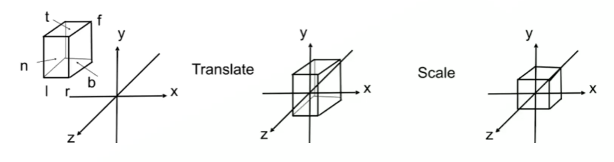

<!--more-->
## MVP变换

## Model Matrix

### 构建模型矩阵

模型矩阵由 先缩放矩阵 再旋转矩阵 再 平移矩阵构成

$$
\mathbf{ModelMatrix}=\mathbf{T}\cdot\mathbf{R}\cdot\mathbf{S}
$$

> 模型坐标系刚开始可以看作是和世界坐标系重合，经过模型矩阵运算的点，是在世界坐标下。 因此模型矩阵也可以看作世界矩阵

## View Matrix

### 构建视图矩阵

摄像机看向的方向默认为z轴负方向，右手坐标系

需已知

1. 摄像机位置$\mathbf{e}$（相对于世界坐标）
2. 摄像机看向的方向$\mathbf{g}$（相对于世界坐标）
3. 摄像机上方趋势向量（up向量）$\mathbf{t}$（相对于世界坐标）

$$
\mathbf{C_x}=cross(\mathbf{g}, \mathbf{t})
$$

$$
\mathbf{C_y}=corss(\mathbf{C_x}, \mathbf{g})
$$

$$
\mathbf{C_z}=-\mathbf{g}
$$

$$
\mathbf{Transform}=\begin{bmatrix}
1&0&0&-e_x\\
0&1&0&-e_y\\
0&0&1&-e_z\\
0&0&0&1
\end{bmatrix}
$$

$$
\mathbf{Rotation}^{-1}=\begin{bmatrix}
C_x.x& C_y.x& C_z.x& 0\\
C_x.y& C_y.y& C_z.y&0\\
C_x.z& C_y.z& C_z.z&0\\
0&0&0&1
\end{bmatrix}=\begin{bmatrix}
C_x.x& C_y.x& -g.x& 0\\
C_x.y& C_y.y& -g.y&0\\
C_x.z& C_y.z& -g.z&0\\
0&0&0&1
\end{bmatrix}
$$

故

$$
\mathbf{ViewMatrix}=\mathbf{Rotation}\cdot\mathbf{Transform}
$$

或者

$$
\mathbf{ViewMatrix}^{-1}=\begin{bmatrix}
C_x.x& C_y.x& C_z.x& e_x\\
C_x.y& C_y.y& C_z.y& e_y\\
C_x.z& C_y.z& C_z.z& e_z\\
0&0&0&1
\end{bmatrix}
$$

$$
\mathbf{ViewMatrix}=\begin{bmatrix}
C_x.x& C_y.x& C_z.x& e_x\\
C_x.y& C_y.y& C_z.y& e_y\\
C_x.z& C_y.z& C_z.z& e_z\\
0&0&0&1
\end{bmatrix}^{-1}=\begin{bmatrix}
C_x.x& C_x.x& C_x.x& -C_x.x\cdot e_x-C_x.y\cdot e_y-C_x.z\cdot\ e_z\\
C_Y.y& C_y.y& C_y.y& -C_y.x\cdot e_x-C_y.y\cdot e_y-C_y.z\cdot\ e_z\\
C_Z.z& C_z.z& C_z.z& -C_z.x\cdot e_x-C_z.y\cdot e_y-C_z.z\cdot\ e_z\\
0&0&0&1
\end{bmatrix}=\begin{bmatrix}
C_x.x& C_x.x& C_x.x& -\mathbf{C_x}\cdot \mathbf{e}\\
C_Y.y& C_y.y& C_y.y& -\mathbf{C_y}\cdot \mathbf{e}\\
C_Z.z& C_z.z& C_z.z& -\mathbf{C_z}\cdot \mathbf{e}\\
0&0&0&1
\end{bmatrix}=\begin{bmatrix}
C_x.x& C_x.x& C_x.x& -\mathbf{C_x}\cdot \mathbf{e}\\
C_Y.y& C_y.y& C_y.y& -\mathbf{C_y}\cdot \mathbf{e}\\
-g.x& -g.y& -g.z& \mathbf{g}\cdot \mathbf{e}\\
0&0&0&1
\end{bmatrix}
$$

> 若已知视图矩阵ViewMatrix，则可以推出Rotation Transform以及e, g ,t
>
> $$
> Transform = -ViewMatrix.inv()[:3,3]
> $$
>
> $$
> Rotation^{-1} = ViewMatrix.inv()[:3,:3]
> $$
>
> $$
> \mathbf{g}=-Rotation^{-1}[:,2]=ViewMatrix.inv()[:3,2]
> $$
>
> $$
> \mathbf{e}=-Transform=ViewMatrix.inv()[:3,3]
> $$
>
> $$
> \mathbf{t}=corss(Rotation^{-1}[:,0],g)
> $$

## 投影矩阵

默认视锥体的近平面n远平面f，上平面t 下平面b 左平面l，NDC坐标范围[-1,1]

$$
\begin{gathered}
\mathrm{M}_{ortho}=
\begin{pmatrix}
\frac{2}{r-l} & 0 & 0 & 0 \\
0 & \frac{2}{t-b} & 0 & 0 \\
0 & 0 & \frac{2}{n-f} & 0 \\
0 & 0 & 0 & 1
\end{pmatrix}
\begin{pmatrix}
1 & 0 & 0 & -\frac{r+l}{2} \\
0 & 1 & 0 & -\frac{t+b}{2} \\
0 & 0 & 1 & -\frac{n+f}{2} \\
0 & 0 & 0 & 1
\end{pmatrix}
\end{gathered}
$$

$$
\mathrm{M}_{perpective}=\begin{pmatrix}
\frac{2n}{r-l} & 0 & \frac{r+l}{r-l} & 0 \\
 \\
0 & \frac{2n}{t-b} & \frac{t+b}{t-b} & 0 \\
 \\
0 & 0 & \frac{-(f+n)}{f-n} & \frac{-2fn}{f-n} \\
 \\
0 & 0 & -1 & 0
\end{pmatrix}
$$

考虑对称 r+l = 0 r-l=2r t+b=0 t-b=2t

$$
\mathrm{M}_{perpective}=\begin{pmatrix}
\frac{n}{r} & 0 & 0 & 0 \\
 \\
0 & \frac{n}{t} & 0 & 0 \\
 \\
0 & 0 & \frac{-(f+n)}{f-n} & \frac{-2fn}{f-n} \\
 \\
0 & 0 & -1 & 0
\end{pmatrix}
$$