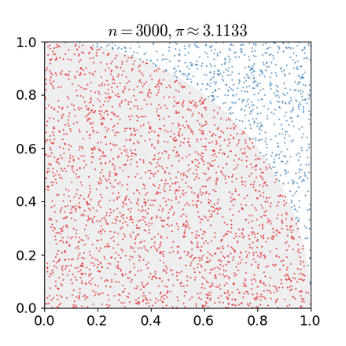

<!--more-->
## 随机变量函数的期望

+ 连续型随机变量

$$
\mathbb{E}_p(f(x))=\int p(x)f(x)dx
$$

+ 离散型随机变量

$$
\mathbb{E}_p(f(x))=\sum p(x)f(x)dx
$$

其中:

$x \sim p(x)$

## Monte Carlo 估计

通过对 $p(x)$ 进行采样，对样本进行计算求平均，来近似估计 $\mathbb{E}(f(x))$

$$
\mathbb{E}_p(f(x))\approx\frac{1}{n}\sum_{i=1}^nf(x_i)_{x_i\sim p(x)}
$$

### 例子

$f(x)=x$ 时：

数学期望

$$
\mathbb{E}_p(x)=\int p(x)xdx
$$

Monte Carlo估计

$$
\mathbb{E}_p(x)\approx\frac{1}{n}\sum_{i=1}^nx_i
$$

## Monte Carlo 积分

对于待求积分

$$
\int_a^bf(x)dx
$$

求该积分即求 $g(x)=\frac{f(x)}{p(x)}$ 的期望，即：

$$
\mathbb{E}(g(x))=\int p(x)g(x)dx=\int p(x)\frac{f(x)}{p(x)}dx=\int_a^bf(x)dx
$$

利用Monte Carlo 方法，可得：

$$
\mathbb{E}(g(x))=\int_a^bf(x)dx\approx\frac{1}{n}\sum_{i=1}^n\frac{f(x_i)}{p(x_i)}
$$

### 例子1

当 $x\sim U(a,b)$ 时（对积分域进行均匀采样），可得:

$$
\mathbb{E}(g(x))=\int_a^bf(x)dx\approx\frac{1}{n}\sum_{i=1}^n\frac{f(x_i)}{\frac{1}{b-a}}=\frac{b-a}{n}\sum_{i=1}^nf(x_i)
$$

### 例子2

$$
f(x,y)=
\left\{
    \begin{array}{cccc}
    1& x^2+y^2 \le 1\\
    0 & otherwise
    \end{array}
\right.
$$

积分

$$
\iint_{D}f(x,y)dxdy
$$

对积分区域D进行均匀采样 $p(x,y)=\frac{1}{D}$

$$
\iint_{D}f(x,y)dxdy = \iint_{D}\frac{f(x,y)}{p(x)}p(x)dxdy \approx \frac{D}{n}\sum_{i=1}^n\sum_{j=1}^nf(x_i,y_j)
$$

可以用该公式估算 $\pi$

> 一维、二维随机采样
>
> + 一维
>   一维随机采样，是对曲线沿线长进行均匀随即采样
>
> $$
> \frac{\int_a^xdl}{\int_a^bdl}=r
> $$
>
> 其中 $dl=\sqrt{(dx)^2+(dy)^2}=\sqrt{1+(\frac{dy}>{dx})^2} dx$
> 令 $r\sim p(x)$，可得 $x$ 的值( $x\sim p(x)$ )
>
> + 二维
>
> $$
> \frac{\int_a^xds}{\int_a^bds}=r
> $$

其中 $ds=\sqrt{(dydz)^2+(dzdx)^2+(dxdy)^2}=\sqrt{1+(\frac{dz}{dx})^2+(\frac{dz}{dy})^2}dxdy$

> 令 $r\sim p(x)$，可得 $(x,y)$ 的值( $(x,y)\sim p(x,y)$ )

## 重要性采样

> 重要性采样（Importance Sampling）是统计学中估计某一分布性质时使用的一种方法。该方法从与原分布不同的另一个分布中采样，而对原先分布的性质进行估计。

$$
\mathbb{E}(f(x))=\int p(x)f(x)dx = \int \frac{p(x)f(x)}{q(x)}q(x)dx \approx \frac{1}{n}\sum_{i=1}^n\frac{p(x)}{q(x)}f(x_i)_{x_i\sim q(x)} = \frac{1}{n}\sum_{i=1}^n\omega(x_i) f(x_i)_{x_i\sim q(x)}
$$

$q(x)$ 称为重要性分布，通过引入 $q(x)$ 来进行间接采样。 $\omega(x_i)= \frac{p(x)}{q(x)}$ 称为重要性权重。

### 例子

$$
\iint_{\Omega}cos\theta d\theta
$$

均匀采样

$$
\iint_{\Omega}cos\theta d\theta=\iint_{\Omega}\frac{cos\theta}{\frac{1}{2\pi}}\frac{1}{2\pi} d\theta\approx \frac{2\pi}{n}\sum_{i=1}^{n}cos\theta
$$

Cosine Weight重要性采样

$$
\iint_{\Omega}cos\theta d\theta=\iint_{\Omega}\frac{cos\theta}{\frac{cos\theta}{\pi}}\frac{cos\theta}{\pi} d\theta\approx \frac{\pi}{n}\sum_{i=1}^{n}1
$$