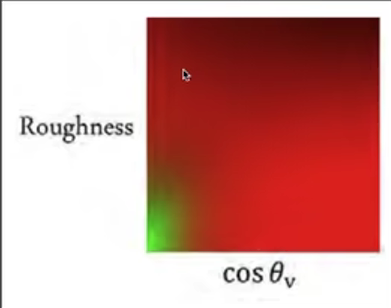
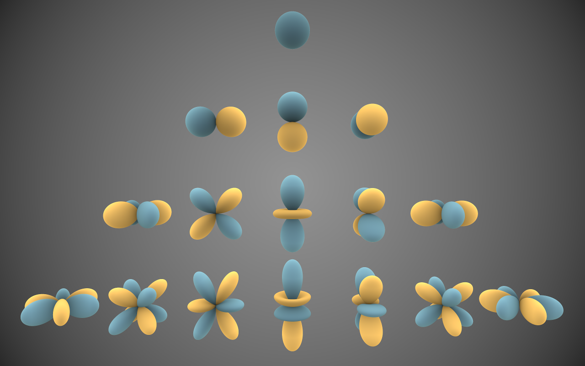
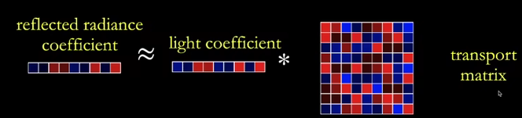

<!--more-->
# RTR Environment Mapping

用一张图像表示从四面八方来的光照，这张图像可以用cube map和spherical map

## Recall

光照模型可以分为`局部光照模型`和`全局光照模型`

### 1.局部光照模型

#### 1.1Lambert漫反射模型

#### 1.2Gourand光照模型

#### 1.3phong光照模型

#### 1.4Blinn-Phong模型

环境光+漫反射光+高光

#### 1.5Cook-Torrance模型

### 2.全局光照模型

#### 2.1光线追踪Ray Tracing

##### 2.1.1路径追踪Path Tracing

##### 2.1.2递归光线追踪Whitted-Style Ray Tracing

##### 2.1.3分布式光线追踪

##### 2.1.4双向路径追踪BDPT

##### 2.1.5光子映射Photon Mapping

##### 2.1.6米特罗波利斯光传输MLT

#### 2.2辐射度算法

## IBL(Image-Based Lighting) or Enviroment Lighting

如果对不带可见项渲染方程进行蒙特卡洛积分，非常慢(需要采样)

修改渲染方程：

$L\left(p, w_o\right) \approx \frac{\int_{\Omega^{f_r}} L\left(p, w_i\right) d w_i}{\int_{\Omega_{f_r}} d w_i} \cdot \int_{\Omega^{+}} f\left(p, w_i, w_o\right) \cos \theta_i d w_i$

由两部分组成一个Lighting项$\frac{\int_{\Omega^{f_r}} L\left(p, w_i\right) d w_i}{\int_{\Omega_{f_r}} d w_i} $一个是BRDF项$\int_{\Omega^{+}} f\left(p, w_i, w_o\right) \cos \theta_i d w_i$

Lighting项事先算好，属于prefiltering（类似于mipmap）需要用 的时候只用查一次即可。消除了采样过程。

BRDF项也是事先预计算，避免使用蒙特卡洛积分，消除采样过程。而BRDF可以写成带有菲涅尔项的Microfacet Material形式，而菲涅尔项又可以用Schlick近似，这样的形式依赖于R(0)、入射角、法线分布(粗糙度)，如果用这三个变量事先预计算一个表，不好算，因为有三个变量，就会有三个维度。那么就需要减少维度，就需要把一个或多个变量提到积分外面去。

那么就有如下形式：
$$\begin{gathered}\int_{\Omega^{+}} f\left(p, w_i, w_o\right) \cos \theta_i d w_i \approx R_0 \int_{\Omega^{+}} \frac{f\left(p, w_i, w_o\right)}{F_{\text {Schlick }}}\left(1-\left(1-\cos \theta_i\right)^5\right) \cos \theta_i d w_i+ \int_{\Omega^{+}} \frac{f\left(p, w_i, w_o\right)}{F_{\text {Schlick }}}\left(1-\cos \theta_i\right)^5 \cos \theta_i d w_i\end{gathered}$$

将$R_0$提到外面去，这样积分就只依赖于入射角和粗糙度，这样就可以事先用一张二维纹理（两个变量）记录算好的值，需要算积分的时候直接查表。

主要思想：用查表代替蒙特卡洛积分，避免采样提高速度，同时表的维度不能太高，如果太高就要一种办法降低变量个数

## Shadow from Environment Lighting

非常难，environment map可以认为很多光源的问题，那么就会有好多shadow map，花销太大

## PRT(Precomputed Radiance Transfer)

### 预备知识

#### 频率和过滤

filtering = getting rid of certain frequency contents

滤波=去掉一些对应频率上的内容

图像上做卷积操作等于频域上做乘法操作。

因此可以将$\int_{\Omega} f(x) g(y) \mathrm{d} x$看作是滤波操作。只要有一个是低频的结果就是低频的。

#### 基函数Basis Functions

A set of functions that can be used to represent other functions in general
$$
f(x)=\sum_i c_i \cdot B_i(x)
$$

傅里叶级数的sin cos就是一组基函数，类似的，多项式空间中$1,x^2,x^3...$也是一组基函数。

### Spherical Harmonics

一系列基函数$Y_{l}^m(\theta,\phi)$ $\theta$为方位角，$\phi$为极角，l为阶数，m为级数

球谐函数基函数相互正交

任何一个球面函数$f(x)$，可以立刻得到SH基函数的系数。(f(x)在基函数的投影)

$$c_i=\int_{\Omega}f(\omega)B_i(\omega)d\omega$$

当光照旋转后可以旋转基函数表示光照，不需要重新计算。这些旋转了的基函数可以用其对应的同阶基函数表示，这些同阶基函数也可以预先计算。

### PRT

$$L(\mathbf{o})=\int_{\Omega} L(\mathbf{i}) V(\mathbf{i}) \rho(\mathbf{i}, \mathbf{o}) \max (0, \boldsymbol{n} \cdot \mathbf{i}) \mathrm{d} \mathbf{i}$$

其中L(i)为lighting，$V(\mathbf{i}) \rho(\mathbf{i}, \mathbf{0}) \max (0, \boldsymbol{n} \cdot \mathbf{i})$为light trasnport

>light transport可以将基函数B(i)看作是L(i)，这样表示的是在基函数的光照下(把基函数当作环境光)，对应的结果

$L(i)\approx\sum l_iB_i$

$$L(\mathbf{o}) \approx \rho \sum l_i \int_{\Omega} \mathrm{B}_i(\mathbf{i}) V(\mathbf{i}) \max (0, \boldsymbol{n} \cdot \mathbf{i}) \mathrm{di}$$

$\int_{\Omega} \mathrm{B}_i(\mathbf{i}) V(\mathbf{i}) \max (0, \boldsymbol{n} \cdot \mathbf{i}) \mathrm{di}$可以预计算

$$L(\mathbf{o}) \approx \rho \sum l_i T_i$$

### diffuse glossy

$$L(\mathbf{o})=\int_{\Omega} L(\mathbf{i}) V(\mathbf{i}) \rho(\mathbf{i}, \mathbf{o}) \max (0, \boldsymbol{n} \cdot \mathbf{i}) \mathrm{d} \mathbf{i}$$

$$L(\mathbf{o})\approx\sum l_iT_i$$

不是lighting的项都是light tansport

在diffuse的情况下，$T_i$是个常数

$T_i = V(\mathbf{i}) \rho(\mathbf{i}, \mathbf{0}) \max (0, \boldsymbol{n} \cdot \mathbf{i})$

在glossy的情况下，$T_i$是o的函数$T_i(o)$，再次投影到球谐函数

$$L(\mathbf{o})\approx\sum(\sum l_it_{ij})B_j(o)$$

$T_i(o)=\sum t_{ij}B_j(o)$

对每一个o记录一个向量，因此用矩阵存储

### Limitations

1. PRT只能描述一些低频的信息，对于光滑的物体只能提高球谐函数的阶数去计算，去提高频率。但是对于接近镜面反射的物体，PRT是解决不了的。

2. 由于预计算（光照是动态的，不同o都有对应的预计算结果），场景/材质是静态的，不能更改场景/材质。

3. 大量预计算的数据，存储较大。

>各种各样的基函数
>
>1. Spherical harmonics
>2. Wavelet 既可以表示低频也可以表示高频，压缩率大。不支持光源旋转
>3. Zonal
>4. Spherical Gaussian
>5. Piecewise Constant