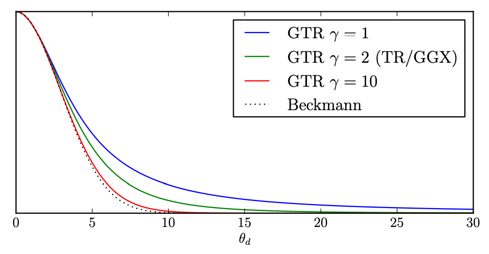

<!--more-->
## PBR 和 PBR Materials

PBR everything in rendering should be physically based.

PBR not just materials but usually referred to as materials

## 对于表面

microfacet models and Disney principed BRDFs(artist friendly but still not PBR)

### Microfacet BRDF

$f(\mathbf{i}, \mathbf{o})=\frac{\mathbf{F}(\mathbf{i}, \mathbf{h}) \mathbf{G}(\mathbf{i}, \mathbf{o}, \mathbf{h}) \mathbf{D}(\mathbf{h})}{4(\mathbf{n}, \mathbf{i})(\mathbf{n}, \mathbf{o})}$

## Normal Distribution Funtion(NDF)(D项)

### Beckmann NDF

$D(h)=\frac{e^{-\frac{\tan ^2 \theta_h}{\alpha^2}}}{\pi \alpha^2 \cos ^4 \theta_h}$

$\alpha$描述的是法线粗糙程度，粗糙程度这个值越小，表面就越光滑

$\theta_h$描述微表面半程向量法线与宏观表面法线方向n的夹角

$tan\theta$定义在了slope space上

### GGX

$D(h)=\frac{\alpha^2}{\pi\left((\mathbf{n} \cdot \mathbf{h})^2\left(\alpha^2-1\right)+1\right)^2}$

$\alpha=roughness^2$

long tail

### GTR（Extending GGX）

$\mathbf{D}(h)=\frac{k(\alpha, \gamma)}{\left(1+(\mathbf{n} \cdot \mathbf{h})^2\left(\alpha^2-1\right)\right)^\gamma}$

even longer tails



## Shadowing-Masking Term(G项)

几何函数项G考虑微平面之间的相互遮挡现象。对于遮挡的情况要对其变暗。

$$
k=\frac{(roughness+1)^2}{8}
$$

$$
G_{Schlick}(\mathbf{n},\mathbf{v})=\frac{\mathbf{n} \cdot \mathbf{v}}{\mathbf{n} \cdot \mathbf{v}(1-k)+k}
$$

$$
G_{Smith}(\mathbf{i},\mathbf{o},\mathbf{h})=G_{Schlick}(\mathbf{\mathbf{i}},\mathbf{h})G_{Schlick}(\mathbf{v},\mathbf{h})
$$

## Fresnel(F项)

$$
F=R_0+(1-R_0)(1-\cos\theta)^5
$$

$R_0$为基础反射率$\theta$是观察方向与半程向量的夹角

$$
\cos\theta =\mathbf{o} \cdot \mathbf{h}
$$

> 网上有些资料说是法线和观察方向的点乘。不过[learnopengl](https://learnopengl.com/PBR/Theory)和维基百科说是半程和观察方向。相信权威

## Kulla-Conty BRDF

粗糙的微表面会造成光线多次bonce，造成能量损失，因此需要补充能量。

$$
E(\omega_o)=\int_0^{2\pi}\int_{-\frac{\pi}{2}}^{\frac{\pi}{2}}f_r(\omega_o,\omega_i)\cos\theta\sin\theta d\theta d\phi
$$

令 $ \mu=\sin\theta $ 即:

$$
E(\omega_o)=\int_0^{2\pi}\int_{0}^{1}f_r(\omega_o,\omega_i)\mu d\mu d\phi
$$

入射的randice假设为1，则反射的总能量也应为1。故需要补充 $ 1-E(\omega_o) $

因此设计一个用于补充能量损失的BRDF

$$
f_{ms}(\omega_o,\omega_i)=\frac{(1-E(\omega_o)(1-E(\omega_i)))}{\pi(1-E_{avg})}
$$

$$
E_{avg}=2\int_0^1 E(\omega)\mu d\mu
$$

上述都是在假设物体没有颜色的情况。但物体的颜色实际为能量的吸收=能量损失一部分。

因此补充color term

$$
\frac{F_{avg}E_{avg}}{1-F_{avg}(1-E_{avg})}
$$

其中$F_{avg}$是平均菲涅尔项

$$
F_{avg}=\frac{\int_0^1F(\mu)\mu d\mu}{\int_0^1\mu d\mu}=2\int_0^2F(\mu) d\mu
$$

因此，最终的BRDF为

$$
\frac{F_{avg}E_{avg}}{1-F_{avg}(1-E_{avg})} f_{ms}
$$

## Disney Principle BRDF

subsurface 次表面散射

metallic

specular

specular tint 表面反射出来的颜色

roughness

anisotropic 各向异性

sheen

sheen tint

clearcoat

clearcoatGloss

## 具体实现

对于一个光源通常存储它的radiance intensity $I$ 和 位置

那对于一个shading point来说，进行PBR渲染需要知道该点的$f_r$和irradiance$E$，然后得出

$$
L_o=\int_E f_rdE \approx \sum_{E_i}^{E_n}f_rE_i
$$

因此就涉及$I$转换到$E$

已知

$$
dE=\frac{d\phi}{dA}
$$

$$
dI=\frac{d\phi}{d\omega}
$$

而

$$
d\omega=\frac{dAcos\theta}{r^2}
$$

> 这里$cos\theta$考虑了dA在光线方向的投影，就是原始方程$\int_\Omega f_rL_icos\theta d\omega$里的$cos\theta$，$L_icos\theta d\omega=dE$只不过这里由于单位球体所以r=1

因此

$$
dE=\frac{d\phi}{dA}=\frac{d\phi cos\theta}{r^2d\omega}=\frac{dIcos\theta}{r^2}
$$

> 对于计算radiance flux $\phi$
>
> $$
> \phi=dEdA=\frac{dIcos\theta}{r^2} \times dA
> $$
>
> 通常假设$dA =  1$

### 代码

```python
class Light:
    light_color = (1,2,3) #radiance intensity
    light_position = (1,2,3)
    light_intensity = 1 #控制强度大小的缩放因子
light = Light()
attenuation = 1.0 / (distance * distance)
E = light.light_color * light.light_intensity * dot(N, direction_i) * attenuation 

```

> 一些代码里直接将E=radiance是因为对于shading point来说只有一个光源，而irradiance是所有方向的radiance的和，因此只有一个光源的情况下radiance = irradiacne