<!--more-->
# Shadow

## shadow mapping

### 算法

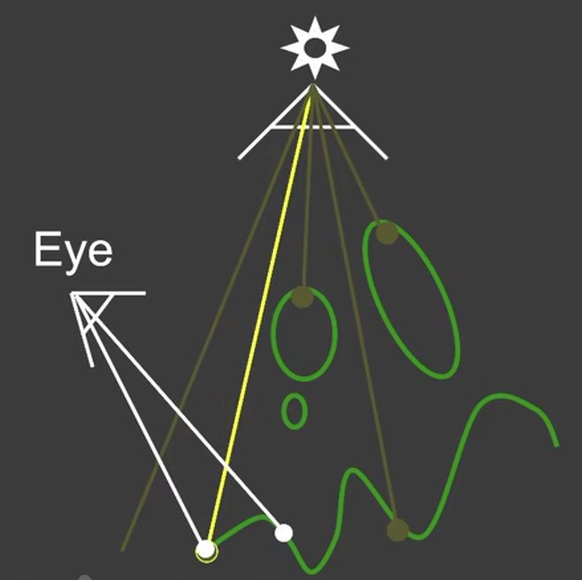

是两趟的算法

第一趟，从点光源出发渲染出一张图(记录像素点出发最近物体点的深度信息)，shadow map

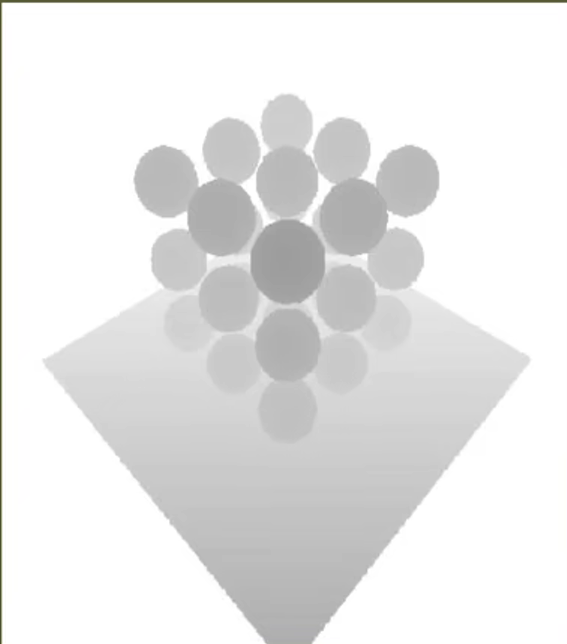

第二趟，从相机位置，结合shadow map，渲染出一张图，这张图包含阴影。

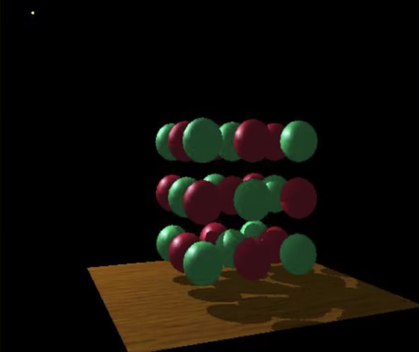

### 优缺点

#### 1.不需要场景的几何信息，shadow map只是一张图，拿来就能用

#### 2.导致自遮挡和走样

##### 自遮挡现象

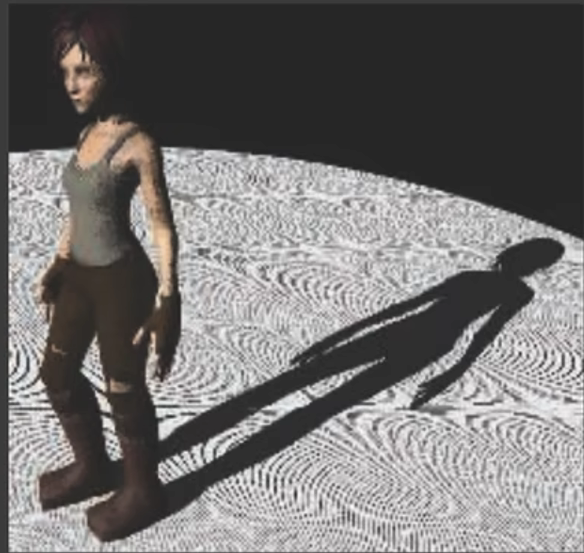
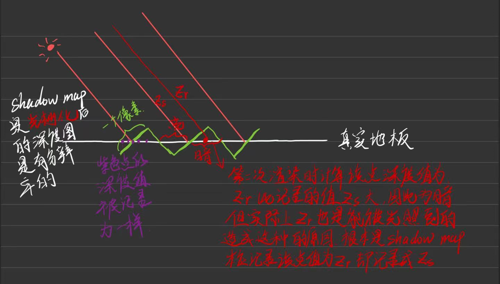
自遮挡：由于shadow map是有分辨率的（它是光栅化后的深度图）因此其一个像素对应真实场景的一个面片，这些面片上的点记录的深度值都是一样的，但实际上这些值不应该一样，因此造成明暗交替的现象。光源与物体越平行，这种现象越严重。

**解决自遮挡：**

1. 深度偏移bias：

    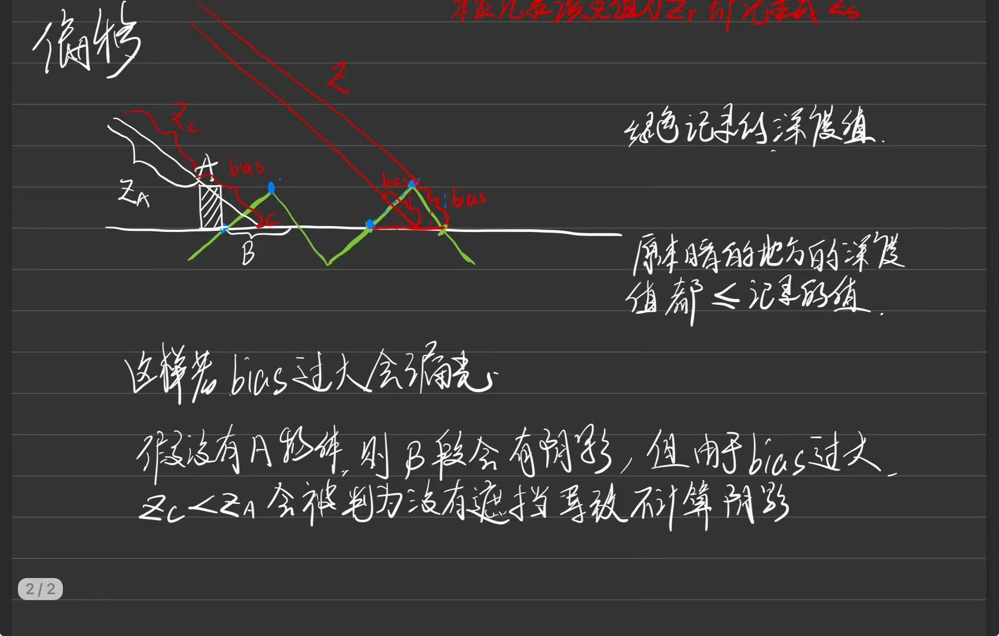

    但bias过大会导致漏光现象

    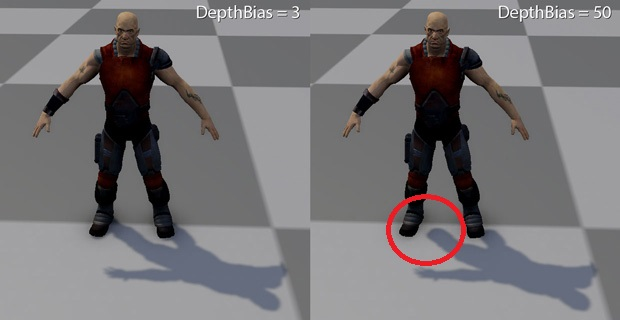

2. second-depth shadow mapping (实际没有人用)
    记录多个深度，除了第一个深度，还要储存次小深度

#### 3.非常知名

## PCSS(Percentage closer soft shadows)用法最多

shadow mapping 给的是硬阴影，PCSS 给的是软阴影

>回顾渲染方程
$L_o\left(\mathrm{p}, \omega_o\right)=\int_{\Omega^{+}} L_i\left(\mathrm{p}, \omega_i\right) f_r\left(\mathrm{p}, \omega_i, \omega_o\right) \cos \theta_i V\left(\mathrm{p}, \omega_i\right) \mathrm{d} \omega_i$
其中V为visibility项
这个方程近似于（证明略，拿来用就行）
$L_o\left(\mathrm{p}, \omega_o\right) \approx \frac{\int_{\Omega^{+}} V\left(\mathrm{p}, \omega_i\right) \mathrm{d} \omega_i}{\int_{\Omega^{+}} \mathrm{d} \omega_i} \cdot \int_{\Omega^{+}} L_i\left(\mathrm{p}, \omega_i\right) f_r\left(\mathrm{p}, \omega_i, \omega_o\right) \cos \theta_i \mathrm{~d} \omega_i$
因此若要计算阴影，可以先做正常的shading(右边积分项)，然后把可见项(左边分数项)乘上即可。

> PCF(Percentage closer filtering)是做阴影抗锯齿的，但是也可以生成软阴影，filter约小越锐利（为1x1的时候一点抗锯齿都没有），filter越大阴影约模糊。
> 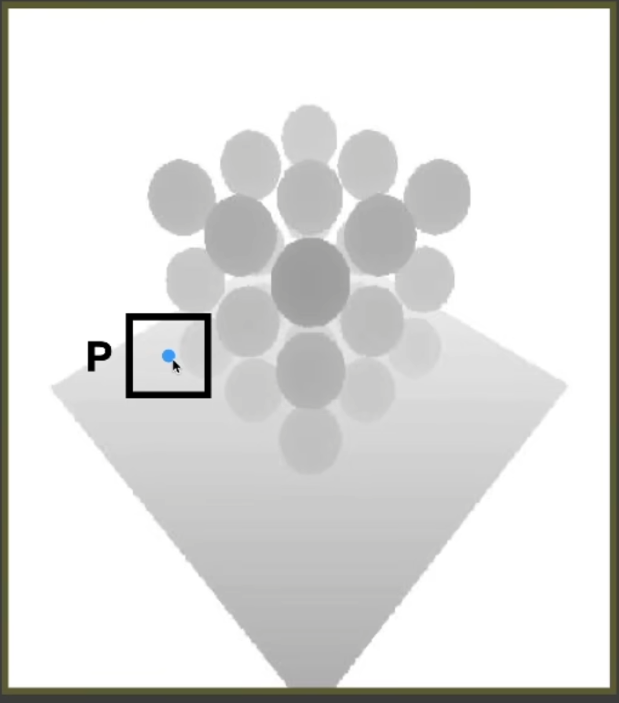
> 在shading point对应的shadow map上取一个框(eg.3x3)会得到一个矩阵$\begin{bmatrix}
    1&0&1\\
    1&0&1\\
    1&1&0
\end{bmatrix}$
对其取平均0.667即为visibility，再乘以正常shading的结果得到阴影。
$V(x)=\sum_{q \in \mathcal{N}(p)} w(p, q) \cdot \chi^{+}\left[D_{\mathrm{SM}}(q)-D_{\text {scene }}(x)\right]$
`注意`：`PCF并不是直接对shadow map做filtering，而是对shading point对应shadow map的点的周围一些点的深度值做filtering。`若直接对shadow map做filtering结果还是有锯齿的。$V(x) \neq \chi^{+}\left\{\left[w * D_{\mathrm{SM}}\right](q)-D_{\text {scene }}(x)\right\}$

**如果根据不同位置（blocker distance）的阴影取不同大小的filter（离遮挡物越远的阴影filter越大）做PCF，这便是PCSS。PCSS用了PCF的思想。**

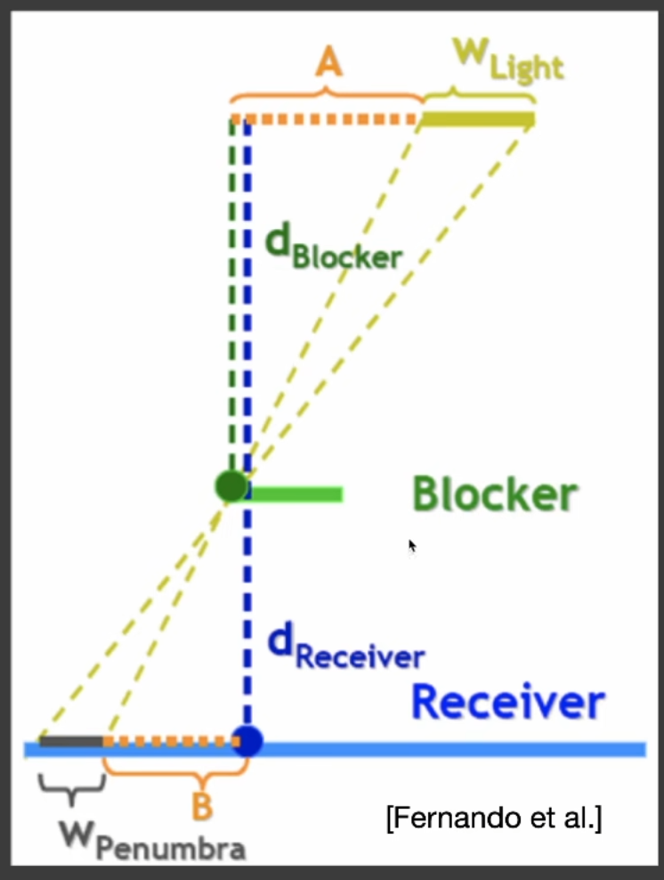

其中$W_{Penumbra}$为半影范围也就是filter的大小，越大阴影越软。Blocker离Light越近$W_{Penumbra}$越大，离Receiver越近$W_{Penumbra}$越小
对于一个面光源来说其shadow map是按点光源生成的，点光源在中心位置。
$$
W_{\text {Penumbra }}=\left(d_{\text {Receiver }}-d_{\text {Blocker }}\right) \cdot W_{\text {Light }} / d_{\text {Blocker }}
$$

流程：

1. Blocker search(速度慢) 
得到遮挡物的平均深度
对一个shading point来说，可以对其对应的ShadowMap的点的一定范围内进行多重采样，每次采样得到的深度若小于$d_{Receiver}$则认为遇到遮挡物并算入平均遮挡深度的贡献，这样多重采样之后得的平均遮挡深度就作为$d_{Blocker}$，采样的范围半径为
$R_{\text {blockersearch }}=W_{\text {Light }} \cdot d_{\text {Receiver }} \cdot c$，c为常数，控制采样范围。
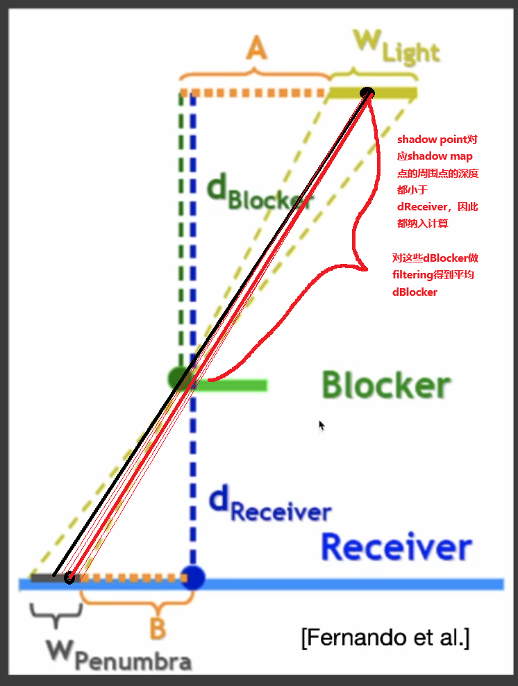
2. Penumbra estimate
根据遮挡物的平均深度，决定filter的大小
3. Percentage closer filtering(速度慢)

## VSSM(Variance Soft Shadow Mapping)

由于上述第一步和第三步都需要多重采样，因此速度会慢。那VSSM就是解决这两个问题。

### 解决第三步

可以用高斯分布的CFD或切比雪夫不等式

具体方法：

有了filter大小用来计算可见项大小，需要在shadow map上遍历filter大小的纹素，去算平均。但是如果我们已经知道有百分之多少的点对应的深度会被遮挡，那么就能直接得到可见项大小。

可以假设filter对应的shadow map大小的区域的深度值符合正态分布，使用一维高斯分布来估算可见项大小。

那如何确定高斯分布的均值和方差？

均值:1.mipmap 2.SAT

>一维情况下，SAT表对应的算法是前缀和
>
>二维情况下，SAT表是以左上角为起点的矩形范围的和

方差:$\operatorname{Var}(X)=\mathrm{E}\left(X^2\right)-\mathrm{E}^2(X)$

由此可以算出某一个shading point对应shadow map中的点的周围点(尺寸为filter大小)中有百分之多少概率的深度值大于shading point对应的深度值即为可见项的大小。

上述“百分之多少概率的深度值”可以用CDF计算近似

#### 进一步思考

我们只是要得到“百分之多少概率的深度值大于”那不管它什么分布，可以直接用切比雪夫不等式估计（只需要知道期望和方差）$P(x>t) \leq \frac{\sigma^2}{\sigma^2+(t-\mu)^2}$

### 解决第一步

我们想要计算遮挡物的平均深度$d_{Blocker}$(蓝色部分)

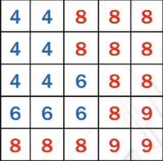

这个采样范围是由 $R_{\text {blockersearch }}=W_{\text {Light }} \cdot d_{\text {Receiver }} \cdot c$ 计算得到的

$\frac{N_1}{N} z_{u n o c c}+\frac{N_2}{N} z_{o c c}=z_{\text {Avg }}$
我们想要得到$z_{o c c}$(遮挡物的平均深度)，需要$\frac{N_1}{N}$的大小和$z_{u n o c c}$的大小。
那么可以估算:

1. $\frac{N_1}{N}$可与由切比雪夫不等式计算得到（有多少纹素要比当前深度大）
2. $z_{u n o c c}=t$ t为shading point对应的深度，因为绝大多数阴影接收者是个平面。

那么就可以计算$z_{o c c}$

## Moment shadow mapping

解决ＶＳＳＭ的问题

## Distance field soft shadows

使用SDF计算软阴影。

SDF上任意一点的值表示，以该点为球心，该值为半径的球不会触碰到任何物体。称这距离为安全距离

进一步，从shading point出发一条ray，可以求出“安全角度”，用安全角度估算可见项。
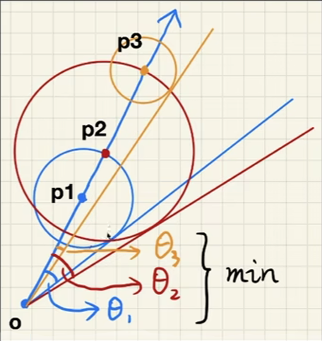

可见项大小

$\arcsin \frac{\operatorname{SDF}(p)}{p-o}$

近似于

$\min \left\{\frac{k \cdot \operatorname{SDF}(p)}{p-o}, 1.0\right\}$

其中K控制阴影的软硬程度。

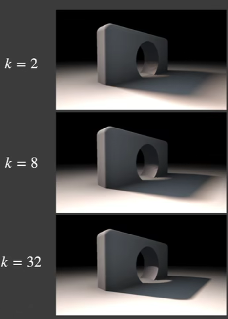