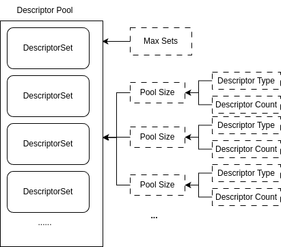
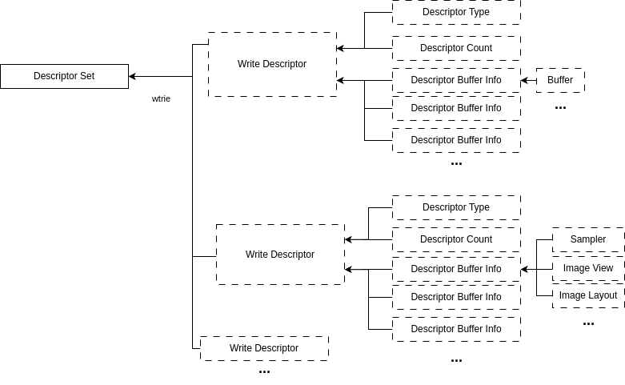

## Descriptor Pool



```cpp
vk::DescriptorPoolCreateInfo descriptorPoolCreateInfo;
    descriptorPoolCreateInfo
        .setPoolSizes({poolSize1, poolSize2, ...}) // 设置池中各类描述符的数量
        .setMaxSets(maxDescriptorSize)   // 设置池最多可分配的 Descriptor Set 数量
        .setFlags(vk::DescriptorPoolCreateFlagBits::eFreeDescriptorSet); // 设置池的标志位, 允许单个descriptor释放，而不是通过释放pool去释放descriptor
```

## Descriptor Set


一个DescriptorSetLayout对应一个DescriptorSet，定义其Descriptor的binding、type(UniformBuffer、 CombinedImageSampler...)和count(`layout(set=0, binding=0) uniform UniformBuffer { mat4 mvp; } ubos[5];`)

```cpp
vk::DescriptorSetAllocateInfo descriptorSetAllocateInfo;
descriptorSetAllocateInfo.setDescriptorPool(descriptorPool)
    .setDescriptorSetCount(descriptorSetCount)
    .setSetLayouts({descriptorSetLayout1,descriptorSetLayout2, ...});
```

```cpp
vk::DescriptorSetLayoutCreateInfo descriptorSetLayoutCreateInfo{};
descriptorSetLayoutCreateInfo.setBindings({descriptorSetLayoutBinding1, descriptorSetLayoutBinding2, ...}); 
```

## Update Descriptor



这里的Descriptor count要和Layout定义的一致

```cpp
vk::DescriptorBufferInfo descriptorBufferInfo1;
descriptorBufferInfo1.setBuffer(uniformBuffer)
    .setOffset(0)
    .setRange(size);
...

vk::WriteDescriptorSet writer;
writer.setBufferInfo({descriptorBufferInfo1, descriptorBufferInfo2, ...})
    .setDescriptorType(vk::DescriptorType::eUniformBuffer)
    .setDescriptorCount(descriptorCount)
    .setDstArrayElement(0)
    .setDstBinding(binding)
    .setDstSet(dstSet);
```

```cpp
vk::DescriptorImageInfo descriptorImageInfo1;
descriptorImageInfo1.setSampler(sampler)
    .setImageView(imageView)
    .setImageLayout(vk::ImageLayout::eShaderReadOnlyOptimal);
...

vk::WriteDescriptorSet writer;
writer.setImageInfo({descriptorImageInfo1, descriptorImageInfo2, ...})
    .setDescriptorType(vk::DescriptorType::eCombinedImageSampler)
    .setDescriptorCount(descriptorCount)
    .setDstArrayElement(0)
    .setDstBinding(binding)
    .setDstSet(dstSet);
```