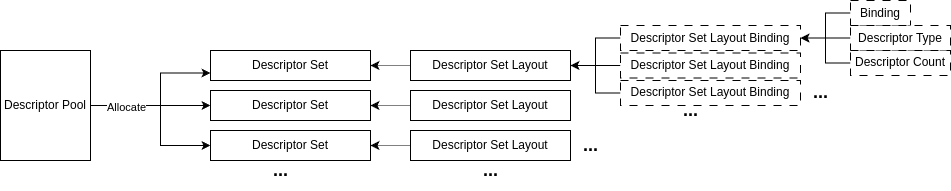

## Descriptor

### Descriptor Pool


```cpp
vk::DescriptorPoolCreateInfo descriptorPoolCreateInfo;
    descriptorPoolCreateInfo
        .setPoolSizes({poolSize1, poolSize2, ...}) // 设置池中各类描述符的数量
        .setMaxSets(maxDescriptorSize)   // 设置池最多可分配的 Descriptor Set 数量
        .setFlags(vk::DescriptorPoolCreateFlagBits::eFreeDescriptorSet); // 设置池的标志位, 允许单个descriptor释放，而不是通过释放pool去释放descriptor
```

### Descriptor Set



一个DescriptorSetLayout对应一个DescriptorSet，定义其Descriptor的binding、type(UniformBuffer、 CombinedImageSampler...)和count(`layout(set=0, binding=0) uniform UniformBuffer { mat4 mvp; } ubos[5];`)

```cpp
vk::DescriptorSetAllocateInfo descriptorSetAllocateInfo;
descriptorSetAllocateInfo.setDescriptorPool(descriptorPool)
    .setDescriptorSetCount(descriptorSetCount)
    .setSetLayouts({descriptorSetLayout1,descriptorSetLayout2, ...});
```

```cpp
vk::DescriptorSetLayoutCreateInfo descriptorSetLayoutCreateInfo{};
descriptorSetLayoutCreateInfo.setBindings({descriptorSetLayoutBinding1, descriptorSetLayoutBinding2, ...}); 
```

### Update Descriptor


这里的Descriptor count要和Layout定义的一致

```cpp
vk::DescriptorBufferInfo descriptorBufferInfo1;
descriptorBufferInfo1.setBuffer(uniformBuffer)
    .setOffset(0)
    .setRange(size);
...

vk::WriteDescriptorSet writer;
writer.setBufferInfo({descriptorBufferInfo1, descriptorBufferInfo2, ...})
    .setDescriptorType(vk::DescriptorType::eUniformBuffer)
    .setDescriptorCount(descriptorCount)
    .setDstArrayElement(0)
    .setDstBinding(binding)
    .setDstSet(dstSet);
```

```cpp
vk::DescriptorImageInfo descriptorImageInfo1;
descriptorImageInfo1.setSampler(sampler)
    .setImageView(imageView)
    .setImageLayout(vk::ImageLayout::eShaderReadOnlyOptimal);
...

vk::WriteDescriptorSet writer;
writer.setImageInfo({descriptorImageInfo1, descriptorImageInfo2, ...})
    .setDescriptorType(vk::DescriptorType::eCombinedImageSampler)
    .setDescriptorCount(descriptorCount)
    .setDstArrayElement(0)
    .setDstBinding(binding)
    .setDstSet(dstSet);
```

## Vulkan Pipeline


1. 通用管线阶段
   + eTopOfPipe: 管线的逻辑起点，无实际操作。
   + eBottomOfPipe: 管线的逻辑终点，无实际操作。
   + eAllGraphics: 所有图形管线阶段的集合（包括顶点处理、片段处理等）。
   + eAllCommands: 所有命令的集合（包括图形、计算、传输等）。
   + eNone / eNoneKHR: 表示无特定阶段，通常用于占位或禁用。
2. 图形管线阶段
   + eDrawIndirect: 间接绘制命令（如 vkCmdDrawIndirect）。
   + eVertexInput: 顶点数据输入（顶点缓冲区读取、索引缓冲区等）。
   + eVertexShader: 顶点着色器执行。
   + eTessellationControlShader: 细分控制着色器（Tessellation）。
   + eTessellationEvaluationShader: 细分评估着色器。
   + eGeometryShader: 几何着色器。
   + eFragmentShader: 片段着色器。
   + eEarlyFragmentTests: 早期片段测试（深度测试、模板测试）。
   + eLateFragmentTests: 后期片段测试。
   + eColorAttachmentOutput: 颜色附件输出（写入渲染目标）。
3. 计算管线阶段
   + eComputeShader: 计算着色器执行。
4. 传输阶段
   + eTransfer: 传输操作（如 vkCmdCopyBuffer、vkCmdCopyImage）。
5. 主机阶段
   + eHost: 主机操作（如主机内存访问或同步）。
6. 扩展相关阶段
   + eTransformFeedbackEXT: 变换反馈（扩展 VK_EXT_transform_feedback）。
   + eConditionalRenderingEXT: 条件渲染（扩展 VK_EXT_conditional_rendering）。
   + eAccelerationStructureBuildKHR / eAccelerationStructureBuildNV: 加速结构构建（光线追踪，扩展 VK_KHR_acceleration_structure 或 VK_NV_acceleration_structure）。
   + eRayTracingShaderKHR / eRayTracingShaderNV: 光线追踪着色器（扩展 VK_KHR_ray_tracing_pipeline 或 VK_NV_ray_tracing）。
   + eFragmentDensityProcessEXT: 片段密度处理（扩展 VK_EXT_fragment_density_map）。
   + eFragmentShadingRateAttachmentKHR / eShadingRateImageNV: 片段着色率/着色率图像（扩展 VK_KHR_fragment_shading_rate 或 VK_NV_shading_rate_image）。
   + eCommandPreprocessNV / eCommandPreprocessEXT: 命令预处理（扩展 VK_NV_device_generated_commands 或 VK_EXT_device_generated_commands）。
   + eTaskShaderEXT / eTaskShaderNV: 任务着色器（网格着色管线，扩展 VK_EXT_mesh_shader 或 VK_NV_mesh_shader）。
   + eMeshShaderEXT / eMeshShaderNV: 网格着色器（扩展 VK_EXT_mesh_shader 或 VK_NV_mesh_shader）。
   >这些阶段依赖特定的 Vulkan 扩展，通常与高级功能（如光线追踪、网格着色等）相关。

| AccessFlagBits                              | 描述                                                                 | 对应的 PipelineStageFlagBits                                                                 |
|---------------------------------------------|----------------------------------------------------------------------|---------------------------------------------------------------------------------------------|
| `eIndirectCommandRead`                      | 间接命令缓冲区读取（如绘制或调度参数）                               | `eDrawIndirect`, `eAccelerationStructureBuildKHR`, `eAccelerationStructureBuildNV`           |
| `eIndexRead`                                | 索引缓冲区读取                                                       | `eVertexInput`                                                                              |
| `eVertexAttributeRead`                      | 顶点属性缓冲区读取                                                   | `eVertexInput`                                                                              |
| `eUniformRead`                              | 统一缓冲区或纹理读取（着色器访问）                                   | `eVertexShader`, `eTessellationControlShader`, `eTessellationEvaluationShader`, `eGeometryShader`, `eFragmentShader`, `eComputeShader`, `eRayTracingShaderKHR`, `eRayTracingShaderNV`, `eTaskShaderEXT`, `eTaskShaderNV`, `eMeshShaderEXT`, `eMeshShaderNV` |
| `eInputAttachmentRead`                      | 输入附件读取（在片段着色器中）                                       | `eFragmentShader`                                                                           |
| `eShaderRead`                               | 着色器读取（包括采样器、图像、缓冲区等）                             | `eVertexShader`, `eTessellationControlShader`, `eTessellationEvaluationShader`, `eGeometryShader`, `eFragmentShader`, `eComputeShader`, `eRayTracingShaderKHR`, `eRayTracingShaderNV`, `eTaskShaderEXT`, `eTaskShaderNV`, `eMeshShaderEXT`, `eMeshShaderNV` |
| `eShaderWrite`                              | 着色器写入（包括图像、缓冲区等）                                     | `eVertexShader`, `eTessellationControlShader`, `eTessellationEvaluationShader`, `eGeometryShader`, `eFragmentShader`, `eComputeShader`, `eRayTracingShaderKHR`, `eRayTracingShaderNV`, `eTaskShaderEXT`, `eTaskShaderNV`, `eMeshShaderEXT`, `eMeshShaderNV` |
| `eColorAttachmentRead`                      | 颜色附件读取（渲染目标）                                             | `eColorAttachmentOutput`                                                                    |
| `eColorAttachmentWrite`                     | 颜色附件写入（渲染目标）                                             | `eColorAttachmentOutput`                                                                    |
| `eDepthStencilAttachmentRead`               | 深度/模板附件读取                                                    | `eEarlyFragmentTests`, `eLateFragmentTests`                                                  |
| `eDepthStencilAttachmentWrite`              | 深度/模板附件写入                                                    | `eEarlyFragmentTests`, `eLateFragmentTests`                                                  |
| `eTransferRead`                             | 传输操作读取（如拷贝缓冲区、图像）                                   | `eTransfer`                                                                                 |
| `eTransferWrite`                            | 传输操作写入（如拷贝缓冲区、图像）                                   | `eTransfer`                                                                                 |
| `eHostRead`                                 | 主机读取（CPU 访问设备内存）                                         | `eHost`                                                                                     |
| `eHostWrite`                                | 主机写入（CPU 写入设备内存）                                         | `eHost`                                                                                     |
| `eMemoryRead`                               | 通用内存读取（不特定于某个阶段）                                     | 任何阶段（`eAllCommands` 等）                                                                |
| `eMemoryWrite`                              | 通用内存写入（不特定于某个阶段）                                     | 任何阶段（`eAllCommands` 等）                                                                |
| `eNone` / `eNoneKHR`                        | 无特定访问类型（占位符）                                             | 任何阶段（通常与 `eNone` 或无阶段关联）                                                      |
| `eTransformFeedbackWriteEXT`                | 变换反馈写入（扩展）                                                 | `eTransformFeedbackEXT`                                                                     |
| `eTransformFeedbackCounterReadEXT`          | 变换反馈计数器读取（扩展）                                           | `eDrawIndirect`                                                                             |
| `eTransformFeedbackCounterWriteEXT`         | 变换反馈计数器写入（扩展）                                           | `eTransformFeedbackEXT`                                                                     |
| `eConditionalRenderingReadEXT`              | 条件渲染缓冲区读取（扩展）                                           | `eConditionalRenderingEXT`                                                                   |
| `eColorAttachmentReadNoncoherentEXT`        | 非一致性颜色附件读取（扩展）                                         | `eColorAttachmentOutput`                                                                    |
| `eAccelerationStructureReadKHR` / `eAccelerationStructureReadNV` | 加速结构读取（光线追踪，扩展）                     | `eComputeShader`, `eRayTracingShaderKHR`, `eRayTracingShaderNV`, `eAccelerationStructureBuildKHR`, `eAccelerationStructureBuildNV` |
| `eAccelerationStructureWriteKHR` / `eAccelerationStructureWriteNV` | 加速结构写入（光线追踪，扩展）                   | `eAccelerationStructureBuildKHR`, `eAccelerationStructureBuildNV`                            |
| `eFragmentDensityMapReadEXT`                | 片段密度图读取（扩展）                                               | `eFragmentDensityProcessEXT`                                                                 |
| `eFragmentShadingRateAttachmentReadKHR` / `eShadingRateImageReadNV` | 片段着色率/着色率图像读取（扩展）                | `eFragmentShadingRateAttachmentKHR`, `eShadingRateImageNV`                                   |
| `eCommandPreprocessReadNV` / `eCommandPreprocessReadEXT` | 命令预处理读取（扩展）                               | `eCommandPreprocessNV`, `eCommandPreprocessEXT`                                              |
| `eCommandPreprocessWriteNV` / `eCommandPreprocessWriteEXT` | 命令预处理写入（扩展）                             | `eCommandPreprocessNV`, `eCommandPreprocessEXT`                                              |

## CommandBuffer

### State

