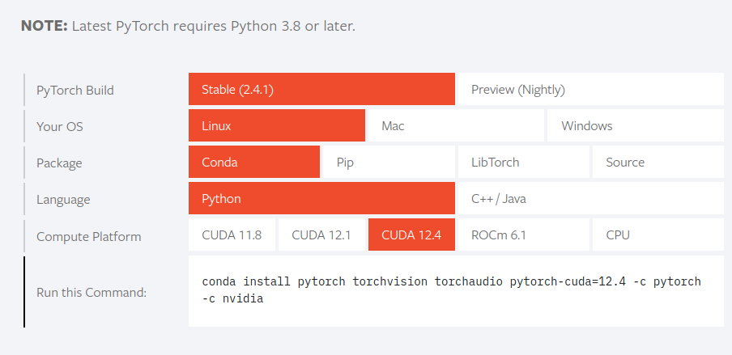

使用conda安装完整的cudatoolkit，非真实环境安装的。
<!--more-->
## conda安装带有编译工具nvcc的完整cudatoolkit

> 请先阅读[注意事项](#注意事项) ！！！！！！！！！！！！！！！

```bash
conda install cuda -c nvidia/label/cuda-12.6.0
```

+ 可以根据当前显卡驱动版本选择合适的版本号
+ 一定要带上channel，**带上的channel是最高优先级**

> 注意: 如果在conda环境外面安装的cudatoolkit要把 `.bashrc`的 `export PATH=/usr/local/cuda/bin:$PATH export LD_LIBRARY_PATH=/usr/local/cuda/lib64:$LD_LIBRARY_PATH`放在 `conda initialize`的前面，防止conda环境外面的cuda环境变量排在conda的cuda环境变量前面。

版本号可以参考[nvidia](https://anaconda.org/nvidia) / [packages ](https://anaconda.org/nvidia/repo)/ [**cuda**](https://anaconda.org/nvidia/cuda)

**版本号一定要和pytoch的cuda版本号对应**



```bash
conda install pytorch torchvision torchaudio pytorch-cuda=xx.xx -c pytorch -c nvidia
```

## 安装gcc与g++

`conda install gcc=版本号 gxx=版本号`

gcc具体版本可以参考[conda-forge](https://anaconda.org/conda-forge) / [packages ](https://anaconda.org/conda-forge/repo)/ [**gcc**](https://anaconda.org/conda-forge/gcc/files)

> 注意：cuda的版本要和gcc的版本兼容，请在 `.condarc`中添加 `conda-forge`频道，且优先级最低

| CUDA version                    | max supported GCC version |
| ------------------------------- | ------------------------- |
| 12.4, 12.5                      | 13.2                      |
| 12.1, 12.2, 12.3                | 12.2                      |
| 12                              | 12.1                      |
| 11.4.1+, 11.5, 11.6, 11.7, 11.8 | 11                        |
| 11.1, 11.2, 11.3, 11.4.0        | 10                        |
| 11                              | 9                         |
| 10.1, 10.2                      | 8                         |
| 9.2, 10.0                       | 7                         |
| 9.0, 9.1                        | 6                         |
| 8                               | 5.3                       |
| 7                               | 4.9                       |
| 5.5, 6                          | 4.8                       |
| 4.2, 5                          | 4.6                       |
| 4.1                             | 4.5                       |
| 4.0                             | 4.4                       |

## 注意事项

请注意conda的channel优先级，注意不要让 `conda-forge::pytorch`替换了 `pytorch::pyrorch`

可以在 `~/.condarc`中配置频道优先级

```bash
channels:
  - defaults
  - pytorch
  - nvidia
  - conda-forge
remote_read_timeout_secs: 120.0 #超时时间
```