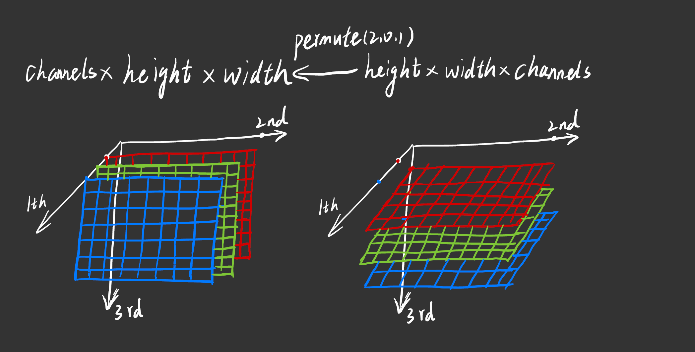

<!--more-->
## 1关于permute(2,0,1)

一图胜前言

opencv是读取图片按照`height*width*channels`

pytorch处理图片是按照`channels*height*width`

`height*width*channels`转换为`channels*height*width`

`image.permute(2,0,1) #image为tensor`

`matplotlib.pyplot.imshow(image)`是按照`height*width*channels`顺序绘制的

## 2关于BGR与RGB

opencv默认读取图片是按照BGR顺序，而pytorch是按照RGB处理照片的。

转换方式

`image[:,:,::-1]`

`cv2.cvtColor(image, cv2.COLOR_BGR2RGB) #image为ndarray`