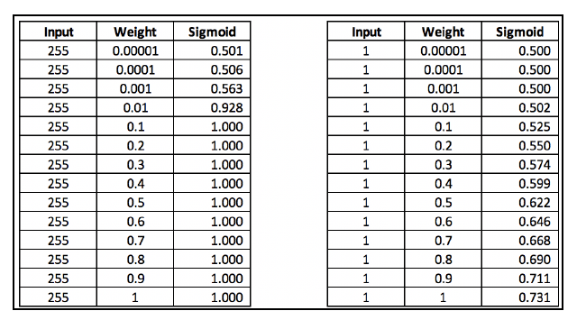
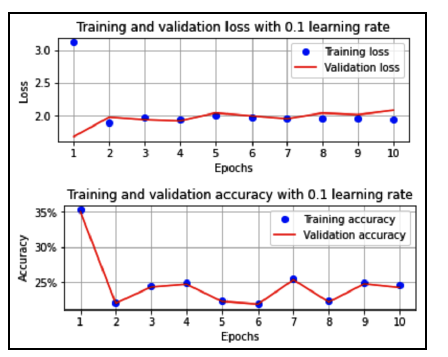
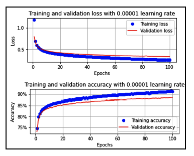

<!--more-->
## 多层感知机

$h_{m\times1}=\sigma(\mathbf{W}_{m\times n}\cdot \mathbf{X}_{n\times 1} + \mathbf{b})=\sigma(\begin{bmatrix}
   \mathbf{w_1}_{1 \times n} \\
   \mathbf{w_2}_{1 \times n} \\
   \vdots \\
   \mathbf{w_n}_{1 \times n}
\end{bmatrix}\cdot \mathbf{x}_{n\times 1} + \mathbf{b})=\sigma(\begin{bmatrix}
   \mathbf{w_1}_{1 \times n}\cdot \mathbf{x}_{n\times 1}=w_{11}x_1+w_{12}x_2+\cdots+ w_{1n}x_n\\
   \mathbf{w_2}_{1 \times n}\cdot \mathbf{x}_{n\times 1}=w_{21}x_1+w_{22}x_2+\cdots+ w_{2n}x_n \\
   \vdots \\
   \mathbf{w_n}_{1 \times n}\cdot \mathbf{x}_{n\times 1}=w_{n1}x_1+w_{n2}x_2+\cdots+ w_{nn}x_n
\end{bmatrix} + \mathbf{b})$

## 损失函数

深度学习中有许多损失函数，它们用于衡量模型的预测与实际目标之间的差异。以下是一些常见的损失函数及其主要用途：

| 损失函数                 | 用途                                                         |
|------------------------|--------------------------------------------------------------|
| 均方误差（Mean Squared Error，MSE） | 回归问题中用于衡量预测值与实际值之间的平方差                    |
| 平均绝对误差（Mean Absolute Error，MAE） | 回归问题中用于衡量预测值与实际值之间的绝对差                    |
| 交叉熵损失（Cross-Entropy Loss）   | 分类问题中的一种常见损失函数，特别适用于多类别分类问题          |
| 二元交叉熵损失（Binary Cross-Entropy Loss） | 二分类问题中用于衡量两个类别的预测概率分布与实际标签之间的差异  |
| 对数损失（Log Loss）             | 与交叉熵损失类似，常用于衡量分类问题中的模型性能                |
| 背景误差敏感的交叉熵损失（Categorical Cross-Entropy Loss） | 用于多类别分类问题，对于每个类别都有一个对应的输出节点         |
| Hinge损失                   | 主要用于支持向量机（SVM）和一些特定的分类问题，鼓励正确的分类并惩罚错误的分类 |
| Huber损失                   | 类似于均方误差，但对预测值与实际值之间的差异不那么敏感，适用于回归问题 |

当涉及到函数原型时，表格不是最佳的方式来展示信息。以下是损失函数及其函数原型的列表：

1. **均方误差（Mean Squared Error，MSE）**:
   $\text{MSE}(y, \hat{y}) = \frac{1}{n} \sum_{i=1}^{n}(y_i - \hat{y}_i)^2$
2. **平均绝对误差（Mean Absolute Error，MAE）**:
   $\text{MAE}(y, \hat{y}) = \frac{1}{n} \sum_{i=1}^{n} |y_i - \hat{y}_i|$

3. **交叉熵损失（Cross-Entropy Loss）**:
   $\text{CrossEntropy}(y, \hat{y}) = -\sum_{i} y_i \log(\hat{y}_i)$

4. **二元交叉熵损失（Binary Cross-Entropy Loss）**:
   $\text{BinaryCrossEntropy}(y, \hat{y}) = -\sum_{i} y_i \log(\hat{y}_i) + (1 - y_i) \log(1 - \hat{y}_i)$

5. **对数损失（Log Loss）**:
   $\text{LogLoss}(y, \hat{y}) = -\frac{1}{n} \sum_{i=1}^{n} [y_i \log(\hat{y}_i) + (1 - y_i) \log(1 - \hat{y}_i)]$

6. **背景误差敏感的交叉熵损失（Categorical Cross-Entropy Loss）**:
   $\text{CategoricalCrossEntropy}(y, \hat{y}) = -\sum_{i} y_i \log(\hat{y}_i)$

7. **Hinge损失**:
   $\text{HingeLoss}(y, \hat{y}) = \max(0, 1 - y \cdot \hat{y})$

8. **Huber损失**:
   $\text{HuberLoss}(y, \hat{y}) = \begin{cases} \frac{1}{2}(y - \hat{y})^2, & \text{if } |y - \hat{y}| \leq \delta \\ \delta(|y - \hat{y}| - \frac{1}{2}\delta), & \text{otherwise} \end{cases}$

这里的 $y$ 代表实际标签，$\hat{y}$ 代表模型的预测，$n$ 是样本数量，$\delta$ 是 Huber 损失的阈值。

## 激活函数

以下是常见的激活函数及其特点：

| 激活函数                      | 函数表达式                                      | 作用                                                   |
|-------------------------------|--------------------------------------------------|--------------------------------------------------------|
| Sigmoid                       | $\sigma(x) = \frac{1}{1 + e^{-x}}$           | 二元分类问题中的输出层，将输出映射到范围 $(0, 1)$      |
| Tanh                          | $\tanh(x) = \frac{e^{x} - e^{-x}}{e^{x} + e^{-x}}$ | 类似于Sigmoid，将输出映射到范围 $(-1, 1)$            |
| ReLU (Rectified Linear Unit)  | $ReLU(x) = \max(0, x)$                         | 隐藏层中最常用的激活函数，引入非线性，简单且有效           |
| Leaky ReLU                    | $LeakyReLU(x) = \max(\alpha x, x)$             | 为了解决 ReLU 中负值导致的神经元“死亡”问题，引入小斜率 $\alpha$ |
| Parametric ReLU (PReLU)       | $PReLU(x) = \max(\alpha x, x)$                 | 类似于 Leaky ReLU，但斜率 $\alpha$ 由模型学习而得      |
| Exponential Linear Unit (ELU) | $ELU(x) = \begin{cases} x, & \text{if } x > 0 \\ \alpha (e^x - 1), & \text{if } x \leq 0 \end{cases}$ | 对负值的响应更加平滑，有助于缓解梯度消失问题     |
| Swish                         | $\text{Swish}(x) = x \cdot \sigma(x)$          | 由Google提出，结合了Sigmoid和ReLU的优点，对梯度更友好      |

注意sigmoid函数存在梯度消失的情况，原因：sigmoid有斜率为0的点，梯度为0，反向传播时，前面的梯度也是0，更新不了模型。

## 影响训练的一些参数

### 数据集的缩放

**缩放数据集有利于获取更好的模型准确度**

例如图像的颜色值0~255，进行sigmoid函数计算

如果都为255，随着权重的变化，Sigmoid(input*weight)的值变化不大，相反如果缩放后(image/255)后随着权重的变化，数据变化较大。

### 批大小

**轮数较少的情况下，较小的批大小有利于提高准确度**

例如数据集大小为60000个

+ 批为10000时，总共训练6次，更新6次权重参数
+ 批为32时，总共训练1875次，更新1875次权重参数

### 优化器

看情况使用，例如Adam就比SGD更快达到最佳准确度

### 学习率

学习率过小需要过长时间训练，学习率过大导致模型不稳定。
|

### 批归一化

BN的作用就是把逐渐向非线性函数映射后向取值区间极限饱和区靠拢的输入分布强制拉回到均值为0方差为1的比较标准的正态分布，使得非线性变换函数的输入值落入对输入比较敏感的区域，以此避免梯度消失问题。因为梯度一直都能保持比较大的状态，所以很明显对神经网络的参数调整效率比较高，就是变动大，就是说向损失函数最优值迈动的步子大，也就是说收敛地快。