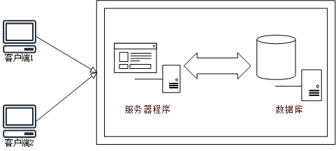
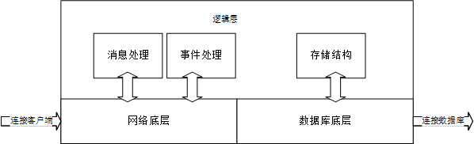
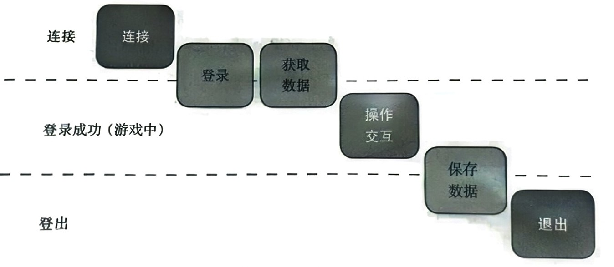
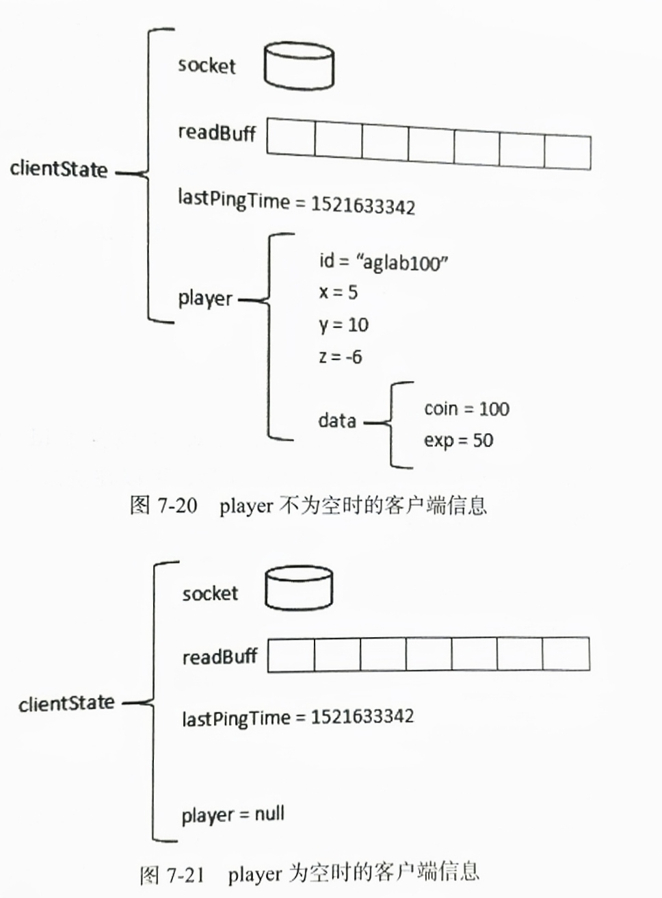
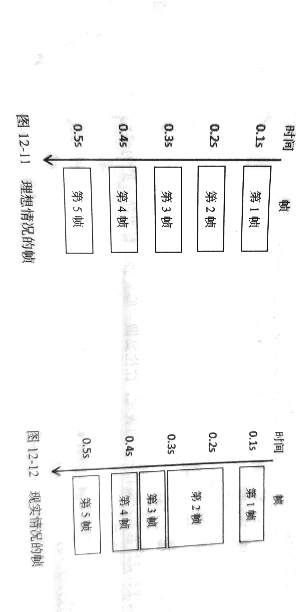

<!--more-->
## 总体架构



## 模块划分



## 游戏流程



## 玩家数据结构



## SQL注入

如果客户端恶意输入请求，将sql命令插入到sql语句中，欺骗服务器，将会造成严重后果。

例如

```c#
string sql = "Select * from player where id=" + id;
```

恶意玩家将id改为`"xiaoming;Delete * FROM player;`

```sql
Select * from player where id=xiaoming;Delete * FROM player;
```

### 防范

1. **使用参数化查询：** 使用参数化的查询语句（预编译语句）是最有效的防止SQL注入的方法。通过使用参数化查询，输入的数据会被视为数据而不是SQL代码，从而防止恶意注入。

    ```
    csharpCopy code// 使用参数化查询
    string sql = "SELECT * FROM Users WHERE Username = @Username AND Password = @Password";
    SqlCommand cmd = new SqlCommand(sql, connection);
    cmd.Parameters.AddWithValue("@Username", userInputUsername);
    cmd.Parameters.AddWithValue("@Password", userInputPassword);
    
    ```

2. **输入验证和过滤：** 对用户输入进行验证和过滤，确保只接受预期的数据。使用白名单（允许的字符集）或黑名单（禁止的字符集）来限制输入。

    ```
    csharpCopy code// 仅接受字母和数字
    string sanitizedInput = Regex.Replace(userInput, "[^a-zA-Z0-9]", "");
    
    ```

3. **使用存储过程：** 存储过程可以将SQL代码封装在数据库中，减少对外部输入的依赖。存储过程内部的参数也可以帮助防止SQL注入。

4. **最小权限原则：** 给予数据库用户最小的权限，仅允许其执行必要的操作。避免使用具有过高权限的账户连接数据库。

5. **ORM框架使用：** 对象关系映射（ORM）框架，如Entity Framework、Dapper等，通常会处理数据库交互，自动使用参数化查询，并提供一些层面上的安全性。

    ```
    csharpCopy code// 使用 Entity Framework 的 LINQ 查询
    var user = dbContext.Users.Where(u => u.Username == userInputUsername && u.Password == userInputPassword).FirstOrDefault();
    
    ```

6. **错误消息处理：** 在生产环境中，限制详细的错误信息输出，以防止攻击者获取有关数据库结构的敏感信息。

7. **监控和日志：** 设置数据库查询的监控和日志，以便及时发现潜在的攻击。日志记录可以帮助你追踪和分析可能的SQL注入尝试。

采取这些预防措施可以大大降低SQL注入的风险。记住，安全性是一个多层面的问题，不仅仅是防范SQL注入，还包括其他方面的安全性措施。

## 同步

由于网络延迟和抖动，很难做到精确的同步，这是一个无解的问
题，只能尽可能降低影响。

主要分为：

+ 状态同步
+ 帧同步

### 状态同步

#### 直接状态同步

客户端A定时向服务器发送**位置信息**，客户端B收到后更新客户端A的位置。

##### 特点

由于网络时延的存在，客户端A发送的同步信息，会经过一段时间
才能到客户端B，因此在延迟较大的情况下，可能会有瞬移的情况。因此一般游戏不会这么直接的同步位置。

#### 跟随算法

为了解决瞬移的问题，可以采用跟随这种障眼法。客户端B收到同步协议后，不直接改变位置，而是让客户端A以一定的速度移动。

##### 特点

客户端B收到客户端A的同步协议后，可能会落后客户端A一些。不过一般游戏不需要非常精确的同步，只要同步的频率高可以降低这种误差。跟随算法应用比较普遍。

#### 预测算法

客户端B收到客户端A的同步协议后一段时间，会根据同步协议中客户端A的速度和当前流逝的时间算出，在下一次同步协议接受前客户端A的位置。从而让客户端A移动到相应位置。

##### 特点

客户端A的速度不可能一直是匀速运动的，当客户端A减速后，客户端B依然按照之前的速度预测位置。因此可能造成接受到同步协议后产生后退的情况。

### 帧同步

帧同步即服务器定义的帧（同步帧）

#### 指令同步

直接发送位置信息造成需要发送的信息太多。如果直接发送指令的话会降低一些延迟。比如直接传输向前移动，向后移动这样的指令。

##### 特点

这种情况会造成误差的积累，由于不同电脑的运行速度不同，可能造成移动的距离不一样。

#### 同步帧

理想状态，服务器每隔一定的时间就执行一次同步帧。保证所有客户端在同一个同步帧时，表现效果完全一样。

实际状况由于系统的卡顿，可能造成某一帧的时间较长，因此就要适当缩短其他帧的时间，保证后续的帧在应该开始运行的时间运行。

```c#
int frame = 0; //当前帧序号
float interval = 0.1f; //周期，两帧的间隔

public void Update() //Unity的update函数
{
    while(Time.time < frame*interval) //保证帧在应该执行的时间执行
    {
        FrameUpdate()//定义的“同步帧”
        frame++;
    }
}
```




