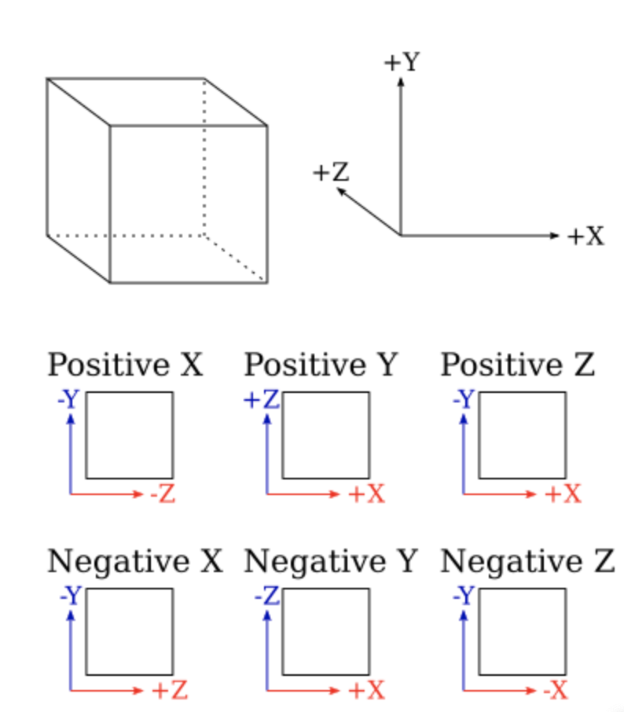

<!--more-->
## 球贴图

根据贴图的UV坐标可以映射到方向继而得到其在三维中的坐标

UV坐标->球坐标方向->三维坐标

$$
x=cos\theta sin\phi\\
y=cos\theta cos\phi\\
z=cos\phi\\
\theta=2\pi u\\
\phi=\pi v
$$

因此

$$
(x,y,z)=(cos2(\pi u)sin(\pi v),cos\pi u cos\pi v,cos\pi v)
$$

> 球投影在接近两极的时候会导致失真

## 立方体贴图

