<!--more-->
## 点与向量的表示

点与向量的表示使用三维是为了方便进行兼容平移操作，可以使二位仿射变化（表示平移）表示为三维变换矩阵

### 二维的表示

#### 点

$\begin{bmatrix}
    x\\y\\1
\end{bmatrix}$

#### 向量

$\begin{bmatrix}
    x\\y\\0
\end{bmatrix}$

### 三维的表示

$\begin{bmatrix}
    x\\y\\z\\1
\end{bmatrix}$

#### 向量

$\begin{bmatrix}
    x\\y\\z\\0
\end{bmatrix}$

## 2D变换

### 缩放

$S(S_{x}, S_{y})= \begin{bmatrix}
    S_{x} & 0 & 0 \\ 0 & S_{y} & 0 \\ 0 & 0 & 1
\end{bmatrix}$

### 旋转

$R(\alpha) = \begin{bmatrix}
    \cos(\alpha) &-\sin(\alpha)&0\\\sin(\alpha)&\cos(\alpha)&0\\0&0&1
\end{bmatrix}$

### 平移

$T(t_{x}, t_{y})=\begin{bmatrix}
    1&0&t_{x}\\0&1&t_{y}\\0&0&1
\end{bmatrix}$

### 意义

#### 二维的变换表示（Affine map）

$\begin{bmatrix}
    x^\prime\\y^\prime
\end{bmatrix}= \begin{bmatrix}
    a&b\\c&d
\end{bmatrix}\cdot\begin{bmatrix}
    x\\y
\end{bmatrix}+\begin{bmatrix}
    t_x\\t_y
\end{bmatrix}$

#### 三维的变换表示

$\begin{bmatrix}
    x^\prime\\y^\prime\\1
\end{bmatrix} = \begin{bmatrix}
    a&b&t_x\\c&d&t_y\\0&0&1
\end{bmatrix}\cdot\begin{bmatrix}
    x\\y\\1
\end{bmatrix}$

左上的二位矩阵对应旋转、缩放等等变换，第三列的前两个数代表平移，最后一行在二维仿射变换下永远是$\begin{bmatrix}
    0&0&1
\end{bmatrix}$

## 3D变换

### 3D平移

3D平移变换矩阵类比于2D平移：

$T(t_{x}, t_{y}, t_{z})=
\begin{bmatrix}
    1 & 0 & 0 & t_{x} \\
    0 & 1 & 0 & t_{y} \\
    0 & 0 & 1 & t_{z} \\
    0 & 0 & 0 & 1
\end{bmatrix}$
其中 $t_{x}$、$t_{y}$、$t_{z}$ 分别表示在 x、y 和 z 轴上的平移距离。

### 3D旋转

3D旋转变换矩阵类比于2D旋转：

#### 绕 X 轴旋转：

$R_x(\theta) =
\begin{bmatrix}
    1 & 0 & 0 \\
    0 & \cos(\theta) & -\sin(\theta) \\
    0 & \sin(\theta) & \cos(\theta)
\end{bmatrix}$

#### 绕 Y 轴旋转：

$R_y(\theta) =
\begin{bmatrix}
    \cos(\theta) & 0 & \sin(\theta) \\
    0 & 1 & 0 \\
    -\sin(\theta) & 0 & \cos(\theta)
\end{bmatrix}$

#### 绕 Z 轴旋转：

$R_z(\theta) =
\begin{bmatrix}
    \cos(\theta) & -\sin(\theta) & 0 \\
    \sin(\theta) & \cos(\theta) & 0 \\
    0 & 0 & 1
\end{bmatrix}$

>看了运动学相关的知识，补充一点。
旋转矩阵的三个用法:
>
>1. 描述B坐标相对于A坐标的姿态
${ }_B^A R=\left[\begin{array}{ccc}\mid & \mid & \mid \\ { }^A \hat{X}_B & { }^A \hat{Y}_B & { }^A \hat{Z}_B \\ \mid & \mid & \mid\end{array}\right]$
其中${ }_B^A R$表示在A坐标轴下B的旋转，${ }^A \hat{X}_B$表示在A坐标下$\hat{X}_B$在三个轴上的投影。注意都是相对于A坐标轴的。
>
>2. 将由B坐标轴表示的点$P$表示成A坐标的表示。
${ }^A P={ }_B^A R^B P$
>
>3. 将A坐标中的向量进行旋转
${ }^A P^{\prime}=R(\theta){ }^A P$
>
>4. 变换矩阵
>$
{ }_B^A T=\left[\begin{array}{ccc}\mid & \mid & \mid & \mid \\ { }^A \hat{X}_B & { }^A \hat{Y}_B & { }^A \hat{Z}_B & { }^A P_B \\ \mid & \mid & \mid & \mid \\ 0&0&0&1\end{array}\right]
$
>
>5. 连乘
>${ }^A P={ }_B^A T^B P={ }_B^A T\left({ }_C^B T^C P\right)={ }_B^A T_C^B T^C P$
>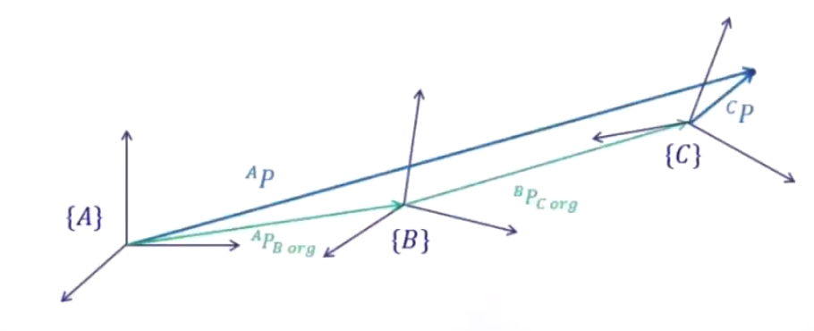

#### 可以将任意旋转转位绕X绕Y和饶Z旋转的组合

$R_{xyz}=R_X(\alpha)R_Y(\beta)R_Z(\gamma)$

其中$(\alpha,\beta,\gamma)$称为欧拉角

#### Rodrigues' Rotation Formula

$R(n, \alpha) = \cos\alpha\cdot\mathbf{I} + (1-\cos\alpha)\cdot\mathbf{n}\mathbf{n}^\mathrm{T}+\sin\alpha\begin{bmatrix}
    0&-n_z& n_y\\n_z&0&-n_x\\-n_y&n_x&0
\end{bmatrix}$

其中$\mathbf{n}$为旋转轴，且为单位向量，$R=\mathbf{V_{rot}}\mathbf{V}^{-1}$即$\mathbf{V_{rot}=R\mathbf{V}}$，$\mathbf{I}$为3x3的单位向量

### 3D缩放

3D缩放变换矩阵类比于2D缩放：

$S(S_{x}, S_{y}, S_{z})=
\begin{bmatrix}
    S_{x} & 0 & 0 & 0 \\
    0 & S_{y} & 0 & 0 \\
    0 & 0 & S_{z} & 0 \\
    0 & 0 & 0 & 1
\end{bmatrix}$
其中 $S_{x}$、$S_{y}$、$S_{z}$ 分别表示在 x、y 和 z 轴上的缩放比例。

#### view/camera transformation

相机放在固定的位置上原点，up at Y, look at -Z

要拍摄的物体进行移动

##### 正交投影

直接将点的z值取0即可

##### 透视投影

透视投影可以分为两部，先将平面挤压到跟近平面一样大，然后在进行正交投影

$M_{persp}=M_{ortho}M_{persp\rightarrow ortho}$

根据近平面和远平面的相似三角形求得矩阵

$M_{persp\rightarrow ortho}=\begin{bmatrix}
    n&0&0&0\\0&n&0&0\\0&0&n+f&-nf\\0&0&1&0
\end{bmatrix}$

## 三角形光栅化

### 采样

### 锯齿alias和反走样Anti-Aliasing

#### Super sample Anti-Aliasing(SSAA)超级采样

使用4倍于屏幕分辨率大小的后台缓冲区和深度缓冲区，当数据要从缓冲区调往屏幕显示的时候，会将后台缓冲区按4个像素一组进行解析(resolve，或降采样downsample)，采用每组求平均值的方法得到一种相对平滑的像素颜色。实际上是通过软件的方式提升了画面的分辨率，此方法开销很大是原来的4倍。

#### MutiSample Anti-Aliasing(MSAA)多重采样

也是使用4倍于屏幕分辨率大小的后台缓冲区和深度缓冲区，屏幕上一个像素也是分为4个子像素，MSAA计算这4个像素被覆盖的个数从而将母像素渲染为原来像素的   (0%,25%,50%,75%,100%)。

和SSAA不同，MSAA每个像素只需要计算一遍，而SSAA是先将画面渲染到虚拟的屏幕上（4倍于原来的屏幕）原来屏幕的子像素相当于虚拟屏幕的像素，每个都会被渲染一次，然后再降采样为1/4和原屏幕的分辨率一样。

#### TAA

#### FXAA

## 着色Shading

### 光照反射

分为Specaluar highlight，Diffuse reflection，Ambient lighting

shading不等于shadow，shading考虑局部，因此不产生阴影

### 漫反射Lambertian(Diffuse) Shading

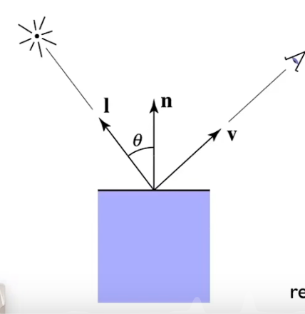

$L_d=k_d\left(I / r^2\right) \max (0, \mathbf{n} \cdot \mathbf{l})$

$k_d$为漫反射系数，如果该点为白色则为1反射所有光，如果是黑色则是0
 
$\left(I / r^2\right)$为点光源

$ \max (0, \mathbf{n} \cdot \mathbf{l})$为光照面积的影响

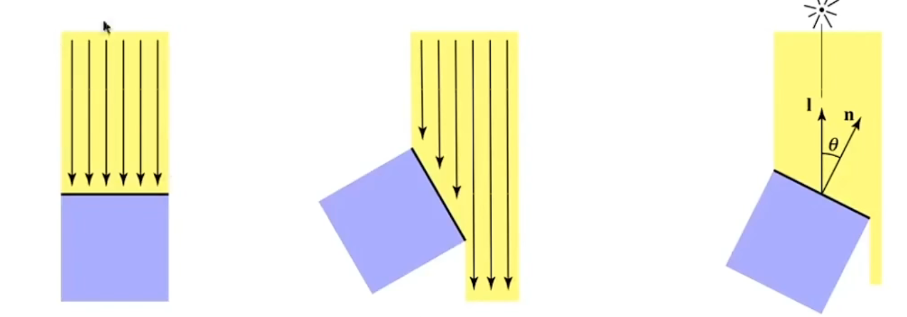

### 高光

$L_s=k_s\left(I / r^2\right) \max (0, \mathbf{n} \cdot \mathbf{h})^p$

此处没有$ \max (0, \mathbf{n} \cdot \mathbf{l})$是因为这个公式本身也是近似，因此忽略了

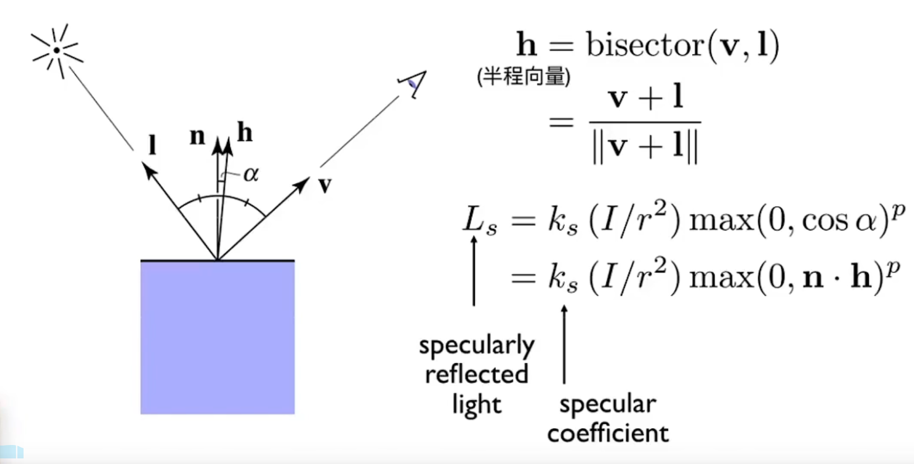

人眼若看到高光则要与镜面反射的向量尽可以接近，也就是半程向量与法向量接近。

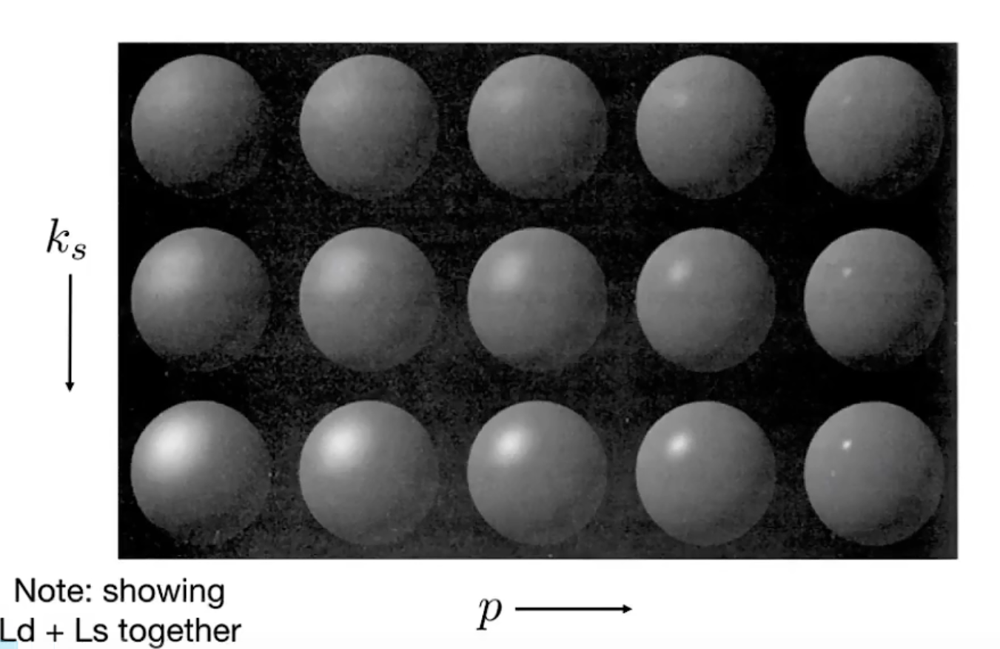

### 环境光照

$L_a=k_a I_a$

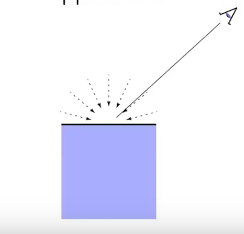

### 所有项之和

#### Blinn-Phong反射模型（是一个简化的模型）

$\begin{aligned} L & =L_a+L_d+L_s=k_a I_a+k_d\left(I / r^2\right) \max (0, \mathbf{n} \cdot \mathbf{l})+k_s\left(I / r^2\right) \max (0, \mathbf{n} \cdot \mathbf{h})^p\end{aligned}$

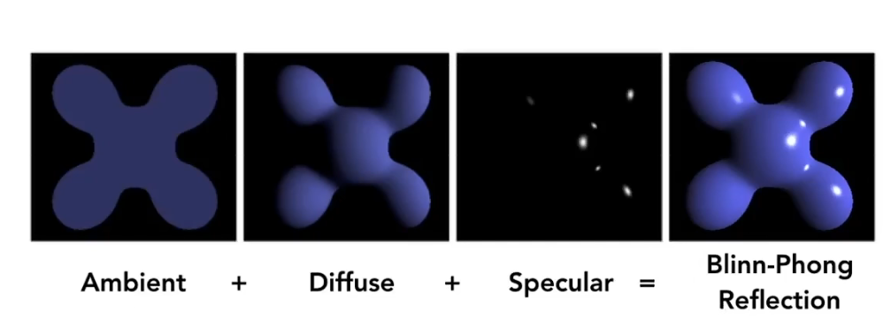

## 着色频率ShadingFrequencies

### Flat shading

逐三角形上进行着色

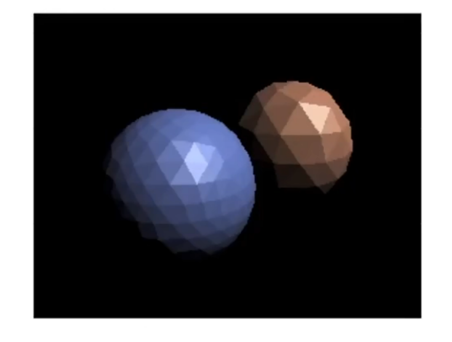

### Gouraud shading

逐顶点上进行着色

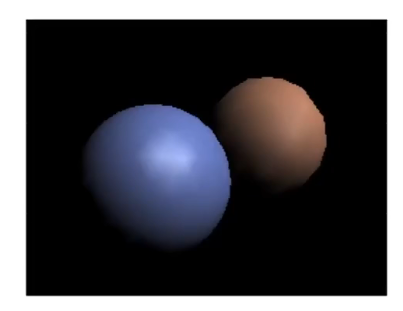

### Phongshading

逐像素上进行着色

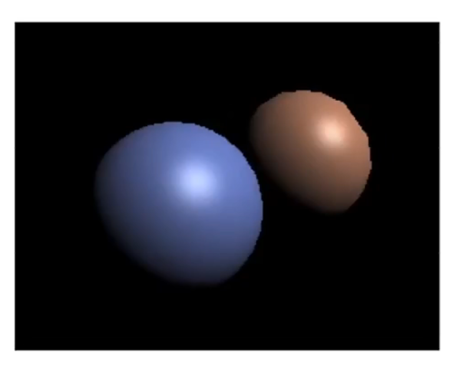

### 三者对比

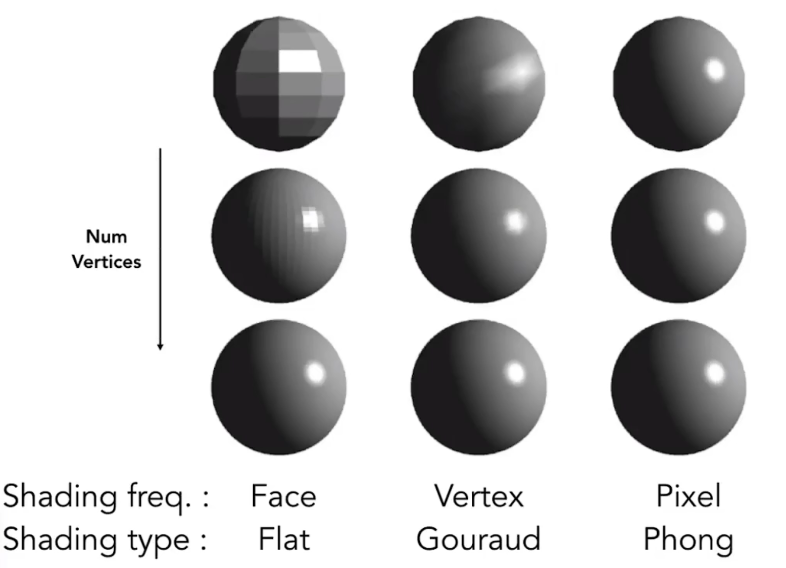

## 渲染管线Graphics (Real-time Rendering)Pipeline

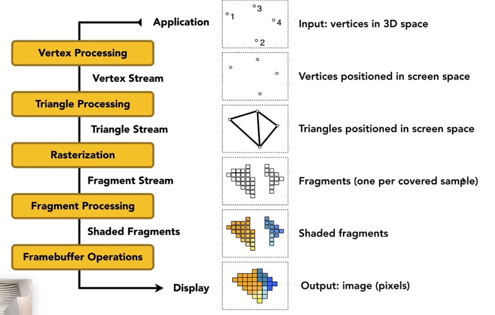

## MipMap
MipMap(多级渐远纹理),许多个纹理，每一个纹理的纹理像素是上一个的1/2

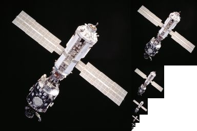

由于屏幕上一个像素覆盖到纹理像素的多少是不同的，因此使用多级纹理可以消除摩尔纹等不好的情况。

## 各向异性过滤 Anisotropic Filtering

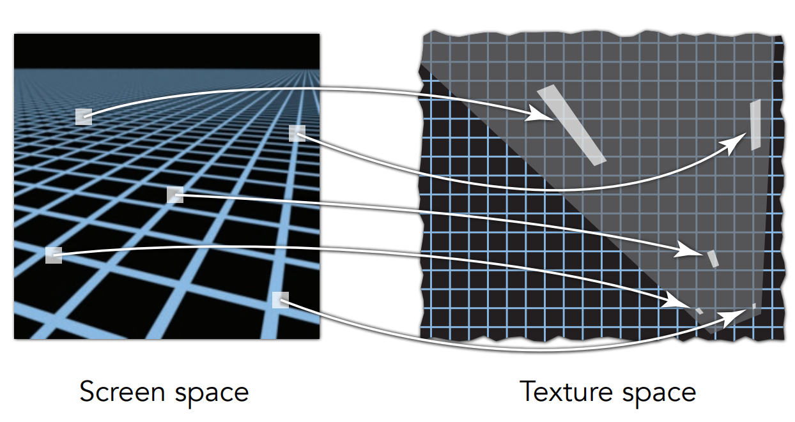

若使用mipmap的正方形去近似实际的长条形效果不好。因此各向异性过滤扩充了x方向和y方向的贴图。

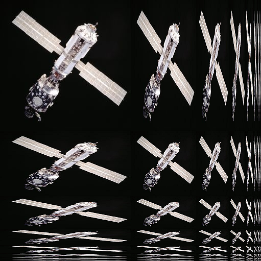

对角线为mipmap

## 法线贴图和位移贴图

法线贴图实际是虚拟的法线（计算时不用真实的法线而是用法线贴图上的法线替换），没有改变真实的几何，而位移贴图是改变了三角形的顶点位置。

## 几何

### 隐式（implicit）几何和显式（explicit）几何

#### 隐式几何

##### algebraic surface

其中的点满足某种关系，比如球，$x^2+y^2+z^2=1$

##### Consructive Solid Geometry(csg) 

通过几种基本的几何进行布尔运算。

##### Distance Function

描述一个点到最近面的距离，例如Signed Distance Funciton(SDF)。

##### Occupancy Field 

占用场表示一个点被曲面占用的概率（占用就是在曲面内部），用神经网络表示的占用场又叫做Neural Surface Field

##### Neural Radiance Field (神经辐射场)

将“空间中的点+点发出的一条射线”映射到“点的密度值+射线的方向对应的颜色值”。

##### Fractals（分形）

例如，雪花，科赫曲线。

#### 显式几何

##### 点云Point Cloud

密集的点表示

##### 多边形面Polygon Mesh

例如用三角形

##### 体素

## Ray Tracing

光栅化有一定的问题（例如全局效果不好），因此引入光线追踪。

光栅化是实时的，光线追踪是离线的。

### Whitted-Style Ray Tracing

>待补充

### radiant flux

单位时间的能量。

用来表示光的亮度。

$\Phi=\frac{dQ}{dt}$，单位$W$，$lm=lumen$

人类对光的感受是通过lumionous flux（光通量）表述的，代表辐射通量中眼睛能感受“亮”的部分。

lumionous flux和radiant fkux是一回事，只是角度不同。

瓦数和流明换算：

$K=683.002 lm/W$

### radiant intensity(or intensity)

单位`立体角`的功率。

$I(\omega)=\frac{d\Phi}{d\omega}$，单位$W/sr$，$lm/sr=cd=candela$

立体角实际上是2维弧度定义的3维延伸。表示一个点形成的球，从中取圆锥，这个圆锥的底面与圆的半径平方比。

$\Omega=\frac{A}{r^2}$

$d\omega = \frac{dA}{r^2}=\sin\theta d\theta d\phi$

故球的立体角为$4\pi$，radiant intensity为$\frac{\Phi}{4\pi}$

### irradiance

单位面积上的功率。

这个面积必须和入射光垂直。

$E(x)=\frac{d\Phi(x)}{dA}$，单位$W/m^2$, $lm/m^2=lux$

### radiance

描述光线的属性。

单位立体角，单位投影面积的功率。

$L(p,\omega)=\frac{d^2\Phi(p,\omega)}{d\omega dA\cos\theta}$，单位$W/sr\cdot m^2$，$cd/m^2=lm/sr \cdot m^2=nit$

$\theta$是单位面积的法线与光线方向的夹角。

radiance可以理解为单位立体角的irradiance或者单位投影面积的radiant intensity

$dE(p,\omega)=L_i(p,\omega)\cos\theta d\omega$

$E(p)=\int_{H^{2}}L_i(p,\omega)\cos\theta d\omega$

$H^2$为单位半球

### Bidirectional Reflectance Distribution Funtion(BRDF)

`BRDF和材质是等价的，BRDF==材质`

描述从一个方向进来的光线，并反射多少能量(radiance)。

$f_r(\omega_i\rightarrow\omega_r)=\frac{dL_r(\omega_r)}{dE_i(\omega_i)}=\frac{dL_r(\omega_r)}{L_i\cos\theta_id\omega_i}$

对于某一个出射方向的radiance求法如下。

$L_r(p,\omega_r)=\int_{H^2}f_r(p,\omega_i\rightarrow\omega_r)L_i(p,\omega_i)\cos\theta_id\omega_i$

### rendering equation

对于某个点的光线由两个部分组成，自己发射的光和其他光线的反射。

$L_o(p,\omega_o)=L_e(p,\omega_o)+\int_{\Omega+}L_i(p,\omega_i)f_r(p,\omega_i,\omega_o)(n\cdot\omega_i)d\omega_i$

全局光照=直接光照（光弹射一次）+间接光照（光弹射2次及以上）

### Monte Carlo Integration

用来积一些复杂的`定`积分。

$\int_a^bf(x)dx=\frac{1}{N}\sum_{i=1}^N\frac{f(X_i)}{p(X_i)},X_i\sim p(x)$

## path tracing(灰常牛皮，渲染效果和现实基本一毛一样)

在半球上进行均匀采样，应用monte carlo

$L_o(p,\omega_o)=\frac{1}{N}\sum_{i=1}^N\frac{L_i(p,\omega_i)f_r(p,\omega_i,\omega_o)(n\cdot\omega_i)}{pdf(\omega_i)}$

N=1时即为path tracing，不为1时为Distributed Ray tracing(FYI)

>ray tracing和path racing补充
>
>以前说ray tracing特指Whitted-style ray tracing
>
>现代说ray tracing是所有光线传播方法的大集合
>比如: path tracing、photo mapping、metropolis light transport、VCM/UPBP等等

>

>细节待补充

## Materials and appearances

### Fresnel Term

如果视角方向与法线接近平行，则很少的光会被反射，如果与法线接近垂直则很多的光会被反射。

表示有多少能量被反射。

+ 近似公式Schlick's approximation

    $R(\theta)=R_0+(1-R_0)(1-\cos\theta)^5$

    $R_0=(\frac{n_1-n_2}{n_1+n_2})^2$

### Microfacet Material真正的基于物理的材质

$f(i,o)=\frac{F(i,h)G(i,o,h)D(h)}{4(n,i)(n,o)}$

$F(i,h)$菲涅尔项$D(h)$，法线分布，$h$为half vector，$G(i,o,h)$几何项shadowing masking

### 材质的分类

Isotropic各项同性

Anisotropic各向异性

## 前沿

### advanced Light transport

+ Unbiased

Bidirectional path tracing(BDPT)
Metropolis light transport(MLT)

+ Biased

Photon mapping
适合用于caustics

Vertex connection and merging(VCM)

+ Instant radiosity(VPL/many light methods)

### Advanced Appearance Modeling

+ No Surface models

Participating media

Hair/fur/fiber(BCSDF)

Granular material

+ Surface Models

Translucent material(BSSRDF)

Cloth

Detailed material(non-statistiacl BRDF)

+ Procedural appearance
>updating...